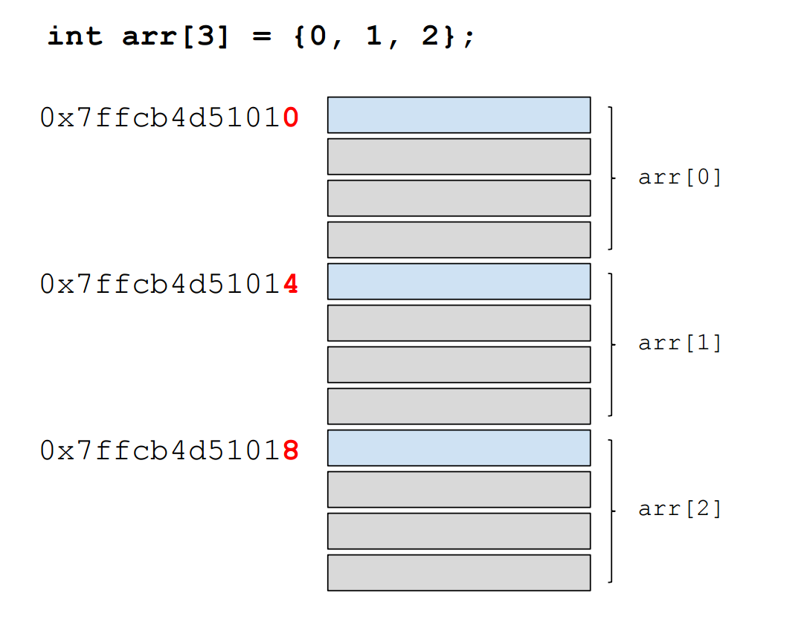
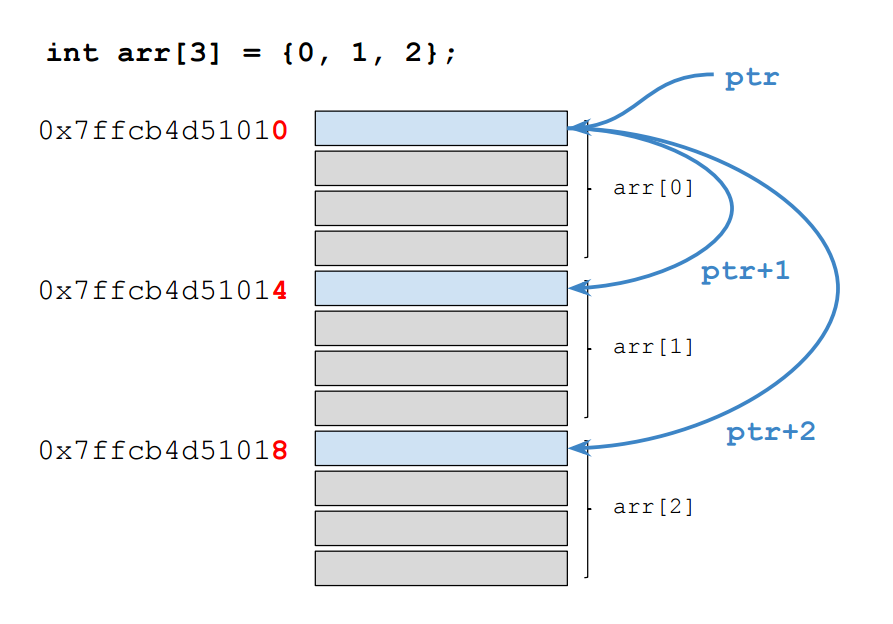
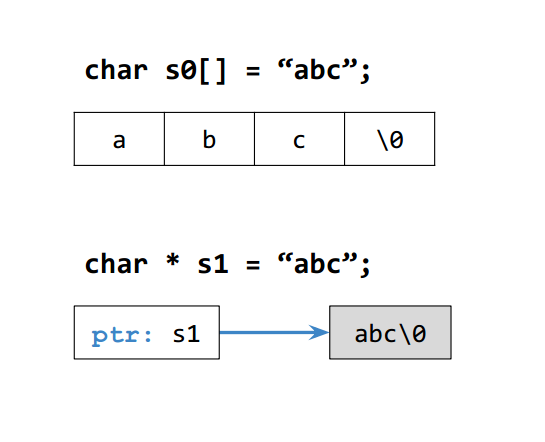

[*back to contents*](https://github.com/gyuho/learn#contents)<br>

# C: array, pointer

- [Reference](#reference)
- [array](#array)
- [`char`](#char)
- [pointer](#pointer)
- [array, pointer](#array-pointer)
- [pointer arithmetic](#pointer-arithmetic)
- [`char` array](#char-array)
- [pointer array](#pointer-array)
- [pointer function](#pointer-function)
- [swap](#swap)

[↑ top](#c-array-pointer)
<br><br><br><br><hr>


#### Reference

- [C11 Specification](http://www.open-std.org/JTC1/SC22/WG14/www/docs/n1570.pdf)
- [Pointers and Memory](http://cslibrary.stanford.edu/102/)

[↑ top](#c-array-pointer)
<br><br><br><br><hr>


#### array

Let's say you have thousands of values to store in your program. One way, you
could:

```c
int num1, num2, num3, num4, num5;
int num6, num7, num8, num9, num10;
...
int num1000, num1001, num1002, num1003, num1004;
...
```

This is too verbose and error-prone. You should use array:


```c
#include <stdio.h>

int main(void)
{
	int arr0[2];
	arr0[0] = 10;
	arr0[1] = 20;
	int sum0=0, i;
	for (i=0; i<2; i++)
		sum0 += arr0[i];
	printf("sum0: %d\n", sum0);
	// sum0: 30

	int len=50;
	double arr1[len];
	int j;
	for (j=0; j<len; j++)
		arr1[j] = (double)j;
	double sum1=0;
	int k;
	for (k=0; k<len; k++)
		sum1 += arr1[k];
	printf("sum1: %f\n", sum1);
	// sum1: 1225.000000

	int arr2[3]={0, 1, 2};
	int i2;
	for (i2=0; i2<3; i2++)
		printf("%d ", arr2[i2]);
	printf("\n");
	// 0 1 2
	
	int arr3[]={0, 1, 2}; // automatically sized to 3
	int i3;
	for (i3=0; i3<3; i3++)
		printf("%d ", arr3[i3]);
	printf("\n");
	// 0 1 2

	int arr4[5]={1}; // automatically fill up with 0
	int i4;
	for (i4=0; i4<5; i4++)
		printf("%d ", arr4[i4]);
	printf("\n");
	// 1 0 0 0 0 

	printf("arr4 sizeof: %ld\n", sizeof(arr4));             // arr4 sizeof: 20
	printf("int sizeof: %ld\n", sizeof(int));               // int sizeof: 4
	printf("arr4 length: %ld\n", sizeof(arr4)/sizeof(int)); // arr4 length: 5

	printf("\ntype 3 integers: ");
	int arr[3];
	scanf("%d", &arr[0]);
	scanf("%d", &arr[1]);
	scanf("%d", &arr[2]);
	int ia;
	for (ia=0; ia<3; ia++)
		printf("%d ", arr[ia]);
	printf("\n");
	// type 3 integers: 100 200 300
	// 100 200 300

    return 0;
}

```

[↑ top](#c-array-pointer)
<br><br><br><br><hr>


#### `char`

C represents string literals with double quotes:

```c
printf("Hello World!\n")
```

And you can save this string in character array type. In C, string is an array
of characters, and the **`null character \0`** is automatically inserted at the
end of all character arrays. C needs `\0` to differentiate between two types of
array of characters, *one that cannot be printed with `%s`, the other that can
be printed with `%s`*:


```c
#include <stdio.h>

int main(void)
{
	char array[7] = "Hello";
	int i;
	for (i=0; i<7; i++)
		printf("%d: %c\n", i, array[i]);
	printf("\n");
	for (i=0; i<7; ++i)
		printf("%d: %c\n", i, array[i]);
	printf("\n");
	/*
		0: H
		1: e
		2: l
		3: l
		4: o
		5: 
		6: 

		0: H
		1: e
		2: l
		3: l
		4: o
		5: 
		6: 
	*/

	char str[]="Hello World!";
	printf("str length: %ld\n", sizeof(str)/sizeof(char));
	// str length: 13
	
	// we need null character to differentiate between these two:
	char charArray[]={'H', 'e', 'l', 'l', 'o'};
	printf("charArray: %s\n", charArray); // charArray: Hello

	char charArrayString[]={'H', 'e', 'l', 'l', 'o', '\0'};
	printf("charArrayString: %s\n", charArrayString); // charArrayString: Hello
	int idx=0;
	while (charArrayString[idx] != 0)
	{
		printf("%c", charArrayString[idx]);
		idx++;
	}
	printf("\n");
	// Hello

	charArrayString[3] = '\0';
	printf("charArrayString: %s\n", charArrayString); // charArrayString: Hel

	charArrayString[1] = 0;
	printf("charArrayString: %s\n", charArrayString); // charArrayString: H

    return 0;
}

```

[↑ top](#c-array-pointer)
<br><br><br><br><hr>


#### pointer

Pointer is a variable to store the address value of data(variable).
`&num` returns the address of `num`. `int * num` defines a pointer type
variable `num`. `*` is also used to dereference *or access* the memory
that the pointer points to.

```c
#include <stdio.h>

int main(void)
{
	int num = 1;
	int * pnum;   // declare pointer-type pnum
	pnum = &num;  // store the address of num to pnum
	printf("%p\n", pnum); // 0x7ffdfbe9a224

	double f = 1.5;
	double * fp = &f;
	*fp = 100.10;
	printf("%f\n", f); // 100.100000

	int * pt = NULL;    // assign NULL pointer if not sure what to store
	printf("%p\n", pt); // (nil)

    return 0;
}

```

[↑ top](#c-array-pointer)
<br><br><br><br><hr>


#### array, pointer 

First take a look at this code:

```c
#include <stdio.h>

int main()
{
	int arr[3] = {0, 1, 2};

	printf("arr: %p\n", arr);         // 0x7ffcb4d51010
	printf("&arr[0]: %p\n", &arr[0]); // 0x7ffcb4d51010
	printf("&arr[1]: %p\n", &arr[1]); // 0x7ffcb4d51014
	printf("&arr[2]: %p\n", &arr[2]); // 0x7ffcb4d51018

	// (X)
	// arr = &arr[1];

	return 0;
}

```



- The name of an array represents the address of an beginning element (first
  element in the array). That is, **array name** is a pointer to the array.
- Each `int` takes 4 bytes of memory, so `int` array element differs 4 bytes
  in its memory addresses.
- The memory address of an array cannot be changed, unlike other pointer
  variables.

<br>
Again, **array name is also a pointer**:

```c
#include <stdio.h>

int main()
{
	int arr[3] = {0, 1, 2};

	printf("*arr: %d\n", *arr);  // 0
	*arr += 100;
	printf("*arr: %d\n", *arr);  // 100
	arr[0] -= 50;
	printf("*arr: %d\n", *arr);  // 50

	int * ptr = &arr[0];
	// int * ptr = arr;
	
	printf("%d %d\n", *ptr, *arr);     // 50 50
	printf("%d %d\n", ptr[0], arr[0]); // 50 50
	printf("%d %d\n", ptr[1], arr[1]); // 1 1
	printf("%d %d\n", ptr[2], arr[2]); // 2 2

	return 0;
}

```

[↑ top](#c-array-pointer)
<br><br><br><br><hr>


#### pointer arithmetic

```c
#include <stdio.h>

int main()
{
	int * pt0 = 0x0010;  // increase by 4
	printf("%p %p\n", pt0+1, pt0+2); // 0x14 0x18

	double * pt1 = 0x0010;  // increase by 8
	printf("%p %p\n", pt1+1, pt1+2); // 0x18 0x20

	int arr[3] = {0, 1, 2};
	int * ptr = arr;
	printf("%d %d %d\n", *ptr, *(ptr+1), *(ptr+2));
	// 0 1 2
	
	printf("%d\n", arr[2] == *(arr+2)); // 1

	return 0;
}

```



[↑ top](#c-array-pointer)
<br><br><br><br><hr>


#### `char` array

In C, there are two way to represent strings:

```c
#include <stdio.h>

int main()
{
	char s0[] = "abc";
	// *s0 = "Hello";   // (X)
	printf("%s\n", s0); // abc
	s0[0] = 'X';
	printf("%s\n", s0); // Xbc

	char * s1 = "abc";
	s1 = "Hello";
	printf("%s\n", s1); // Hello
	s1[0] = 'X';        // (X)
	printf("%s\n", s1); // (X)

	return 0;
}

```



[↑ top](#c-array-pointer)
<br><br><br><br><hr>


#### pointer array

```c
#include <stdio.h>

int main()
{
	int n0=0, n1=1, n2=2;
	int * arr[3] = {&n0, &n1, &n2};
	printf("%d\n", *arr[0]); // 0
	printf("%d\n", *arr[1]); // 1
	printf("%d\n", *arr[2]); // 2

	char * sArr[3] = {"AA", "BB", "CC"};
	printf("%s\n", sArr[0]); // AA
	printf("%s\n", sArr[1]); // BB
	printf("%s\n", sArr[2]); // CC

	return 0;
}

```

[↑ top](#c-array-pointer)
<br><br><br><br><hr>


#### pointer function

```c
#include <stdio.h>

// argument is passed by value!
// make sure to pass pointer if you want to update!
void updateArray(int * arrPt, int len, int delta)
{
	int i;
	for (i=0; i<len; i++)
		arrPt[i] += delta;
}

void printArray(int * arrPt, int len)
{
	int i;
	for (i=0; i<len; i++)
		printf("%d ", arrPt[i]);
	printf("\n");
}

int main()
{
	int arr[3] = {1,2,3};
	updateArray(arr, sizeof(arr) / sizeof(int), 10);
	printArray(arr, sizeof(arr) / sizeof(int));
	// 11 12 13

	return 0;
}

```

[↑ top](#c-array-pointer)
<br><br><br><br><hr>


#### swap

```c
#include <stdio.h>

void swapValue(int v1, int v2)
{
	int temp = v1;
	v1 = v2;
	v2 = temp;
}

void swapPointer(int * pt1, int * pt2)
{
	int temp = *pt1; // dereference
	*pt1 = *pt2;
	*pt2 = temp;
}

int main()
{
	int num1 = 1;
	int num2 = 2;
	swapValue(num1, num2);
	printf("num1 num2: %d %d\n", num1, num2);
	// 1 2

	swapPointer(&num1, &num2);
	printf("num1 num2: %d %d\n", num1, num2);
	// 2 1

	return 0;
}

```

[↑ top](#c-array-pointer)
<br><br><br><br><hr>

