[*back to contents*](https://github.com/gyuho/learn#contents)
<br>

# Distributed systems, raft

- [Reference](#reference)
- [distributed systems, consensus algorithm](#distributed-systems-consensus-algorithm)
- [raft algorithm: introduction](#raft-algorithm-introduction)
- [raft algorithm: terminology](#raft-algorithm-terminology)
- [raft algorithm: leader election](#raft-algorithm-leader-election)
- [raft algorithm: log replication](#raft-algorithm-log-replication)
- [raft algorithm: log consistency](#raft-algorithm-log-consistency)
- [raft algorithm: safety](#raft-algorithm-safety)
- [raft algorithm: follower and candidate crashes](#raft-algorithm-follower-and-candidate-crashes)
- [raft algorithm: client interaction](#raft-algorithm-client-interaction)
- [raft algorithm: log compaction](#raft-algorithm-log-compaction)
- [raft algorithm: summary](#raft-algorithm-summary)

[↑ top](#distributed-systems-raft)
<br><br><br><br>
<hr>


#### Reference

- [Linearizability versus Serializability](http://www.bailis.org/blog/linearizability-versus-serializability/)
- [The Raft Consensus Algorithm](https://raft.github.io/)
- [*Raft paper by Diego Ongaro and John Ousterhout*](http://ramcloud.stanford.edu/raft.pdf)
- [Consensus (computer science)](https://en.wikipedia.org/wiki/Consensus_(computer_science))
- [CAP theorem](https://en.wikipedia.org/wiki/CAP_theorem)
- [Raft (computer science)](https://en.wikipedia.org/wiki/Raft_(computer_science))
- [Raft lecture (Raft user study)](https://www.youtube.com/watch?v=YbZ3zDzDnrw)
- [`coreos/etcd`](https://github.com/coreos/etcd)
- [Raft Protocol Overview by Consul](https://www.consul.io/docs/internals/consensus.html)
- [Protocol Buffers](https://en.wikipedia.org/wiki/Protocol_Buffers)
- [Protocol Buffers](https://en.wikipedia.org/wiki/Protocol_Buffers)

[↑ top](#distributed-systems-raft)
<br><br><br><br>
<hr>


#### distributed systems, consensus algorithm

> In distributed computing, a problem is divided into many tasks, each of which
> is solved by one or more computers, which communicate with each other by
> message passing.
>
> A distributed system may have a common goal, such as solving a large
> computational problem. Alternatively, each computer may have its own user
> with individual needs, and the **purpose of the distributed system** is to
> **coordinate the use of shared resources** or **provide communication
> services** to the users.
> 
> [*Distributed computing*](https://en.wikipedia.org/wiki/Distributed_computing)
> *by Wikipedia*

- *In parallel computing*, multiple processors may have access to a globally 
  **shared memory to exchange data between processors**.
- *In distributed computing*, each processor has its **own private memory**
  exchanging data by **passing messages between processors**.

<br>
> A fundamental problem in **distributed computing** is to achieve overall **system
> reliability** in the presence of a number of *faulty processes*. This often
> requires processes to agree on some data value that is needed during
> computation. Examples of applications of **consensus** include **whether to commit
> a transaction to a database, agreeing on the identity of a leader, state
> machine replication, and atomic broadcasts.**
>
> [*Consensus*](https://en.wikipedia.org/wiki/Consensus_(computer_science))
> *by Wikipedia*

A process can fail either from a *crash* or a *loss of the process presenting
different symptoms to different observers*
([*Byzantine fault*](https://en.wikipedia.org/wiki/Byzantine_failure)).
The consensus algorithm handles these kinds of *faulty processes* in
distributed computing systems, and keeps data consistent even when it loses one
of its communications.

<br>
An ultimate **consensus algorithm** should achieve:
- **_consistency_**.
- **_availability_**.
- **_partition tolerance_**.

[CAP theorem](https://en.wikipedia.org/wiki/CAP_theorem) states that
it is impossible that a distributed computer system simultaneously satisfies
them all. 

<br>
One of the most important properties of distributed computing is
*linearizability*:

> In concurrent programming, an operation (or set of operations) is atomic,
> **linearizable**, indivisible or uninterruptible if it appears to the rest
> of the system to occur instantaneously. **Atomicity is a guarantee of
> isolation from concurrent processes**. Additionally, **atomic operations**
> commonly have a **succeed-or-fail** definition—they either successfully
> change the state of the system, or have no apparent effect.
>
> [*Linearizability*](https://en.wikipedia.org/wiki/Linearizability)
> *by Wikipedia*

<br>
> **Linearizability** provides **the illusion that each operation applied by
> concurrent processes takes effect instantaneously at some point between
> its invocation and its response**, implying that the meaning of a concurrent
> object's operations can be given by pre- and post-conditions.
>
> [*Linearizability: A Correct Condition for Concurrent
> Objects*](https://cs.brown.edu/~mph/HerlihyW90/p463-herlihy.pdf)

<br>
In other words, once an operation finishes, every other machine in the cluster
must see it. While operations are concurrent in distributed system, every
machine sees each operation in the same linear order. Think of
*linearizability* as *atomic consistency* with an atomic operation where a set
of operations occur atomically with respect to other parts of the system.

*Linearizability* is *local*. Since an operation on each object is linearized,
all operations in the system are linearizable. *Linearizability* is
**non-blocking**, since a pending invocation does not need to wait for other
pending invocation to complete, or an object with a pending operation does
not block the total operation, which makes it suitable for concurrent and
real-time systems.

<br>
*Serializability* is *global* because it's a property of an entire history of
operations:

> Serializability is a guarantee about transactions, or groups of one or more
> operations over one or more objects. It guarantees that the execution of a
> set of transactions (usually containing read and write operations) over
> multiple items is equivalent to some serial execution (total ordering) of the
> transactions.
> 
> [*Serializability*](http://www.bailis.org/blog/linearizability-versus-serializability/)
> *by Peter Bailis*

<br>
**Each linearizable operation** applied by concurrent processes
*takes effect instantaneously* at some point **between its invocation and its
response**. It's an **atomic**, *or linearizable*, operation. But what if a
system cannot satisfy this requirement?

**Sequential consistency** is another consistency model, *weaker than
linearizability*. Each operation can take effect **before its invocation**
or **after its response** (*not necessarily between its invocation and its
response as in linearizability*). And it is still considered *consistent*.

> Many caches also behave like sequentially consistent systems. If I write a
> tweet on Twitter, or post to Facebook, it **takes time to percolate through
> layers of caching systems**. **Different users will see my message at
> different times–but each user will see my operations in order**. Once seen,
> a post shouldn’t disappear. **If I write multiple comments, they’ll become
> visible sequentially, not out of order**.
>
> [*Sequential consistency*](https://aphyr.com/posts/313-strong-consistency-models)
> *by aphyr*

<br>
[**_etcd_**](https://github.com/coreos/etcd) is a **distributed consistent
key-value** store,
[*`/etc`*](http://www.tldp.org/LDP/Linux-Filesystem-Hierarchy/html/etc.html)
distributed. The directory `/etc` in Linux contains system configuration files
for program controls. `etcd` is a distributed key-value store for these
system configurations. There are many
[key/value databases](http://nosql-database.org/). For example,
[**_Redis_**](http://redis.io/) is an **key-value** cache and store, a data
structure server for **_RE_**mote **_DI_**ctionary **_S_**erver.

**_Redis_** and **_`etcd`_** have the same premise: **_key-value store_**.
But they are different in that `etcd` is designed for distributed system and
for storing system configurations.

<br>
The goal of `etcd` as a **distributed consistent key-value store**
is **sequential consistency**:

> `etcd` tries to ensure **sequential consistency**, which means each replica
> have the same command execution ordering.
>
> [*Xiang Li*](https://github.com/coreos/etcd/issues/741)

<br>
Now you have this distributed key-value storage `etcd`. Then what can we do
with it? [*Kubernetes*](http://kubernetes.io) uses `etcd` to manage a cluster
of application containers in a distributed system.

[↑ top](#distributed-systems-raft)
<br><br><br><br>
<hr>


#### raft algorithm: introduction

To make your program reliable, you would:
- execute program in a collection of machines (distributed system).
- ensure that they all run exactly the same way (consistency).

This is the definition of **replicated state machine**. And a *state machine*
can be any program or application with inputs and outputs. *Each replicated
state machine* computes identical copy with a same state, which means when
some servers are down, other state machines can keep running. A distributed
system usually implements *replicated state machines* by **replicating logs
identically across cluster**. And the goal of *Raft algorithm* is to **keep
those replicated logs consistent**.

> **Raft is a consensus algorithm for managing a replicated
> log.** It produces a result equivalent to (multi-)Paxos, and
> it is as efficient as Paxos, but its structure is different
> from Paxos; this makes Raft more understandable than
> Paxos and also provides a better foundation for building
> practical systems.
>
> [*In Search of an Understandable Consensus Algorithm*](http://ramcloud.stanford.edu/raft.pdf)
> *by Diego Ongaro and John Ousterhout*

<br>
Raft nodes(servers) must be one of three states: `follower`, `candidate`, or
`leader`. A `leader` sends periodic heartbeat messages to its `followers`
to maintain its authority. In normal operation, there is **exactly only one
`leader`** for each term. All servers start as a `follower`, and the
`follower` becomes a `candidate` when there is no current `leader` and starts
an election. If a `candidate` receives the majority of votes, it becomes a
`leader`. The `leader` then accepts new log entries from clients and replicates
those log entries to its `followers`.

*Raft* inter-server communication is done by remote procedure calls
(RPCs). The basic Raft algorithm requires only two types of RPCs
(later `InstallSnapshot` RPC added):

- `RequestVote` RPCs, issued by `candidates` during elections.
- `AppendEntries` RPCs, issued by `leaders`:
  - **to replicate log entries**.
  - **to send out heartbeat messages**.

**Servers retry RPCs** *when they do not receive a response in time*,
and **send RPCs in parallel** *for best performance*.

A `log entry` is considered *safely replicated* when the leader has replicated
it on the **quorum of its followers**. Once `log entry` has been *safely
replicated* on a majority of servers, it is considered **safe to be applied**
to its state machine. And such `log entry` is *called* **committed**. Then
**`leader`** **applies committed entry to its state machine**. `Applying
committed entry to state machine` means *executing the command in the log
entry*. Again, `leader` attempts to **replicate a log entry on the quorum
of its followers**. Once they are replicated on the majority of its followers,
it is **safely replicated**. Therefore it is **safe to be applied**. Then the
`leader` **commits that log entry**. *Raft* guarantees that such entries are
committed in a durable storage, and that they will eventually be
applied *(executed)* by other available state machines. When a `log entry` is
committed, it is safe to be applied. And for a `log entry` to be committed,
it only needs to be stored on the quorum of cluster. This means each `command`
can complete as soon as the majority of cluster has responded to a single
round of `AppendEntries` RPCs. In other words, the `leader` does not need to
wait for responses from every node.

Most critical case for performance is when a leader replicates log entries.
*Raft* algorithm minimizes the number of messages by requiring a single
round-trip request only to half of the cluster. *Raft* also has mechanism
to discard obsolete information accumulated in the log. Since system
cannot handle infinitely growing logs, *Raft* uses `snapshot` to save the
state of the entire system on a stable storage, so that logs stored
up to the `snapshot` point can be discarded.

[↑ top](#distributed-systems-raft)
<br><br><br><br>
<hr>


#### raft algorithm: terminology

- **`state machine`**: Any program or application that *takes input* and
  *returns output*.
- **`replicated state machines`**: State machines that are distributed on a
  collection of servers and compute identical copies of the same state.
  Even when some of the servers are down, other state machines can keep
  running. Typically **replicated state machines are implemented by
  replicating log entries identically on the collection of servers**.
- **`log`**: A `log` is a list of commands, so that *state machines*
  can apply those commands *when it is safe to do so*. A log entry is the
  primary work unit of *Raft algorithm*. A `command` can complete when only a
  majority of cluster has responded to a single round of remote procedure
  calls, so that the minority of slow servers do not affect the overall
  performance.
- **`log commit`**: A leader `commits` a log entry only after the leader has
  replicated the entry on majority of servers in a cluster. Then such entry
  is safe to be applied to state machines. `commit` also includes preceding
  entries, such as the ones from previous leaders. This is done by the leader
  keeping track of the highest index to commit.
- **`quorum`** or **`majority of nodes(servers, members)`**: A `quorum` is the
  majority of servers in the *Raft* cluster. When the size of cluster is `n`,
  then the `quorum` is `(n/2) + 1`. When the cluster has 5 machines, the
  `quorum` is 3.
- **`leader`**: *Raft algorithm* first elects a `leader` that handles
  client requests. A `leader` accept new log entries from clients and
  replicates those log entries to its followers. Once logs are replicated,
  `leader` tells its followers when to apply those log entries to their
  state machines. When a leader fails, *Raft* elects a new leader. In normal
  operation, there is **exactly only one leader** for each term. A leader must
  send periodic heartbeat messages to its followers to maintain its authority.
- **`client`**: A `client` requests a `leader` to append its new log entry.
  Then `leader` writes and replicates them to its followers. A client does
  **not need to know which machine is the leader**: it can send write requests
  to any node in the cluster. If a client sends a request to a follower, it
  redirects to the current leader (Raft paper §5.1). A leader sends out
  `AppendEntries` RPCs with its `leaderId` to other servers, so that a
  follower knows where to redirect client requests.
- **`follower`**: A `follower` is completely passive, issuing no RPCs and only
  responding to incoming RPCs from candidates or leaders. All servers start as
  followers. If a follower receives no communication or no heartbeat from a
  valid `leader`, it becomes a `candidate` and then starts an election.
- **`candidate`**: A server becomes a `candidate` from a `follower` when there
  is no current `leader`, so electing a new `leader`: it's a state between
  `follower` and `leader`. If a candidate receives votes from the majority
  of cluster, it becomes the new `leader`.
- **`term`**: *Raft* divides time into `terms` of arbitrary duration, indexed
  with consecutive integers. Each term begins with an *election*. And if the
  election ends with no leader *(split vote)*, it creates a new `term`. *Raft*
  ensures that each `term` has at most one leader for the given `term`. `term
  index` is used to detect obsolete data, only allowing the sync with servers
  with biggest `term number` (`index`). Any server with stale `term` must stay
  as or *revert back to* `follower` state. And requests from such servers are
  rejected.

[↑ top](#distributed-systems-raft)
<br><br><br><br>
<hr>


#### raft algorithm: leader election

*Raft* inter-server communication is done by remote procedure calls
(RPCs). The basic Raft algorithm requires only two types of RPCs
(later `InstallSnapshot` RPC added):

- `RequestVote` RPCs, issued by `candidates` during elections.
- `AppendEntries` RPCs, issued by `leaders`:
  - **to replicate log entries**.
  - **to send out heartbeat messages**.

**Servers retry RPCs** *when they do not receive a response in time*,
and **send RPCs in parallel** *for best performance*.

<br>
Summary of
[§5.2 Leader election](http://ramcloud.stanford.edu/raft.pdf):

1. A server begins as a `follower` with a new `term`.
2. A `leader` sends periodic heartbeat messages to its followers in order to
   maintain its authority.
3. Each `follower` waits for heartbeats from a valid leader. The heartbeat
   message from `leader` is **valid** only when the `leader`'s `term number`
   is equal to or greater than `follower`'s `term number`.
4. Each `follower` has its own **randomized** `election timeout`, in order to
   avoid *split vote*. So in most cases, only a single `follower` server
   times out. If the follower has not received such heartbeats within timeout,
   it assumes that there is no current `leader` in cluster.
5. Then the `follower` starts a new `election` and becomes `candidate`.
6. When a `follower` becomes a `candidate`, it:
	- increments its `term number`.
	- resets its `election timeout`.
7. `candidate` first votes for itself.
8. `candidate` then **sends `RequestVote` RPCs** to other servers.
9. `RequestVote` RPC includes the information of `candidate`'s log
   (`index`, `term number`, etc).
10. `follower` denies voting if its log is more complete
   log than `candidate`.
11. Then **`candiate`** either:
	- **_becomes the leader_** by *winning the election* when it gets **majority
	  of votes**. Then it must send out heartbeats to others
	  to establish itself as a leader.
	- **_reverts back to a follower_** when it receives a RPC from a **valid
	  leader**. A valid `leader` must have `term number` that is
	  equal to or greater than `candidate`'s. RPCs with lower `term`
	  numbers are rejected. A leader **only appends to log**. Therefore,
	  future-leader will have **most complete** log among electing
	  majority: a leader's log is the truth and `leader` will eventually
	  make followers' logs identical to the leader's.
	- **_starts a new election and increments its current `term` number_**
	  **when votes are split with no winner** That is, its **`election
	  times out` receiving no heartbeat message from a valid leader, so
	  it retries**. *Raft* randomizes `election timeout` duration to avoid
	  split votes. It remains as a `candidate`.

<br>
And server states in *Raft*:


<br>
Here's how election works:


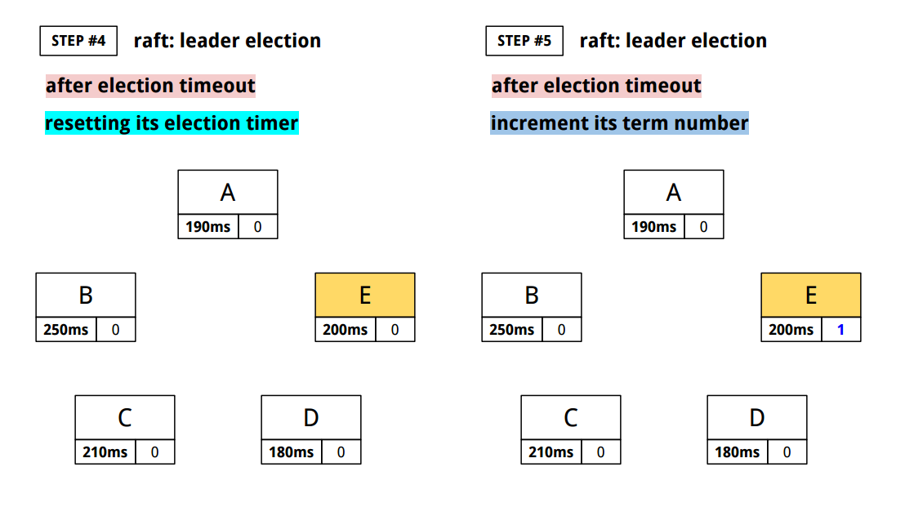


[↑ top](#distributed-systems-raft)
<br><br><br><br>
<hr>


#### raft algorithm: log replication

*Raft* inter-server communication is done by remote procedure calls
(RPCs). The basic Raft algorithm requires only two types of RPCs
(later `InstallSnapshot` RPC added):

- `RequestVote` RPCs, issued by `candidates` during elections.
- `AppendEntries` RPCs, issued by `leaders`:
  - **to replicate log entries**.
  - **to send out heartbeat messages**.

**Servers retry RPCs** *when they do not receive a response in time*,
and **send RPCs in parallel** *for best performance*.

<br>
Summary of
[§5.3 Log replication](http://ramcloud.stanford.edu/raft.pdf):

1. Once cluster has elected a leader, it starts receiving `client` requests.
2. Each `client` request contains a `command` to be run by replicated state
   machines.
3. The leader **only appends** `command` to its log, never overwriting nor
   deleting its log entries.
4. The leader **replicates** the *log entry* to its `followers` with
   `AppendEntries` RPCs. The leader keeps sending those RPCs until
   all followers eventually store all log entries. Each `AppendEntries` RPC
   contains leader's `term number`, its log entry index, its `leaderId`
5. A `log entry` is considered *safely replicated* when the leader has
   replicated it on the **quorum of its followers**.
6. Once `log entry` has been *safely replicated* on a majority of servers,
   it is considered **safe to be applied** to its state machine. And such `log
   entry` is *called* **committed**. Then **`leader`** **applies committed
   entry to its state machine**. `Applying committed entry to state machine`
   means *executing the command in the log entry*. Again, `leader` attempts to
   **replicate a log entry on the quorum of its followers**. Once they are
   replicated on the majority of its followers, it is **safely replicated**.
   Therefore it is **safe to be applied**. Then the `leader` **commits that
   log entry**. *Raft* guarantees that such entries are committed in a durable
   storage, and that they will eventually be applied *(executed)* by other
   available state machines. When a `log entry` is committed, it is safe to be
   applied. And for a `log entry` to be committed, it only needs to be stored
   on the quorum of cluster. This means each `command` can complete as soon as
   the majority of cluster has responded to a single round of `AppendEntries`
   RPCs. In other words, the `leader` does not need to wait for responses from
   every node.
7. Then the `leader` returns the execution result to the client.
8. Future `AppendEntries` RPCs from the `leader` has the highest index of
   `committed` log entry, so that `followers` could learn that a log entry is
   `committed`, and they can apply the entry to their local state machines as
   well. *Raft* ensures all committed entries are durable and eventually
   executed by all of available state machines.

<br>
Here's how log replication works:

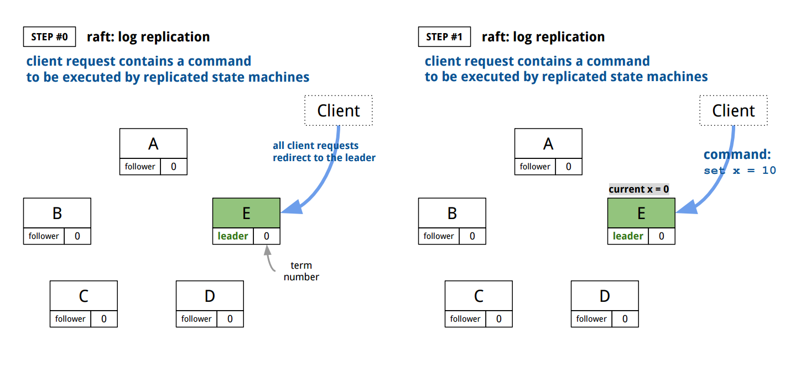
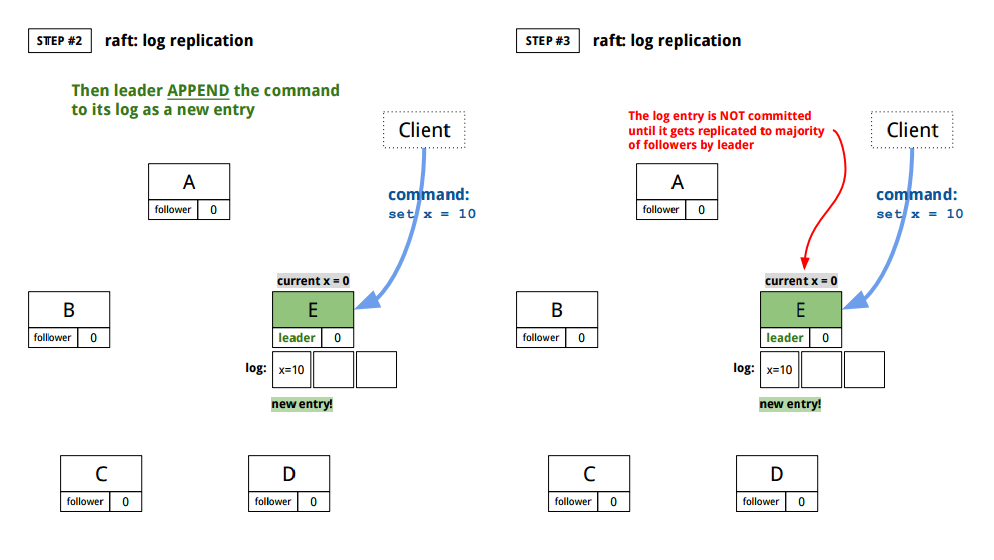
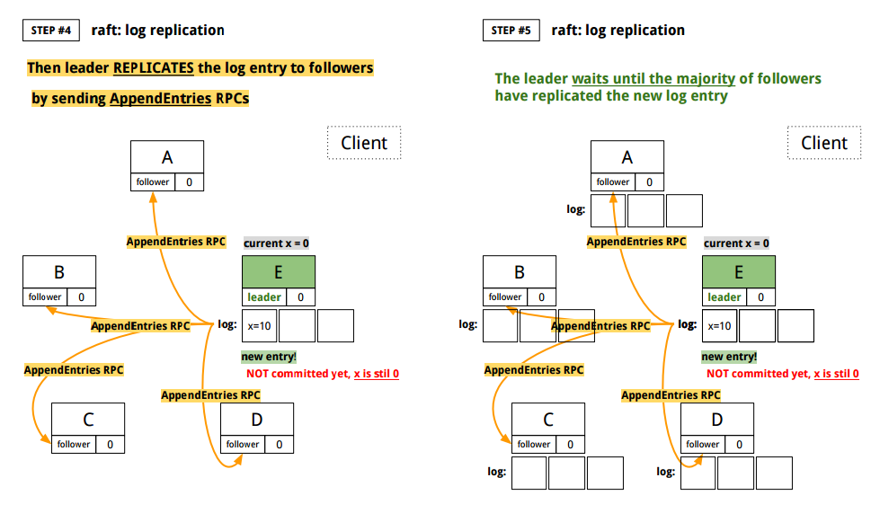
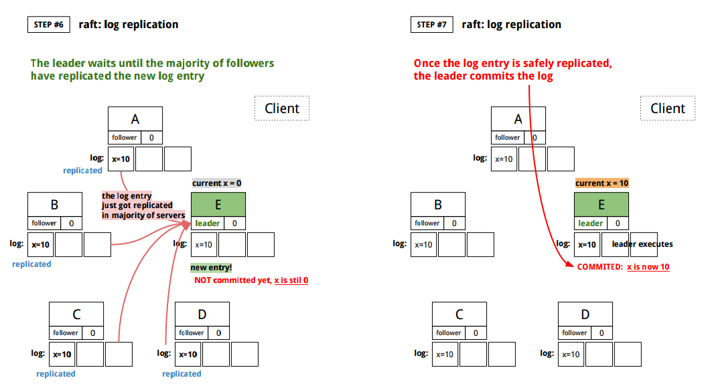
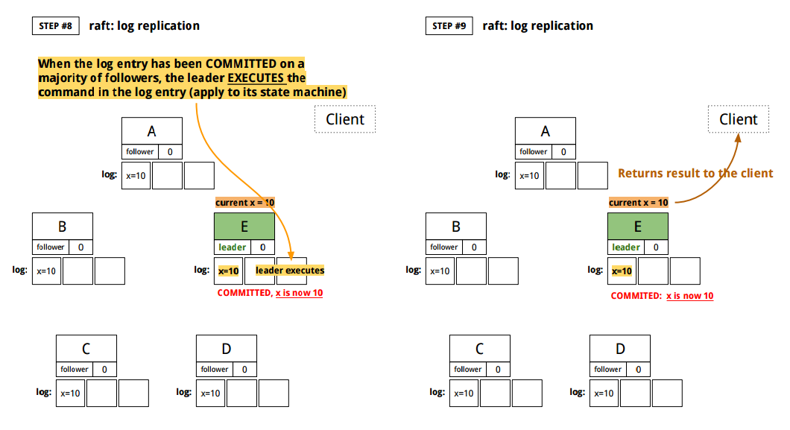
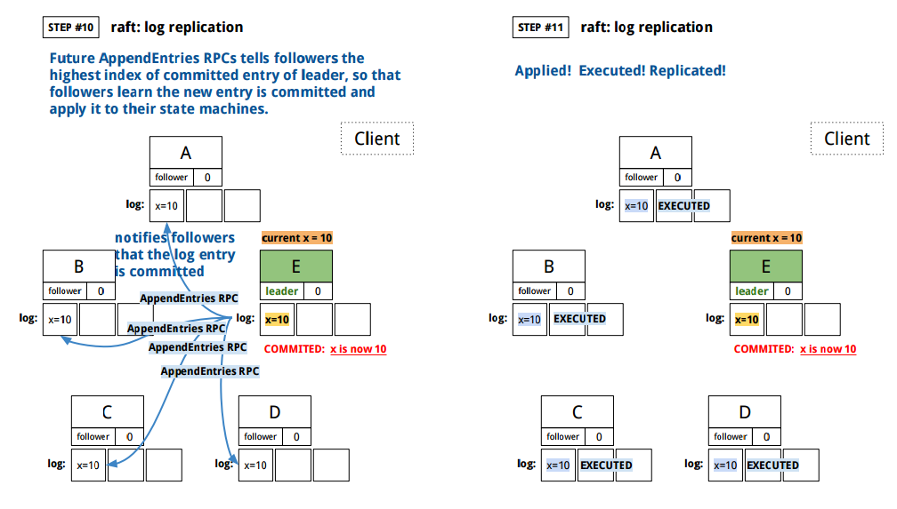

[↑ top](#distributed-systems-raft)
<br><br><br><br>
<hr>


#### raft algorithm: log consistency


<br>
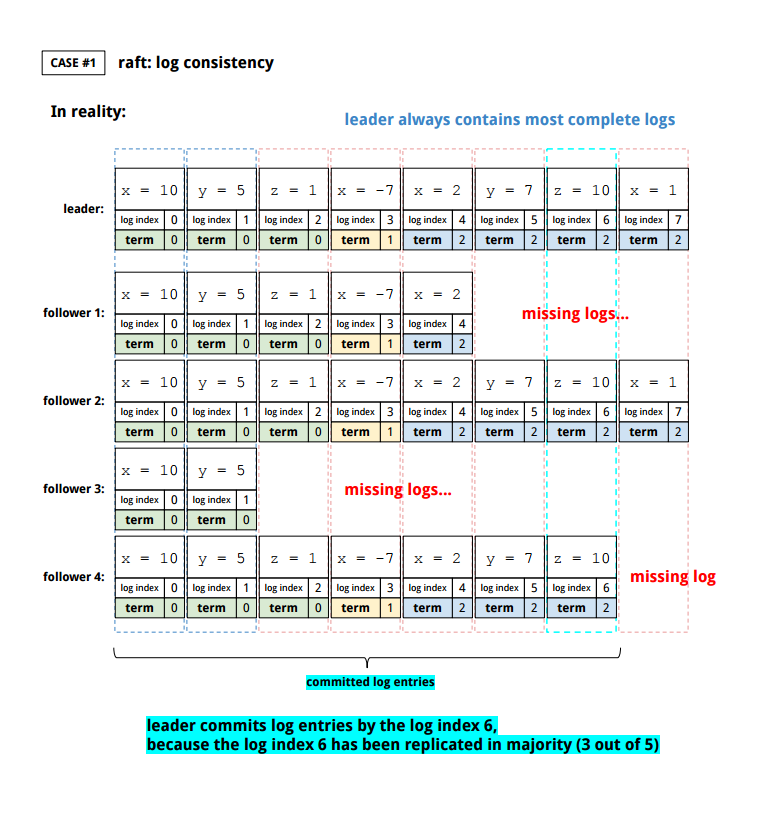
<br>


<br>
**Log Matching Property**:
- If two entries in different logs have the same `index` and `term`, then they
  store the same `command`. This is because `leader` creates maximum one entry
  per `index` for the given `term`, and log entries never change their position
  in the log.
- If two entries in different logs have the same `index` and `term`, then the
  `logs` are identical in all preceding entries. This is guaranteed by
  `AppendEntries` RPC that does consistency check: the RPC contains `index`
  and `term` that immediately precede new entries, and if `follower` does not
  find an entry in its log with the same `index` and `term`, then it refuses
  the new entries. As a result, whenever `AppendEntries` returns successfully,
  `leader` learns that the `follower`'s log is identical to `leader`'s.

<br>
Then what if `AppendEntries` RPC fails? It fails when **`follower` does not
have the entry at immediate-preceding `index` and `term`**. And the `leader`
keeps sending `AppendEntries` RPCs until all `followers` eventually contain all
log entries in order to maintain the log consistency.

<br>
Then how does `leader` achieve this by keep sending `AppendEntries` RPCs?
<br>

A `follower` may have extraneous entries. The `leader` checks the log with its
latest log entry that two logs agree. And it deletes logs after that point.
A `follower` may be missing some entries. In this case, `leader` keeps sending
`AppendEntries` RPCs until it finds the matching entry.


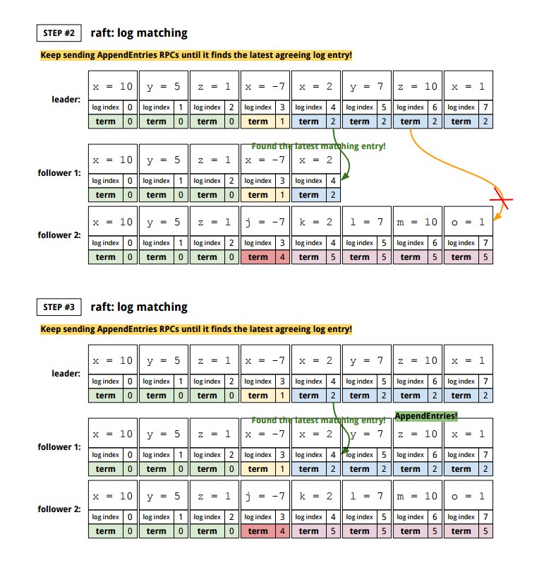
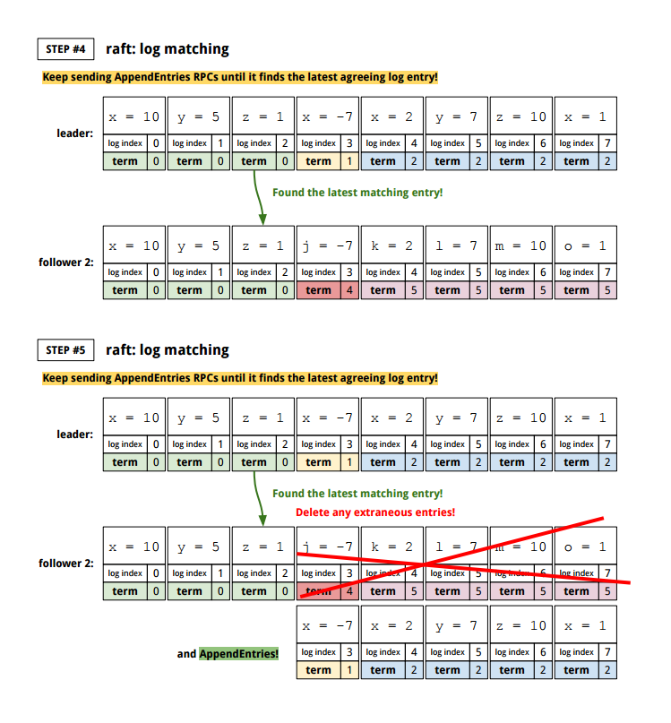

[↑ top](#distributed-systems-raft)
<br><br><br><br>
<hr>


 


#### raft algorithm: safety

Summary of
[§5.4 Safety](http://ramcloud.stanford.edu/raft.pdf):

<br>
*Raft* algorithm's **_safety_** is ensured when:

1. each state machine executes exactly the same commands in the same order.
2. a leader for any given term contains all of log entries committed
   in previous terms.

<br>
And to guarantee the safety requirement:

- A leader never overwrites nor deletes log entries.
- Only leader log entries can be committed.
- Entries must be committed before applying to a state machine.
- Elect the candidate with most complete log.

When committing entries from previous terms, `leader` overwrites
`followers` with logs to handle the conflict entries. `leader`
first *finds the latest `follower` log entry* that matches with
leader's entry. And *deletes any extraneous entries after that
index*, in `follower`'s log. This is done by `AppendEntries` RPC.

[↑ top](#distributed-systems-raft)
<br><br><br><br>
<hr>


#### raft algorithm: follower and candidate crashes

Summary of
[§5.5 Follower and candidate crashes](http://ramcloud.stanford.edu/raft.pdf):

> If a *follower or candidate crashes*, then future `RequestVote` and
> `AppendEntries` RPCs sent to it will fail. Raft handles these failures
> by **retrying indefinitely**; if the *crashed server restarts*, then
> the *RPC will complete successfully*. If a server crashes after
> completing an RPC but before responding, then it will receive the same RPC
> again after it restarts. **Raft RPCs are idempotent**, so this causes no
> harm. For example, if a follower receives an `AppendEntries` request
> that includes log entries already present in its log, it ignores those
> entries in the new request.
>
> [*§5.5 Follower and candidate crashes*](http://ramcloud.stanford.edu/raft.pdf)

[↑ top](#distributed-systems-raft)
<br><br><br><br>
<hr>


#### raft algorithm: client interaction

Summary of
[§8 Client interaction](http://ramcloud.stanford.edu/raft.pdf):

> If a client sends a request to a follower, it
> redirects to the current leader
>
> [*Raft paper §5.1*](http://ramcloud.stanford.edu/raft.pdf)

<br>
> In concurrent programming, an operation (or set of operations) is atomic,
> **linearizable**, indivisible or uninterruptible if it appears to the rest
> of the system to occur instantaneously. Atomicity is a guarantee of isolation
> from concurrent processes. Additionally, atomic operations commonly have a
> succeed-or-fail definition — they either successfully change the state of
> the system, or have no apparent effect.
>
> [*Linearizability*](https://en.wikipedia.org/wiki/Linearizability)
> *by Wikipedia*

<br>
Again, *clients send all requests to the Raft leader*. A client first connects
to a randomly chosen server. And if the server is not the leader, the server
will reject the requests from the client, and tell the client which server is
the most recent leader. `AppendEntries` RPCs to `followers` include `leader`'s
network address.

<br>
In *Raft*, each operation should appear to execute instantaneously, only once,
at some point between the call and response: **_linearizable semantics_**.
And changes in the cluster should appear in the same order to all of the
machines in the cluster. However, **if a leader crashes**, *client requests*
will **time out** and try again with randomly-chosen servers. If it were
after the leader had committed the log entry but before responding to
the client, the client tries the same command with the new leader:
*the command would get executed a second time*.

To prevent this, clients assign unique serial number to each command. Then the
state machine in a server stores the most recent serial number processes for
each client with the associated response. If the state machine finds a command
whose serial number has already been executed, it immediately returns the
response without re-executing the request the second time.

<br>
But still, *Raft* client does not need to know which machine is the `leader`.
Then how do we redirect clients to `leader`, which send requests to
`followers`? 

> Yes, a client can submit a write request to any machine in the cluster. What
> happens is the etcd machine you contact **creates a raft RPC** and **tags it
> with a unique id**. When the machine sees that unique id, tag come back as a
> raft log commit, then it returns a 200 OK to the client.
>
> [*Brandon
> Phillips*](https://groups.google.com/d/msg/coreos-user/et7-Lm0gQxo/jkeZPKo0uaEJ)

<br>
`TODO: find related code in etcd`

[↑ top](#distributed-systems-raft)
<br><br><br><br>
<hr>


#### raft algorithm: log compaction

Summary of
[§7 Log compaction](http://ramcloud.stanford.edu/raft.pdf):

Most critical case for performance is when a leader replicates log entries.
*Raft* algorithm minimizes the number of messages by requiring a single
round-trip request only to half of the cluster. *Raft* also has mechanism
to discard obsolete information accumulated in the log.

<br>
Since the system cannot handle infinitely growing logs, *Raft* uses `snapshot`
to save the state of the entire system on a stable storage, so that logs stored
up to the `snapshot` point can be discarded. Here's how `snapshot` works in
*Raft* log:


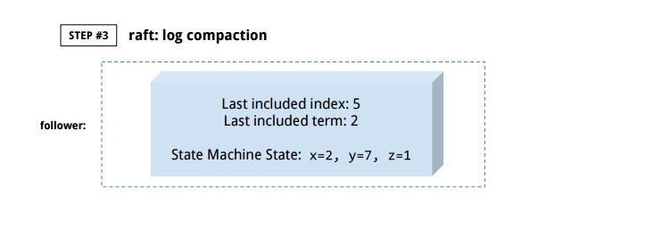

[↑ top](#distributed-systems-raft)
<br><br><br><br>
<hr>


#### **raft algorithm: summary**

Here's pseudo-code that summarizes *Raft* algorithm (*Raft Paper Figure 2*):

```go
// ServerState contains persistent, volatile states of
// all servers(follower, candidate, leader).
type ServerState struct {

	// Persistent state on all servers.
	// This should be updated on stable storage
	// before responding to RPCs.
	//
	// currentTerm is the latest term that server
	// has been in. A server begins with currentTerm 0,
	// and it increases monotonically
	currentTerm int
	//
	// votedFor is the candidateId that received vote
	// in current term, from this server.
	votedFor string
	//
	// logs is a list of log entries, of which contains
	// command for state machine, and the term when the
	// entry was received by a leader.
	logs []string

	// Volatile state on all servers.
	//
	// commitIndex is the index of the latest(or highest)
	// committed log entry. It starts with 0 and increases
	// monotonically.
	commitIndex int
	//
	// lastApplied is the index of the highest log entry
	// applied to state machine. It is the index of last
	// executed command. It starts with 0 and increases
	// monotonically.
	lastApplied int

	// Volatile state on leaders.
	// This must be reinitialized after election.
	//
	// serverToNextIndex maps serverID to the index of
	// next log entry to send to that server.
	// NextIndex gets initialized with the last leader
	// log index + 1.
	serverToNextIndex map[string]int
	//
	// serverToMatchIndex maps serverID to the index of
	// highest log entry that has been replicated on that server.
	// The MatchIndex begins with 0, increases monotonically.
	serverToMatchIndex map[string]int
}


// AppendEntries is invoked by a leader to:
//	- replicate log entries.
//	- send heartbeat messages.
//
//
// leaderTerm is the term number of the leader.
//
// leaderID is the serverID of the leader so that
// followers can redirect clients to the leader.
//
// prevLogIndex is the index of immediate preceding
// log entry (log entry before the new ones).
//
// prevLogTerm is the term number of prevLogIndex entry.
//
// entries contains log entries to store. It's empty for
// heartbeats. And it is a list so that a leader can be
// more efficient replicating log entries.
//
// leaderCommit is the leader's commitIndex.
//
// It returns the currentTerm and its success.
// Current terms are exchanged whenever servers
// communicate. It always updates its current term
// with a larger value, so that if a candidate or
// leader discovers that its term is out of date,
// it immediately reverts to follower state (§5.1).
//
// It returns true if the follower has the matching
// entry with the prevLogIndex and prevLogTerm.
//
func AppendEntries(
	targetServer      string,

	leaderTerm        int,
	leaderID          string,
	prevLogIndex      int,
	prevLogTerm       int,
	entries           []string,
	leaderCommitIndex int,
) (int, bool) {
	
	currentTerm := getCurrentTerm(targetServer)
	if leaderTerm < currentTerm {
		// so that the leader can update itself.
		// This means the leader is out of date.
		// The leader will revert back to a follower state.
		return currentTerm, false
	}

	logs := getLogs(targetServer)
	if v, exist := logs[prevLogIndex]; exist {
		if v['term'] != prevLogTerm {
			// An existing entry conflicts with a new entry.
			// The entry at prevLogIndex has a different term.
			// We need to delete the existing entry and
			// all the following entries.
			delete(logs, prevLogTerm)
			delete(logs, prevLogTerm + 1 ...)
		}
	} else {
		// the log entry with prevLogIndex
		// and prevLogTerm does not exist
		return currentTerm, false
	}

	// append any new entries that are not already in the log.
	for _, entry := range entries {
		if !findEntry(logs, entry) {
			logs = append(logs, entry)
		}
	}

	commitIndex := getCommitIndex(targetServer)
	if leaderCommitIndex > commitIndex {
		setCommitIndex(targetServer, min(leaderCommit, indexOfLastNewEntry))
	}

	return currentTerm, true
}

// RequestVote is invoked by candidates to gather votes.
//
// lastLogIndex is the index of candiate's last log entry.
// lastLogTerm is the term number of lastLogIndex.
//
// It returns currentTerm, and boolean value if the candidate
// has received vote or not.
//
func RequestVote(
	targetServer  string,

	candidateTerm int,
	candidateID   string,
	lastLogIndex  int,
	lastLogTerm   int,
) (int, bool) {

	currentTerm := getCurrentTerm(targetServer)
	if candidateTerm < currentTerm {
		return currentTerm, false
	}

	// votedFor is the candidateID that received vote
	// in the current term.
	votedFor := targetServer.vote()
	if votedFor == nil || votedFor == candidateID {
		// candidate's log is at least up-to-date
		// as receiver's log, so grant vote.
		return currentTerm, true
	}

	return currentTerm, false
}

func doServer(server *ServerState) {
	// All servers.
	if server.commitIndex > server.lastApplied {
		server.lastApplied++
		execute(server.logs[server.lastApplied])
	}
}

func candidate(server *ServerState) {
	// All servers.
	if server.commitIndex > server.lastApplied {
		server.lastApplied++
		execute(server.logs[server.lastApplied])
	}

	// on conversion to candidate
	server.currentTerm++
	
	// vote for itself
	vote(server)

	// reset election timer
	server.electionTimer.init()

	if SendRequestVote(allServers) > majority {
		becameLeader(server)
	}

	if electionTimeOut() {
		startNewElection()
	}
}

func becameLeader(server *ServerState) {
	// this needs to be sent periodically
	// while idle.
	SendHeartBeats(allServers)

	select {
	case entry := <-command:
		server.logs = append(server.logs, entry)
		execute(entry) // apply to state machine
		respond(entry.client)
	}

	for follower, nextIndex := range server.serverToNextIndex {
		if server.lastLogIndex >= nextIndex {
			AppendEntries(server.logs[nextIndex:])
		}
	}

	for index := range server.logs {
		if index > server.commitIndex {
			if server.logs[index].term == server.currentTerm {
				if majority of matchIndex[followers] >= index {
					server.commitIndex = index
				}					
			}
		}
	}
}

```


[↑ top](#distributed-systems-raft)
<br><br><br><br>
<hr>

