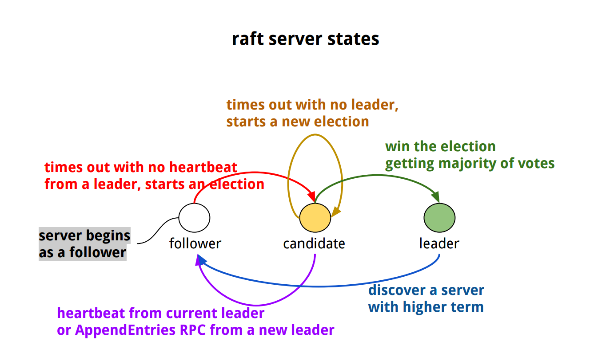
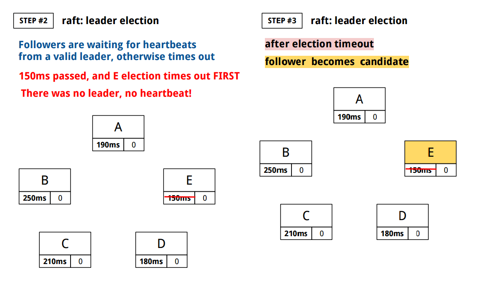
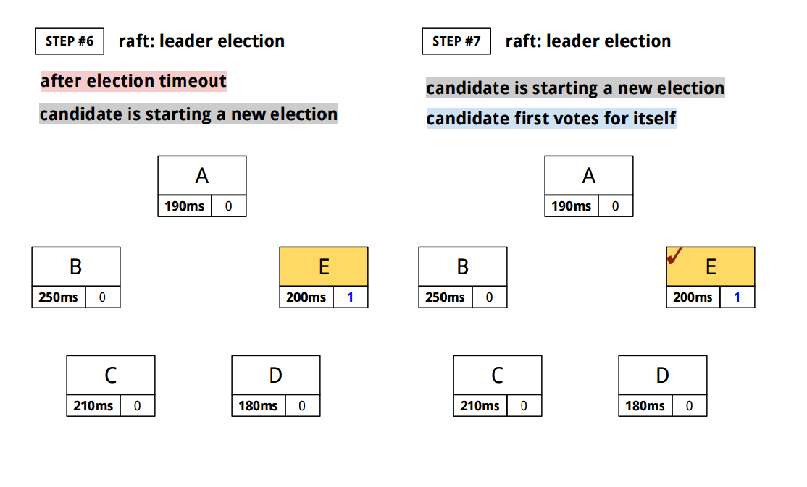
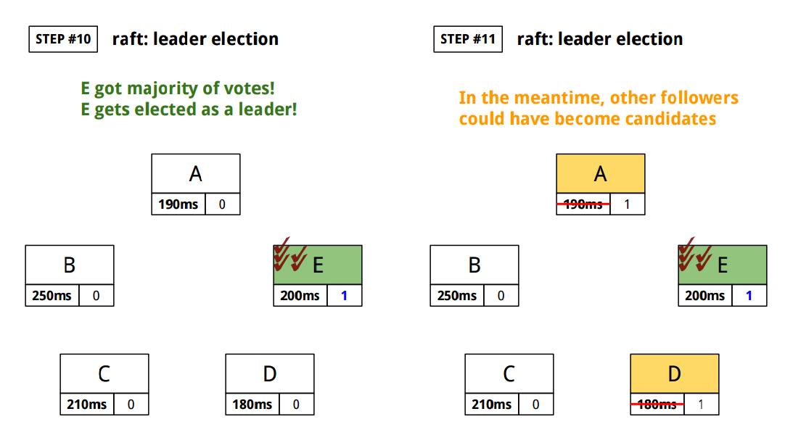
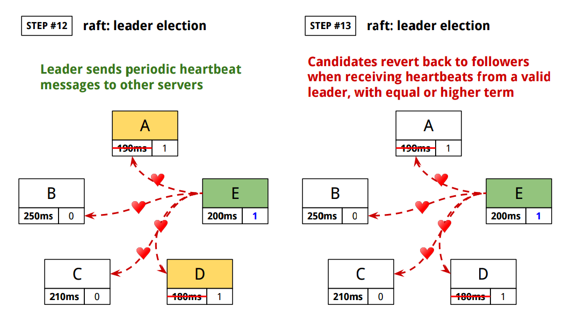
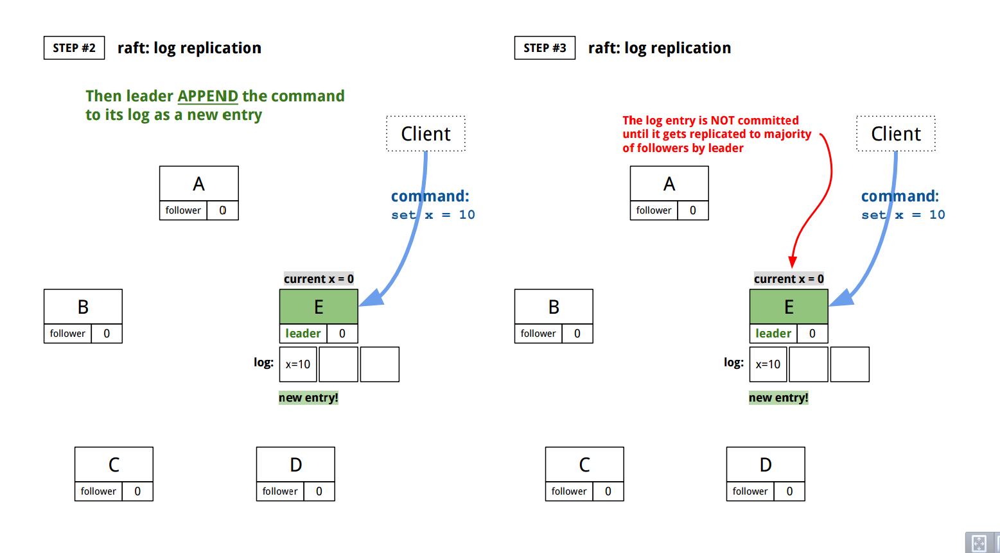
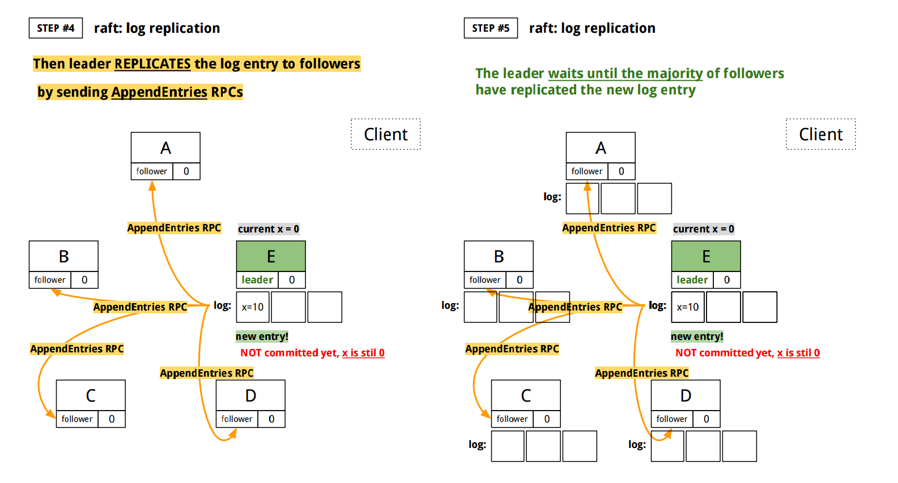
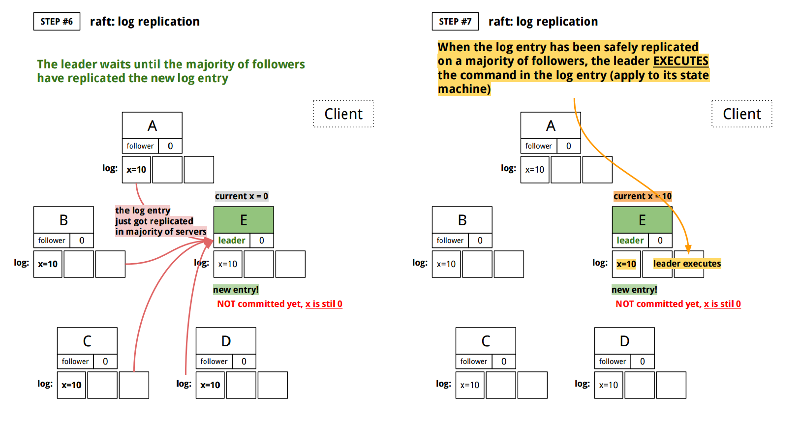
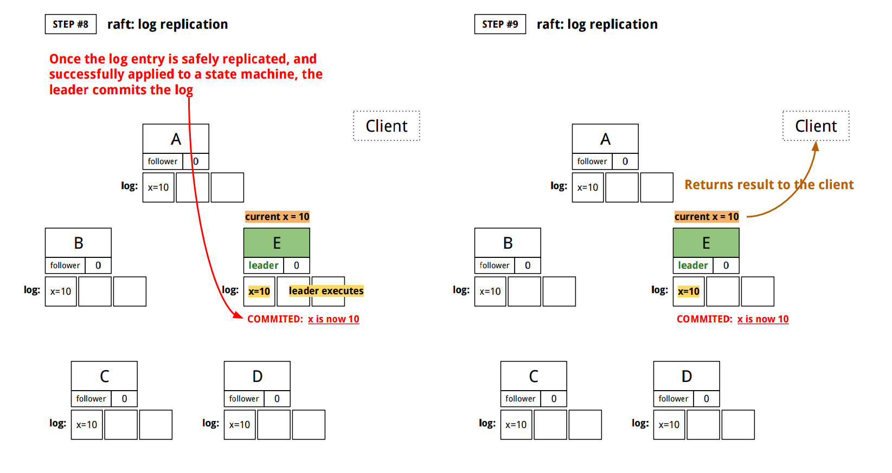
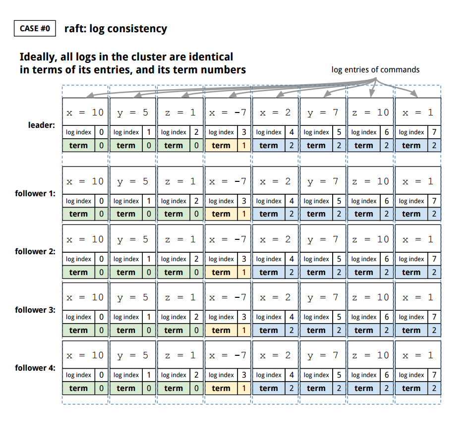

[*back to contents*](https://github.com/gyuho/learn#contents)
<br>

# etcd, raft algorithm


**Disclaimer**.

This is high-level overview of *raft algorithm* to understand the internals of
[`coreos/etcd`](https://github.com/coreos/etcd). You don't need know these
details to use `etcd`. And I may say things out of ignorance.
Please refer to [Reference](#reference) below.

<br>

- [Reference](#reference)
- [consensus algorithm](#consensus-algorithm)
- [raft algorithm: introduction](#raft-algorithm-introduction)
- [raft algorithm: terminology](#raft-algorithm-terminology)
- [raft algorithm: leader election](#raft-algorithm-leader-election)
- [raft algorithm: log replication](#raft-algorithm-log-replication)
- [raft algorithm: log consistency](#raft-algorithm-log-consistency)
- [raft algorithm: safety](#raft-algorithm-safety)
- [**raft algorithm: summary**](#raft-algorithm-summary)
- [`etcd` internals: RPC between machines](#etcd-internals-rpc-between-machines)
  - [**`raft`**](#raft)
  - [**`etcdserver`**](#etcdserver)

[↑ top](#etcd-raft-algorithm)
<br><br><br><br>
<hr>


#### Reference

- [The Raft Consensus Algorithm](https://raft.github.io/)
- [*Raft paper by Diego Ongaro and John Ousterhout*](http://ramcloud.stanford.edu/raft.pdf)
- [Consensus (computer science)](https://en.wikipedia.org/wiki/Consensus_(computer_science))
- [CAP theorem](https://en.wikipedia.org/wiki/CAP_theorem)
- [Raft (computer science)](https://en.wikipedia.org/wiki/Raft_(computer_science))
- [Raft lecture (Raft user study)](https://www.youtube.com/watch?v=YbZ3zDzDnrw)
- [coreos/etcd](https://github.com/coreos/etcd)
- [Raft Protocol Overview by Consul](https://www.consul.io/docs/internals/consensus.html)
- [Protocol Buffers](https://en.wikipedia.org/wiki/Protocol_Buffers)

[↑ top](#etcd-raft-algorithm)
<br><br><br><br>
<hr>


#### consensus algorithm

> A fundamental problem in **distributed computing** is to achieve overall **system
> reliability** in the presence of a number of *faulty processes*. This often
> requires processes to agree on some data value that is needed during
> computation. Examples of applications of **consensus** include **whether to commit
> a transaction to a database, agreeing on the identity of a leader, state
> machine replication, and atomic broadcasts.**
>
> [*Consensus*](https://en.wikipedia.org/wiki/Consensus_(computer_science))
> *by Wikipedia*

A process can fail either from a *crash failure* or [*Byzantine
failure*](https://en.wikipedia.org/wiki/Byzantine_failure):
- *crash failure* occurs when the process abruptly stops.
- *Byzantine failure* is the loss of the process presenting different symptoms
  to different observers (*Byzantine fault*).

*Byzantine failures* are far more disruptive because they affect
*agreement*, *consensus* services in distributed computing systems.
Ideally every process must agree on the same value. If a distributed system
loses one of its communications, it can result in data inconsistency.
A consensus algorithm must be resilient to these failures in order to
guarantee the correctness.

<br>
An ultimate **consensus algorithm** would achieve:
- **_consistency_**.
- **_availability_**.
- **_partition tolerance_**.

[CAP theorem](https://en.wikipedia.org/wiki/CAP_theorem) states that
it is impossible that a distributed computer system simultaneously satisfies
them all.

[↑ top](#etcd-raft-algorithm)
<br><br><br><br>
<hr>


#### raft algorithm: introduction

> **Raft is a consensus algorithm for managing a replicated
> log.** It produces a result equivalent to (multi-)Paxos, and
> it is as efficient as Paxos, but its structure is different
> from Paxos; this makes Raft more understandable than
> Paxos and also provides a better foundation for building
> practical systems.
>
> [*In Search of an Understandable Consensus
> Algorithm*](http://ramcloud.stanford.edu/raft.pdf)
> *by Diego Ongaro and John Ousterhout*

One way to make your program reliable is:
- execute the program in a collection of machines (distributed system).
- ensure that they all get executed exactly the same way (consistency).

This is the definition of **replicated state machine** in the paper.
A *state machine* can be any program or application that takes inputs
and returns outputs. **Replicated state machines** in a distributed system
**compute identical copies** of the same state, so that even if some servers
are down, other **state machines can keep running**. A **replicated state
machine** is usually **implemented by replicating logs identically across
the servers**. The goal of *Raft* algorithm is to **keep the replicated logs
consistent**.

[↑ top](#etcd-raft-algorithm)
<br><br><br><br>
<hr>


#### raft algorithm: terminology

- **`state machine`**: Any program or application that *takes input* and
  *returns output*.
- **`replicated state machines`**: State machines that are distributed on a
  collection of servers and compute identical copies of the same state.
  Even when some of the servers are down, other state machines can keep
  running. Typically **replicated state machines are implemented by
  replicating log entries identically on the collection of servers**.
- **`log`**: A log contains a list of commands, so that *state machines*
  can apply those log entries *when it is safe to do so*. A log entry is the
  primary work unit of *Raft algorithm*.
- **`log commit`**: A leader `commits` a log entry only after the leader has
  replicated the entry on a majority of servers in the cluster. Such log entry
  is considered safe to be applied to state machines. `Commit` also includes
  preceding entries, such as the ones from previous leaders. This is done by
  the leader keeping track of the highest index to commit.
- **`leader`**: *Raft algorithm* first elects a `leader` to handle
  client requests and replicate log entries to other servers(followers).
  Once logs are replicated, the leader tells when to apply log entries to
  their state machines. When a leader fails or gets disconnected from
  other servers, then the algorithm elects a new leader. In normal operation,
  there is **exactly only one leader**. A leader sends periodic heartbeat
  messages to other servers to maintain its authority.
- **`client`**: A client *requests* that **a leader append a new log entry**.
  Then the leader writes and replicates them to its followers. A client does
  **not need to know which machine is the leader**, sending write requests to
  any machine in the cluster. If a client sends a request to a follower, it
  redirects to the current leader (Raft paper §5.1). A leader sends out
  `AppendEntries` RPCs with its `leaderId` to other servers, so that a
  follower knows where to redirect client requests.
- **`follower`**: A follower is completely passive, issuing no RPCs and only
  responds to incoming RPCs from candidates and leaders. All servers start as
  followers. If a follower receives no communication(heartbeat), it becomes a
  candidate to start an election. 
- **`candidate`**: A candidate is used to elect a new leader. It's a server
  state between `follower` and `leader`. If a candidate receives votes from
  the majority of servers, it becomes the new `leader`.
- **`term`**: *Raft* divides time into `terms` of arbitrary duration, indexed
  with consecutive integers. Each term begins with an *election*. And if the
  election ends with no leader (split vote), it creates a new `term`. *Raft*
  ensures that each `term` has at most one leader in the given `term`. `Term`
  index is also used to detect obsolete information. Servers always sync with
  biggest `term` number(index), and any *server with stale `term`* number
  **reverts back to `follower` state**, and any requests from such servers
  are rejected.

[↑ top](#etcd-raft-algorithm)
<br><br><br><br>
<hr>


#### raft algorithm: leader election

*Raft* servers communicate through remote procedure calls (RPCs).
The basic Raft algorithm requires only two types of RPCs:

- `RequestVote` RPCs, issued by candidates during elections.
- `AppendEntries` RPCs, issued by leaders:
  - **to replicate log entries**.
  - **to send out heartbeat messages**.

<br>
This is the summary of
[§5.2 Leader election](http://ramcloud.stanford.edu/raft.pdf):

1. A server begins as a `follower` with a new `term`.
2. A `leader` sends periodic heartbeat messages to its followers in order to
   maintain its authority.
3. `Followers` wait for **randomized** `election timeout` until they receive
   heartbeats from a valid leader of equal or greater `term` number.
4. If **`election times out`** and `followers` receive no such communication
   from a leader, then it assumes there is no current leader in the cluster,
   and it begins a new `election` and the **`follower` becomes the
   `candidate`**, **incrementing its current `term` index(number)**,
   and **resetting its `election timer`**.
5. **`Candidate` first votes for itself** and **sends `RequestVote` RPCs**
   to other servers(followers). `RequestVote` RPC includes `candidate`'s log
   information so that a follower can deny its voting if the follower's log
   is more up-to-date than `candidate`'s. *Raft* compares log's index and
   `term` number to determine the up-to-date log.
6. Then the **`candiate`** either:
	- **_becomes the leader_** by *winning the election* when it gets **majority
	  of votes**. Then it must send out heartbeats to others
	  to establish itself as a leader.
	- **_reverts back to a follower_** when it receives a RPC from a **valid
	  leader**. A valid heartbeat message must have a `term` number that is
	  equal to or greater than `candidate`'s. RPCs with lower `term`
	  numbers are rejected. A leader **only appends to log**. Therefore,
	  future-leader will have the **most complete** log among electing
	  majority: a leader's log is the truth and a leader will eventually
	  make followers' logs identical to the leader's.
	- **_starts a new election and increments its current `term` number_**
	  **when votes are split with no winner** That is, its **`election
	  times out` receiving no heartbeat message from a valid leader, so
	  it retries**. *Raft* randomizes `election timeout` duration to avoid
	  split votes. It remains as a `candidate`.

<br>
And server states in *Raft*:




<br>
Here's how election works:









[↑ top](#etcd-raft-algorithm)
<br><br><br><br>
<hr>


#### raft algorithm: log replication

*Raft* servers communicate through remote procedure calls (RPCs).
The basic Raft algorithm requires only two types of RPCs:

- `RequestVote` RPCs, issued by candidates during elections.
- `AppendEntries` RPCs, issued by leaders:
  - **to replicate log entries**.
  - **to send out heartbeat messages**.

<br>
This is the summary of
[§5.3 Log replication](http://ramcloud.stanford.edu/raft.pdf).

<br>
Once the cluster has elected a leader, it starts receiving `client` requests.

1. A `client` request contains a command for replicated state machines.
2. The leader **appends** the command to its log as a **new entry**.
3. The leader **replicates** the *log entry* to its `followers`,
   with `AppendEntries` RPC. The leader keeps sending those RPCs until
   all followers eventually store all log entries. Each `AppendEntries` RPC
   contains `term` number of the leader, its log entry index, its `leaderId`.
4. When the log entry has been *safely replicated* on a majority of servers,
   the leader applies the entry to its state machine. What its means by
   `apply the entry to state machine` is *execute the command in the log
   entry*.
5. Once a log entry has been *safely replicated* and applied to the leader's
   state machine, the leader `commits` the log.
6. After the leader applies the log entry to its state machine (`committed`),
   it returns the execution result to the client and tell `followers` that
   the log entry is committed.

Note that **a leader only appends**, never overwriting nor deleting entries.

<br>
Here's how log replication works:







[↑ top](#etcd-raft-algorithm)
<br><br><br><br>
<hr>


#### raft algorithm: log consistency


<br>

<br>


[↑ top](#etcd-raft-algorithm)
<br><br><br><br>
<hr>


 


#### raft algorithm: safety

This is the summary of
[§5.4 Safety](http://ramcloud.stanford.edu/raft.pdf).

*Raft* algorithm's **_safety_** is ensured when:

1. each state machine executes exactly the same commands in the same order.
2. a leader for any given term contains all of log entries committed
   in previous terms.

<br>
And to guarantee the safety requirement:

- A leader never overwrites nor deletes log entries.
- Only leader log entries can be committed.
- Entries must be committed before applying to a state machine.
- Elect the candidate with most complete log.

In order to commit entries from previous terms, a leader
overwrites followers' log to handle the conflict entries.
Leader first *finds the latest log entry* matching with leader's entry,
and then *deletes follower's extraneous entries after that index*.
This is done by `AppendEntries` RPC.

[↑ top](#etcd-raft-algorithm)
<br><br><br><br>
<hr> 


#### **raft algorithm: summary**

Here's pseudo-code that summarizes *Raft* algorithm:

```go
// ServerState contains persistent, volatile states of
// all servers(follower, candidate, leader).
type ServerState struct {

	// Persistent state on all servers.
	// This should be updated on stable storage
	// before responding to RPCs.
	//
	// currentTerm is the latest term that server
	// has been in. A server begins with currentTerm 0,
	// and it increases monotonically
	currentTerm int
	//
	// votedFor is the candidateId that received vote
	// in current term, from this server.
	votedFor string
	//
	// logs is a list of log entries, of which contains
	// command for state machine, and the term when the
	// entry was received by a leader.
	logs []string

	// Volatile state on all servers.
	//
	// commitIndex is the index of the latest(or highest)
	// committed log entry. It starts with 0 and increases
	// monotonically.
	commitIndex int
	//
	// lastApplied is the index of the highest log entry
	// applied to state machine. It is the index of last
	// executed command. It starts with 0 and increases
	// monotonically.
	lastApplied int

	// Volatile state on leaders.
	// This must be reinitialized after election.
	//
	// serverToNextIndex maps serverID to the index of
	// next log entry to send to that server.
	// NextIndex gets initialized with the last leader
	// log index + 1.
	serverToNextIndex map[string]int
	//
	// serverToMatchIndex maps serverID to the index of
	// highest log entry that has been replicated on that server.
	// The MatchIndex begins with 0, increases monotonically.
	serverToMatchIndex map[string]int
}


// AppendEntries is invoked by a leader to:
//	- replicate log entries.
//	- send heartbeat messages.
//
//
// leaderTerm is the term number of the leader.
//
// leaderID is the serverID of the leader so that
// followers can redirect clients to the leader.
//
// prevLogIndex is the index of immediate preceding
// log entry (log entry before the new ones).
//
// prevLogTerm is the term number of prevLogIndex entry.
//
// entries contains log entries to store. It's empty for
// heartbeats. And it is a list so that a leader can be
// more efficient replicating log entries.
//
// leaderCommit is the leader's commitIndex.
//
// It returns the currentTerm and its success.
// Current terms are exchanged whenever servers
// communicate. It always updates its current term
// with a larger value, so that if a candidate or
// leader discovers that its term is out of date,
// it immediately reverts to follower state (§5.1).
//
// It returns true if the follower has the matching
// entry with the prevLogIndex and prevLogTerm.
//
func AppendEntries(
	targetServer      string,

	leaderTerm        int,
	leaderID          string,
	prevLogIndex      int,
	prevLogTerm       int,
	entries           []string,
	leaderCommitIndex int,
) (int, bool) {
	
	currentTerm := getCurrentTerm(targetServer)
	if leaderTerm < currentTerm {
		// so that the leader can update itself.
		// This means the leader is out of date.
		// The leader will revert back to a follower state.
		return currentTerm, false
	}

	logs := getLogs(targetServer)
	if v, exist := logs[prevLogIndex]; exist {
		if v['term'] != prevLogTerm {
			// An existing entry conflicts with a new entry.
			// The entry at prevLogIndex has a different term.
			// We need to delete the existing entry and
			// all the following entries.
			delete(logs, prevLogTerm)
			delete(logs, prevLogTerm + 1 ...)
		}
	} else {
		// the log entry with prevLogIndex
		// and prevLogTerm does not exist
		return currentTerm, false
	}

	// append any new entries that are not already in the log.
	for _, entry := range entries {
		if !findEntry(logs, entry) {
			logs = append(logs, entry)
		}
	}

	commitIndex := getCommitIndex(targetServer)
	if leaderCommitIndex > commitIndex {
		setCommitIndex(targetServer, min(leaderCommit, indexOfLastNewEntry))
	}

	return currentTerm, true
}

// RequestVote is invoked by candidates to gather votes.
//
// lastLogIndex is the index of candiate's last log entry.
// lastLogTerm is the term number of lastLogIndex.
//
// It returns currentTerm, and boolean value if the candidate
// has received vote or not.
//
func RequestVote(
	targetServer  string,

	candidateTerm int,
	candidateID   string,
	lastLogIndex  int,
	lastLogTerm   int,
) (int, bool) {

	currentTerm := getCurrentTerm(targetServer)
	if candidateTerm < currentTerm {
		return currentTerm, false
	}

	// votedFor is the candidateID that received vote
	// in the current term.
	votedFor := targetServer.vote()
	if votedFor == nil || votedFor == candidateID {
		// candidate's log is at least up-to-date
		// as receiver's log, so grant vote.
		return currentTerm, true
	}

	return currentTerm, false
}

func doServer(server *ServerState) {
	// All servers.
	if server.commitIndex > server.lastApplied {
		server.lastApplied++
		execute(server.logs[server.lastApplied])
	}
}

func candidate(server *ServerState) {
	// All servers.
	if server.commitIndex > server.lastApplied {
		server.lastApplied++
		execute(server.logs[server.lastApplied])
	}

	// on conversion to candidate
	server.currentTerm++
	
	// vote for itself
	vote(server)

	// reset election timer
	server.electionTimer.init()

	if SendRequestVote(allServers) > majority {
		becameLeader(server)
	}

	if electionTimeOut() {
		startNewElection()
	}
}

func becameLeader(server *ServerState) {
	// this needs to be sent periodically
	// while idle.
	SendHeartBeats(allServers)

	select {
	case entry := <-command:
		server.logs = append(server.logs, entry)
		execute(entry) // apply to state machine
		respond(entry.client)
	}

	for follower, nextIndex := range server.serverToNextIndex {
		if server.lastLogIndex >= nextIndex {
			AppendEntries(server.logs[nextIndex:])
		}
	}

	for index := range server.logs {
		if index > server.commitIndex {
			if server.logs[index].term == server.currentTerm {
				if majority of matchIndex[followers] >= index {
					server.commitIndex = index
				}					
			}
		}
	}
}

```


[↑ top](#etcd-raft-algorithm)
<br><br><br><br>
<hr>


#### `etcd` internals: RPC between machines

*Raft* servers communicate through remote procedure calls (RPCs).
The basic Raft algorithm requires only two types of RPCs:

- `RequestVote` RPCs, issued by candidates during elections.
- `AppendEntries` RPCs, issued by leaders:
  - **to replicate log entries**.
  - **to send out heartbeat messages**.

<br>
`etcd` uses [`Protocol Buffers`](https://developers.google.com/protocol-buffers/docs/overview?hl=en)
for inter-machine communication of structured data. Below are some of
the related, core packages:

- [**`raft`**](http://godoc.org/github.com/coreos/etcd/raft):
  implements the raft consensus algorithm.
- [`raft/raftpb`](http://godoc.org/github.com/coreos/etcd/raft/raftpb):
  [auto-generated](https://github.com/coreos/etcd/blob/master/raft/raftpb/raft.pb.go#L1-L3)
  by protocol buffer compiler. It defines `MessageType`, `Entry`,
  `Message`, `State`, and other structured data required for *Raft* algorithm.
- [`rafthttp`](http://godoc.org/github.com/coreos/etcd/rafthttp):
  implements `http` operations in *Raft*.
- [**`etcdserver`**](http://godoc.org/github.com/coreos/etcd/etcdserver):
  connects servers in the cluster, using `HTTP`. It defines `Cluster`
  interface with methods: `ID` to return the cluster ID, `ClientURLs` to
  return the list of all clients URLs, `Members` to return the slice of
  members, etc. It also defines `Server` interface: `Start` to start a `etcd`
  server(*cluster*), `Stop` to stop the server, `ID` to return the ID of the
  server, `Leader` to return the server ID of leader, `Do` to handle the
  server requests, `Process` to take the raft message and apply it to the
  server's state machine (execute the command in log entry), `AddMember` to add
  a member into the cluster, `RemoveMember` to remove a member from the
  cluster, `UpdateMember` to update an existing member in the cluster.
- [`etcdserver/etcdhttp`](http://godoc.org/github.com/coreos/etcd/etcdserver/etcdhttp):
  implements `etcdserver` endpoints with muxed handlers.
- [`etcdserver/etcdserverpb`](http://godoc.org/github.com/coreos/etcd/etcdserver/etcdserverpb):
  auto-generated by protocol buffer compiler. It defines `Request` types used
  in `etcdserver` package.
- [`discovery`](http://godoc.org/github.com/coreos/etcd/discovery):
  implements cluster discovery.
- [**`client`**](http://godoc.org/github.com/coreos/etcd/client): is the official
  *Go* `etcd` client.


[↑ top](#etcd-raft-algorithm)
<br><br><br><br>
<hr>


##### **`raft`**

Package `raft` implements the raft consensus algorithm.
And package `etcdserver` imports `raft` and `raftpb` package
to create and run `etcd` clusters:

- https://github.com/coreos/etcd/blob/master/etcdserver/server.go
- https://github.com/coreos/etcd/blob/master/etcdserver/raft.go
- https://github.com/coreos/etcd/blob/master/etcdserver/storage.go


<br>
Here's how `raft` and `raftpb` are **used** in `etcdserver`:

- [`Server`](https://godoc.org/github.com/coreos/etcd/etcdserver#Server)
  interface requires `Process` method to take `raftpb.Message` and
  to apply(execute) the message to its state machine. `Server` interface in
  `etcdserver` package is satisfied by type
  [`EtcdServer`](https://godoc.org/github.com/coreos/etcd/etcdserver#EtcdServer).
- `raftNode` struct embeds `raft.Node` interface that represents a node in a
  cluster. `raftNode` also embeds `raft.MemoryStorage` to store data
  in-memory.
- `raftNode` has `applyc chan apply` as a channel to do `apply` (execute
  commands in log entry). And `apply` is defined as a struct that contains
  a slice of `raftpb.Entry` which contains `Type`, `Term`, `Index`, `Data`.
  `apply` struct also contains `snapshot raftpb.SnapShot`, which represents
  current state of the system, with member `conf_state`, `index`, `term`.

<br>
First, it's helpful to look at
[`raft/raftpb/raft.proto`](https://github.com/coreos/etcd/blob/master/raft/raftpb/raft.proto)
because it defines structured data format used in *Raft* RPCs.

<br>
Here's how `raft` gets implemented. First, to define the server state:

```go
// Possible values for StateType.
const (
	StateFollower StateType = iota
	StateCandidate
	StateLeader
)

// StateType represents the role of a node in a cluster.
type StateType uint64

```

<br>
`Config` struct contains the configuration of a *Raft* node.

```go
type Config struct {
	ID             uint64     // non-zero ID of a raft node.
	peers          []uint64   // slice of all node IDs, including the node itself.

    ElectionTick   int        // election timeout, must be greater than
	                          // HeartbeatTick

	HearbeatTick   int        // heartbeat interval

	Storage Storage  // storage for a raft node.

	Applied         uint64   // the index of last applied entry.
	MaxSizePerMsg   uint64   // maximum size of each appending message.
	MaxInflightMsgs int      // maximum number of in-flight append-waiting
	                         // messages. TCP/UDP has its own buffer but useful
	                         // for avoid overflowing.

    Logger Logger
}

```

Please look at https://godoc.org/github.com/coreos/etcd/raft#Config for full
comments. And here's the definition of `Storage` in the `Config`:

```go
// Storage is an interface that may be implemented by the application
// to retrieve log entries from storage.
//
// If any Storage method returns an error, the raft instance will
// become inoperable and refuse to participate in elections; the
// application is responsible for cleanup and recovery in this case.
type Storage interface {
	// InitialState returns the saved HardState and ConfState information.
	InitialState() (pb.HardState, pb.ConfState, error)
	
	// Entries returns a slice of log entries in the range [lo,hi).
	// MaxSize limits the total size of the log entries returned, but
	// Entries returns at least one entry if any.
	Entries(lo, hi, maxSize uint64) ([]pb.Entry, error)
	
	// Term returns the term of entry i, which must be in the range
	// [FirstIndex()-1, LastIndex()]. The term of the entry before
	// FirstIndex is retained for matching purposes even though the
	// rest of that entry may not be available.
	Term(i uint64) (uint64, error)
	
	// LastIndex returns the index of the last entry in the log.
	LastIndex() (uint64, error)
	
	// FirstIndex returns the index of the first log entry that is
	// possibly available via Entries (older entries have been incorporated
	// into the latest Snapshot; if storage only contains the dummy entry the
	// first log entry is not available).
	FirstIndex() (uint64, error)

	// Snapshot returns the most recent snapshot.
	Snapshot() (pb.Snapshot, error)
}

```

So
[`raft/storage.go`](https://github.com/coreos/etcd/blob/master/raft/storage.go)
defines `Storage` interface, and package `raft` defines `MemoryStorage` type
that satisfies `Storage` interface by implementing methods in `Storage`
method.

<br>
[`raft/node.go`](https://github.com/coreos/etcd/blob/master/raft/node.go)
defines [`Node`](https://godoc.org/github.com/coreos/etcd/raft#Node)
interface, as below:

```go
type Node interface {
    // Tick increments the internal logical clock for the Node by a single tick. Election
    // timeouts and heartbeat timeouts are in units of ticks.
    Tick()

    // Campaign causes the Node to transition to candidate state and start campaigning to become leader.
    Campaign(ctx context.Context) error

    // Propose proposes that data be appended to the log.
    Propose(ctx context.Context, data []byte) error

    // ProposeConfChange proposes config change.
    // At most one ConfChange can be in the process of going through consensus.
    // Application needs to call ApplyConfChange when applying EntryConfChange type entry.
    ProposeConfChange(ctx context.Context, cc pb.ConfChange) error

    // Step advances the state machine using the given message. ctx.Err() will be returned, if any.
    Step(ctx context.Context, msg pb.Message) error

    // Ready returns a channel that returns the current point-in-time state
    // Users of the Node must call Advance after applying the state returned by Ready
    Ready() <-chan Ready

    // Advance notifies the Node that the application has applied and saved progress up to the last Ready.
    // It prepares the node to return the next available Ready.
    Advance()

    // ApplyConfChange applies config change to the local node.
    // Returns an opaque ConfState protobuf which must be recorded
    // in snapshots. Will never return nil; it returns a pointer only
    // to match MemoryStorage.Compact.
    ApplyConfChange(cc pb.ConfChange) *pb.ConfState

    // Status returns the current status of the raft state machine.
    Status() Status

    // Report reports the given node is not reachable for the last send.
    ReportUnreachable(id uint64)

    // ReportSnapshot reports the stutus of the sent snapshot.
    ReportSnapshot(id uint64, status SnapshotStatus)

    // Stop performs any necessary termination of the Node
    Stop()
}

```

Then what types satisfy this `Node` interface?
[`raft/node.go`](https://github.com/coreos/etcd/blob/master/raft/node.go)
has internal type `node` that satisfies `Node` interface.

```go
// node is the canonical implementation of the Node interface
type node struct {
	propc      chan pb.Message
	recvc      chan pb.Message
	confc      chan pb.ConfChange
	confstatec chan pb.ConfState
	readyc     chan Ready
	advancec   chan struct{}
	tickc      chan struct{}
	done       chan struct{}
	stop       chan struct{}
	status     chan chan Status
}

func newNode() node {
	return node{
		propc:      make(chan pb.Message),
		recvc:      make(chan pb.Message),
		confc:      make(chan pb.ConfChange),
		confstatec: make(chan pb.ConfState),
		readyc:     make(chan Ready),
		advancec:   make(chan struct{}),
		tickc:      make(chan struct{}),
		done:       make(chan struct{}),
		stop:       make(chan struct{}),
		status:     make(chan chan Status),
	}
}

```

By doing this, the type `node` is implicitly exported
as an interface type `Node`. And other packages use `Node`
with methods implemented in `node` type. For example:

```go
func StartNode(c *Config, peers []Peer) Node {
	...
	n := newNode()
	go n.run(r)
	return &n
}

```

Please check out
[this](https://github.com/gyuho/learn/tree/master/doc/go_interface#implicitly-exporting-interface)
for more detailed explanation of Go `interface` behavior.

Most operations in *Raft* is based on `raft.Node`, and states and data are
stored through `raft.MemoryStorage`. For the full source code and
documentation, please go to
[godoc.org/github.com/coreos/etcd/raft](http://godoc.org/github.com/coreos/etcd/raft).

[↑ top](#etcd-raft-algorithm)
<br><br><br><br>
<hr>


##### **`etcdserver`**

Package `etcdserver` defines interfaces for `etcd` cluster and servers.
Let's look at the actual code.

<br>
[`etcdserver/raft.go`](https://github.com/coreos/etcd/blob/master/etcdserver/raft.go)
imports package
[`raft`](http://godoc.org/github.com/coreos/etcd/raft)
and [`raft/raftpb`](http://godoc.org/github.com/coreos/etcd/raft/raftpb).

<br>
[`etcdserver/member.go`](https://github.com/coreos/etcd/blob/master/etcdserver/member.go)
implements `Member` as a member in a cluster. `Member` contains attributes of
peers and clients.

```go
// RaftAttributes represents the raft related attributes of an etcd member.
type RaftAttributes struct {
	PeerURLs []string `json:"peerURLs"`
}

// Attributes represents all the non-raft related attributes of an etcd member.
type Attributes struct {
	Name       string   `json:"name,omitempty"`
	ClientURLs []string `json:"clientURLs,omitempty"`
}

type Member struct {
	ID types.ID `json:"id"`
	RaftAttributes
	Attributes
}

```


<br>
[`etcdserver/cluster.go`](https://github.com/coreos/etcd/blob/master/etcdserver/cluster.go)
defines `Cluster` interface:

```go
type Cluster interface {
	// ID returns the cluster ID
	ID() types.ID

	// ClientURLs returns an aggregate set of all URLs on which this
	// cluster is listening for client requests
	ClientURLs() []string

	// Members returns a slice of members sorted by their ID
	Members() []*Member

	// Member retrieves a particular member based on ID, or nil if the
	// member does not exist in the cluster
	Member(id types.ID) *Member

	// IsIDRemoved checks whether the given ID has been removed from this
	// cluster at some point in the past
	IsIDRemoved(id types.ID) bool

	// ClusterVersion is the cluster-wide minimum major.minor version.
	Version() *semver.Version
}

```

And it has internal type `cluster` to satisfy this interface:

```go
type cluster struct {
	id    types.ID
	token string
	store store.Store

	sync.Mutex // guards the fields below
	version    *semver.Version
	members    map[types.ID]*Member
	// removed contains the ids of removed members in the cluster.
	// removed id cannot be reused.
	removed map[types.ID]bool
}

```

You can add, remove, update members in a cluster.


<br>
[`etcdserver/server.go`](https://github.com/coreos/etcd/blob/master/etcdserver/server.go)
defines `Server` interface:

```go
type Server interface {
	// Start performs any initialization of the Server necessary for it to
	// begin serving requests. It must be called before Do or Process.
	// Start must be non-blocking; any long-running server functionality
	// should be implemented in goroutines.
	Start()

	// Stop terminates the Server and performs any necessary finalization.
	// Do and Process cannot be called after Stop has been invoked.
	Stop()

	// ID returns the ID of the Server.
	ID() types.ID

	// Leader returns the ID of the leader Server.
	Leader() types.ID

	// Do takes a request and attempts to fulfill it, returning a Response.
	Do(ctx context.Context, r pb.Request) (Response, error)

	// Process takes a raft message and applies it to the server's raft state
	// machine, respecting any timeout of the given context.
	Process(ctx context.Context, m raftpb.Message) error

	// AddMember attempts to add a member into the cluster. It will return
	// ErrIDRemoved if member ID is removed from the cluster, or return
	// ErrIDExists if member ID exists in the cluster.
	AddMember(ctx context.Context, memb Member) error

	// RemoveMember attempts to remove a member from the cluster. It will
	// return ErrIDRemoved if member ID is removed from the cluster, or return
	// ErrIDNotFound if member ID is not in the cluster.
	RemoveMember(ctx context.Context, id uint64) error

	// UpdateMember attempts to update a existing member in the cluster. It will
	// return ErrIDNotFound if the member ID does not exist.
	UpdateMember(ctx context.Context, updateMemb Member) error

	ClusterVersion() *semver.Version
}

```

And `EtcdServer` type satisfies the `Server` interface:

```go
// EtcdServer is the production implementation of the Server interface
type EtcdServer struct {
	// r must be the first element to keep 64-bit alignment for atomic
	// access to fields
	r raftNode

	cfg       *ServerConfig
	snapCount uint64

	w          wait.Wait
	stop       chan struct{}
	done       chan struct{}
	errorc     chan error
	id         types.ID
	attributes Attributes

	cluster *cluster

	store store.Store
	kv    dstorage.KV

	stats  *stats.ServerStats
	lstats *stats.LeaderStats

	SyncTicker <-chan time.Time

	reqIDGen *idutil.Generator

	// forceVersionC is used to force the version monitor loop
	// to detect the cluster version immediately.
	forceVersionC chan struct{}
}

```

[↑ top](#etcd-raft-algorithm)
<br><br><br><br>
<hr>
