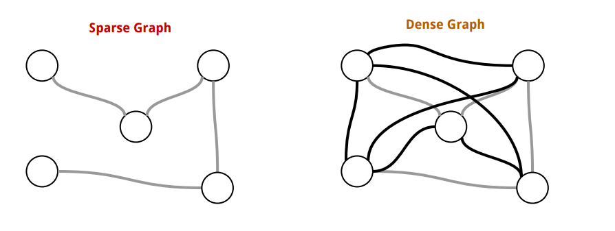
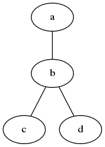
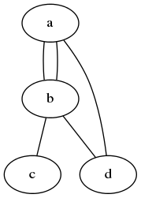
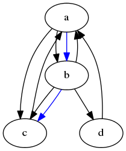
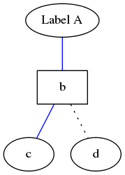
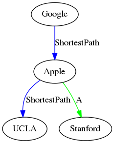

[*back to contents*](https://github.com/gyuho/learn#contents)<br>

# Go: graph, interface

- [Reference](#reference)
- [graph](#graph)
- [graph visualization with DOT](#graph-visualization-with-dot)

[↑ top](#go-graph-interface)
<br><br><br><br><hr>


#### Reference

- [Graph theory](https://en.wikipedia.org/wiki/Graph_theory)
- [Introduction to Graphs and Their Data Structures](https://www.topcoder.com/community/data-science/data-science-tutorials/introduction-to-graphs-and-their-data-structures-section-1/)
- [**My YouTube turorial Tree, Graph Theory Algorithms**](https://www.youtube.com/playlist?list=PLT6aABhFfinvsSn1H195JLuHaXNS6UVhf)
- [Graph Contraction II: Connectivity and MSTs](http://www.cs.cmu.edu/afs/cs/academic/class/15210-s12/www/lectures/lecture18.pdf)
- [Graph traversal](https://en.wikipedia.org/wiki/Graph_traversal)
- [**github.com/gyuho/goraph**](https://github.com/gyuho/goraph)

[↑ top](#go-graph-interface)
<br><br><br><br><hr>


#### graph

Graph is a fundamental data structure in computer science, widely used
in network and database systems. Let a graph be
`G = (V, E)`, where `V` is vertex(node) and `E` is edge between
vertices(nodes). `|V|` is the number of nodes in `G`, also called *order*
or *size* of a graph. `|E|` is the number of edges.


<br>
- `G` is [**sparse**](http://stackoverflow.com/questions/12599143/what-is-the-distinction-between-sparse-and-dense-graphs)
  when `|E|` is close to the minimum `|E|`.
- `G` is [**dense**](https://en.wikipedia.org/wiki/Dense_graph)
  when `|E|` is close to the maximum `|E|`.



<br>
Tree is also a graph. `G` is a **tree** iff:
- `|E| = |V| - 1`.
- `G` is acyclic.
- `G` is connected.
- Adding any `E` creates a cycle in `G`.
- `G` has only one path between a pair of vertices.

<br>
Graphs can be represented in many different ways:
- [**Adjacency list**](https://en.wikipedia.org/wiki/Adjacency_list),
  with a list of vertices, where each describes its neighboring vertices.
  **Adjacency list** is good for *sparse graphs* with fast iteration.
- [**Adjacency matrix**](https://en.wikipedia.org/wiki/Adjacency_matrix),
  to represent `G` in a `|V| x |V|` matrix.
  **Adjacency matrix** is good for *dense graphs* with fast lookup.


<br>
[My initial implementation](https://github.com/gyuho/goraph/pull/49)
used Go `struct`:

```go
type Graph struct {
	sync.Mutex

	// NodeMap is a hash-map for all Nodes in the graph.
	NodeMap map[*Node]bool

	// maintain nodeID in order not to have duplicate Node IDs in the graph.
	nodeID map[string]bool
}


// Node is a Node(node) in Graph.
type Node struct {

	// ID of Node is assumed to be unique among Nodes.
	ID string

	// Color is used for graph traversal.
	Color string

	sync.Mutex

	// WeightTo maps its Node to outgoing Nodes with its edge weight (outgoing edges from its Node).
	WeightTo map[*Node]float32

	// WeightFrom maps its Node to incoming Nodes with its edge weight (incoming edges to its Node).
	WeightFrom map[*Node]float32
}


// Edge connects from Src to Dst with weight.
type Edge struct {
	Src    *Node
	Dst    *Node
	Weight float32
}

```

<br>
There's nothing wrong about using `struct`, especially when you already
know types of data you would use. But it's not as generic as package
[`container/heap`](http://golang.org/pkg/container/heap/).
I want `interface` in order to allow any Go data types as long as they
satisfies my `interface`s. First, we need to define what methods we need
for graph operations. For example, `container/heap` interface:

```go
type Interface interface {
	sort.Interface
	Push(x interface{}) // add x as element Len()
	Pop() interface{}   // remove and return element Len() - 1.
}
```

<br>
`interface` might not be a good idea, but let's see how it goes:

**Graph**:
- Get all vertices in a graph.
- Find if a vertex exists in a graph or not.
- Add a vertex to a graph.
- Delete a vertex from a graph.
- Add an edge between two vertices.
- Replace an edge between two vertices.
- Delete an edge between two vertices.
- Get the weight value between vertices.
- Get the parent vertices of an argument vertex.
- Get the child vertices of an argument vertex.

<br>
And here's Go implementation of graphs:

```go
package main

import (
	"bytes"
	"encoding/json"
	"fmt"
	"io"
	"os"
	"sync"
)

func main() {
	f, err := os.Open("graph.json")
	if err != nil {
		panic(err)
	}
	defer f.Close()
	g, err := NewDefaultGraphFromJSON(f, "graph_00")
	if err != nil {
		panic(err)
	}
	fmt.Println(g.String())
	/*
		B -- 18.000 --> E
		B -- 14.000 --> S
		B -- 5.000 --> A
		B -- 30.000 --> D
		C -- 24.000 --> E
		C -- 9.000 --> S
		T -- 16.000 --> D
		T -- 6.000 --> F
		T -- 19.000 --> E
		T -- 44.000 --> A
		D -- 20.000 --> A
		D -- 30.000 --> B
		D -- 2.000 --> E
		D -- 11.000 --> F
		D -- 16.000 --> T
		F -- 11.000 --> D
		F -- 6.000 --> E
		F -- 6.000 --> T
		E -- 19.000 --> T
		E -- 18.000 --> B
		E -- 24.000 --> C
		E -- 2.000 --> D
		E -- 6.000 --> F
		A -- 15.000 --> S
		A -- 5.000 --> B
		A -- 20.000 --> D
		A -- 44.000 --> T
		S -- 100.000 --> A
		S -- 14.000 --> B
		S -- 200.000 --> C
	*/
}

// Graph describes the methods of graph operations.
// It assumes that the identifier of a Vertex is string and unique.
// And weight values is float64.
type Graph interface {
	// Init initializes a Graph.
	Init()

	// GetVertices returns a map from vertex ID to
	// empty struct value. Graph does not allow duplicate
	// vertex ID.
	GetVertices() map[string]struct{}

	// FindVertex returns true if the vertex already
	// exists in the graph.
	FindVertex(vtx string) bool

	// AddVertex adds a vertex to a graph, and returns false
	// if the vertex already existed in the graph.
	AddVertex(vtx string) bool

	// DeleteVertex deletes a vertex from a graph.
	// It returns true if it got deleted.
	// And false if it didn't get deleted.
	DeleteVertex(vtx string) bool

	// AddEdge adds an edge from vtx1 to vtx2 with the weight.
	AddEdge(vtx1, vtx2 string, weight float64) error

	// ReplaceEdge replaces an edge from vtx1 to vtx2 with the weight.
	ReplaceEdge(vtx1, vtx2 string, weight float64) error

	// DeleteEdge deletes an edge from vtx1 to vtx2.
	DeleteEdge(vtx1, vtx2 string) error

	// GetWeight returns the weight from vtx1 to vtx2.
	GetWeight(vtx1, vtx2 string) (float64, error)

	// GetParents returns the map of parent vertices.
	// (Vertices that come towards the argument vertex.)
	GetParents(vtx string) (map[string]struct{}, error)

	// GetChildren returns the map of child vertices.
	// (Vertices that go out of the argument vertex.)
	GetChildren(vtx string) (map[string]struct{}, error)

	// String describes the Graph.
	String() string
}

// defaultGraph is an internal default graph type that
// implements all methods in Graph interface.
type defaultGraph struct {
	mu sync.Mutex // guards the following

	// Vertices stores all vertices.
	Vertices map[string]struct{}

	// VertexToChildren maps a Vertex identifer to children with edge weights.
	VertexToChildren map[string]map[string]float64

	// VertexToParents maps a Vertex identifer to parents with edge weights.
	VertexToParents map[string]map[string]float64
}

// newDefaultGraph returns a new defaultGraph.
func newDefaultGraph() *defaultGraph {
	return &defaultGraph{
		Vertices:         make(map[string]struct{}),
		VertexToChildren: make(map[string]map[string]float64),
		VertexToParents:  make(map[string]map[string]float64),
		//
		// without this
		// panic: assignment to entry in nil map
	}
}

// NewDefaultGraph returns a new defaultGraph.
func NewDefaultGraph() Graph {
	return newDefaultGraph()
}

// newDefaultGraphFromJSON creates a graph Data from JSON.
// Here's the sample JSON data:
//
//	{
//	    "graph_00": {
//	        "S": {
//	            "A": 100,
//	            "B": 14,
//	            "C": 200
//	        },
//	        "A": {
//	            "S": 15,
//	            "B": 5,
//	            "D": 20,
//	            "T": 44
//	        },
//	        "B": {
//	            "S": 14,
//	            "A": 5,
//	            "D": 30,
//	            "E": 18
//	        },
//	        "C": {
//	            "S": 9,
//	            "E": 24
//	        },
//	        "D": {
//	            "A": 20,
//	            "B": 30,
//	            "E": 2,
//	            "F": 11,
//	            "T": 16
//	        },
//	        "E": {
//	            "B": 18,
//	            "C": 24,
//	            "D": 2,
//	            "F": 6,
//	            "T": 19
//	        },
//	        "F": {
//	            "D": 11,
//	            "E": 6,
//	            "T": 6
//	        },
//	        "T": {
//	            "A": 44,
//	            "D": 16,
//	            "F": 6,
//	            "E": 19
//	        }
//	    },
//	}
//
func newDefaultGraphFromJSON(rd io.Reader, graphID string) (*defaultGraph, error) {
	js := make(map[string]map[string]map[string]float64)
	dec := json.NewDecoder(rd)
	for {
		if err := dec.Decode(&js); err == io.EOF {
			break
		} else if err != nil {
			return nil, err
		}
	}
	if _, ok := js[graphID]; !ok {
		return nil, fmt.Errorf("%s does not exist", graphID)
	}
	gmap := js[graphID]
	g := newDefaultGraph()
	for vtx1, mm := range gmap {
		if !g.FindVertex(vtx1) {
			g.AddVertex(vtx1)
		}
		for vtx2, weight := range mm {
			if !g.FindVertex(vtx2) {
				g.AddVertex(vtx2)
			}
			g.ReplaceEdge(vtx1, vtx2, weight)
		}
	}
	return g, nil
}

// NewDefaultGraphFromJSON returns a new defaultGraph from a JSON file.
func NewDefaultGraphFromJSON(rd io.Reader, graphID string) (Graph, error) {
	return newDefaultGraphFromJSON(rd, graphID)
}

func (g *defaultGraph) Init() {
	// (X) g = newDefaultGraph()
	// this only updates the pointer
	//
	*g = *newDefaultGraph()
}

func (g *defaultGraph) GetVertices() map[string]struct{} {
	g.mu.Lock()
	defer g.mu.Unlock()
	return g.Vertices
}

func (g *defaultGraph) FindVertex(vtx string) bool {
	g.mu.Lock()
	defer g.mu.Unlock()
	if _, ok := g.Vertices[vtx]; !ok {
		return false
	}
	return true
}

func (g *defaultGraph) AddVertex(vtx string) bool {
	g.mu.Lock()
	defer g.mu.Unlock()
	if _, ok := g.Vertices[vtx]; !ok {
		g.Vertices[vtx] = struct{}{}
		return true
	}
	return false
}

func (g *defaultGraph) DeleteVertex(vtx string) bool {
	g.mu.Lock()
	defer g.mu.Unlock()
	if _, ok := g.Vertices[vtx]; !ok {
		return false
	} else {
		delete(g.Vertices, vtx)
	}
	if _, ok := g.VertexToChildren[vtx]; ok {
		delete(g.VertexToChildren, vtx)
	}
	for _, smap := range g.VertexToChildren {
		if _, ok := smap[vtx]; ok {
			delete(smap, vtx)
		}
	}
	if _, ok := g.VertexToParents[vtx]; ok {
		delete(g.VertexToParents, vtx)
	}
	for _, smap := range g.VertexToParents {
		if _, ok := smap[vtx]; ok {
			delete(smap, vtx)
		}
	}
	return true
}

func (g *defaultGraph) AddEdge(vtx1, vtx2 string, weight float64) error {
	g.mu.Lock()
	defer g.mu.Unlock()
	if _, ok := g.Vertices[vtx1]; !ok {
		return fmt.Errorf("%s does not exist in the graph.", vtx1)
	}
	if _, ok := g.Vertices[vtx2]; !ok {
		return fmt.Errorf("%s does not exist in the graph.", vtx2)
	}
	if _, ok := g.VertexToChildren[vtx1]; ok {
		if v, ok2 := g.VertexToChildren[vtx1][vtx2]; ok2 {
			g.VertexToChildren[vtx1][vtx2] = v + weight
		} else {
			g.VertexToChildren[vtx1][vtx2] = weight
		}
	} else {
		tmap := make(map[string]float64)
		tmap[vtx2] = weight
		g.VertexToChildren[vtx1] = tmap
	}
	if _, ok := g.VertexToParents[vtx2]; ok {
		if v, ok2 := g.VertexToParents[vtx2][vtx1]; ok2 {
			g.VertexToParents[vtx2][vtx1] = v + weight
		} else {
			g.VertexToParents[vtx2][vtx1] = weight
		}
	} else {
		tmap := make(map[string]float64)
		tmap[vtx1] = weight
		g.VertexToParents[vtx2] = tmap
	}
	return nil
}

func (g *defaultGraph) ReplaceEdge(vtx1, vtx2 string, weight float64) error {
	g.mu.Lock()
	defer g.mu.Unlock()
	if _, ok := g.Vertices[vtx1]; !ok {
		return fmt.Errorf("%s does not exist in the graph.", vtx1)
	}
	if _, ok := g.Vertices[vtx2]; !ok {
		return fmt.Errorf("%s does not exist in the graph.", vtx2)
	}
	if _, ok := g.VertexToChildren[vtx1]; ok {
		g.VertexToChildren[vtx1][vtx2] = weight
	} else {
		tmap := make(map[string]float64)
		tmap[vtx2] = weight
		g.VertexToChildren[vtx1] = tmap
	}
	if _, ok := g.VertexToParents[vtx2]; ok {
		g.VertexToParents[vtx2][vtx1] = weight
	} else {
		tmap := make(map[string]float64)
		tmap[vtx1] = weight
		g.VertexToParents[vtx2] = tmap
	}
	return nil
}

func (g *defaultGraph) DeleteEdge(vtx1, vtx2 string) error {
	g.mu.Lock()
	defer g.mu.Unlock()
	if _, ok := g.Vertices[vtx1]; !ok {
		return fmt.Errorf("%s does not exist in the graph.", vtx1)
	}
	if _, ok := g.Vertices[vtx2]; !ok {
		return fmt.Errorf("%s does not exist in the graph.", vtx2)
	}
	if _, ok := g.VertexToChildren[vtx1]; ok {
		if _, ok := g.VertexToChildren[vtx1][vtx2]; ok {
			delete(g.VertexToChildren[vtx1], vtx2)
		}
	}
	if _, ok := g.VertexToParents[vtx2]; ok {
		if _, ok := g.VertexToParents[vtx2][vtx1]; ok {
			delete(g.VertexToParents[vtx2], vtx1)
		}
	}
	return nil
}

func (g *defaultGraph) GetWeight(vtx1, vtx2 string) (float64, error) {
	g.mu.Lock()
	defer g.mu.Unlock()
	if _, ok := g.Vertices[vtx1]; !ok {
		return 0.0, fmt.Errorf("%s does not exist in the graph.", vtx1)
	}
	if _, ok := g.Vertices[vtx2]; !ok {
		return 0.0, fmt.Errorf("%s does not exist in the graph.", vtx2)
	}
	if _, ok := g.VertexToChildren[vtx1]; ok {
		if v, ok := g.VertexToChildren[vtx1][vtx2]; ok {
			return v, nil
		}
	}
	return 0.0, fmt.Errorf("there is not edge from %s to %s", vtx1, vtx2)
}

func (g *defaultGraph) GetParents(vtx string) (map[string]struct{}, error) {
	g.mu.Lock()
	defer g.mu.Unlock()
	if _, ok := g.Vertices[vtx]; !ok {
		return nil, fmt.Errorf("%s does not exist in the graph.", vtx)
	}
	rs := make(map[string]struct{})
	if _, ok := g.VertexToParents[vtx]; ok {
		for k := range g.VertexToParents[vtx] {
			rs[k] = struct{}{}
		}
	}
	return rs, nil
}

func (g *defaultGraph) GetChildren(vtx string) (map[string]struct{}, error) {
	g.mu.Lock()
	defer g.mu.Unlock()
	if _, ok := g.Vertices[vtx]; !ok {
		return nil, fmt.Errorf("%s does not exist in the graph.", vtx)
	}
	rs := make(map[string]struct{})
	if _, ok := g.VertexToChildren[vtx]; ok {
		for k := range g.VertexToChildren[vtx] {
			rs[k] = struct{}{}
		}
	}
	return rs, nil
}

func (g *defaultGraph) String() string {
	buf := new(bytes.Buffer)
	for vtx1 := range g.Vertices {
		cmap, _ := g.GetChildren(vtx1)
		for vtx2 := range cmap {
			weight, _ := g.GetWeight(vtx1, vtx2)
			fmt.Fprintf(buf, "%s -- %.3f --> %s\n", vtx1, weight, vtx2)
		}
	}
	return buf.String()
}

```

[↑ top](#go-graph-interface)
<br><br><br><br><hr>


#### graph visualization with DOT

`DOT` is a graph description language for [Graphviz](http://www.graphviz.org).
It is a simple way of describing graphs that both humans and computer
programs can use. `DOT` files typically have `.gv` (or `.dot`) extensions.

<br>
`sudo apt-get -y install graphviz` and save this file:

```go
// The graph name and the semicolons are optional
graph MyGraph {
	a -- b -- c;
	b -- d;
}

```

<br>
And compile:

```
dot -Tpng sample.dot -o sample.png;
dot -Tpdf sample.dot -o sample.pdf;
``` 

<br>
Output:



<br>
<br>
Here's are more examples:

<br>
###### undirected graph

```go
// The graph name and the semicolons are optional
graph graphname {
	a -- b -- c;
	b -- a;
	d -- a;
	b -- d;
}

```



<br>
###### directed graph

```go
digraph graphname {
	a -> b -> c;
	a -> b -> c [color=blue];
	b -> a;
	b -> d;
	d -> a;
	c -> a -> c;
}

```



<br>
<br>
###### attributes

```go
graph graphname {
	// The label attribute can be used to change the label of a node
	a [label="Label A"];

	// Here, the node shape is changed.
	b [shape=box];

	// These edges both have different line properties
	// Set line color as blue
	a -- b -- c [color=blue];

	// Set line style as dotted
	b -- d [style=dotted];
}

```



<br>
<br>
###### label

```go
digraph graphname {
	a [label="Google"]
	b [label="Apple"]
	c [label="UCLA"]
	d [label="Stanford"]
	a -> b [label=50, color=blue];
	b -> c [label=-10, color=red];
	b -> d [label="A", color=green];
}

```


<br>
<br>

```go
digraph graphname {
	Google -> Apple [label=50, color=blue];
	Apple -> UCLA [label=-10, color=red];
	Apple -> Stanford [label="A", color=green];
}

```


<br>
<br>

```go
digraph graphname {
	Google -> Apple -> UCLA [label=ShortestPath, color=blue];
	Apple -> Stanford [label="A", color=green];
}

```



[↑ top](#go-graph-interface)
<br><br><br><br><hr>
