[*back to contents*](https://github.com/gyuho/learn#contents)
<br>

# Go: graph, strongly connected components

- [Reference](#reference)
- [Strongly Connected Components: Tarjan](#strongly-connected-components-tarjan)

[↑ top](#go-graph-strongly-connected-components)
<br><br><br><br>
<hr>


#### Reference

- [Strongly connected component](http://en.wikipedia.org/wiki/Strongly_connected_component)
- [Tarjan's strongly connected components algorithm](http://en.wikipedia.org/wiki/Tarjan%27s_strongly_connected_components_algorithm)
- [**github.com/gyuho/goraph**](https://github.com/gyuho/goraph)

[↑ top](#go-graph-strongly-connected-components)
<br><br><br><br>
<hr>


#### Strongly Connected Components: Tarjan

> In the mathematical theory of directed graphs, a graph is
> said to be **strongly connected** if **every vertex** is **reachable**
> from **every other vertex**.
>
> [*Strongly connected component*](http://en.wikipedia.org/wiki/Strongly_connected_component)
> *by Wikipedia*

<br>

> Tarjan's Algorithm is an algorithm in graph theory for finding
> the strongly connected components of a graph. Although proposed
> earlier, it can be seen as an improved version of Kosaraju's algorithm,
> and is comparable in efficiency to the path-based strong component
> algorithm. Tarjan's Algorithm is named for its discoverer, Robert Tarjan.
>
> [*Tarjan's strongly connected components algorithm*](https://en.wikipedia.org/wiki/Tarjan%27s_strongly_connected_components_algorithm)
> *by Wikipedia*

```
 0. Tarjan(G):
 1.
 2. 	globalIndex = 0 // smallest unused index
 3. 	let S be a stack
 4. 	result = [][]
 5.
 6. 	for each vertex v in G:
 7. 		if v.index is undefined:
 8. 			tarjan(G, v, globalIndex, S, result)
 9.
10. 	return result
11.
12.
13. tarjan(G, v, globalIndex, S, result):
14.
15. 	v.index = globalIndex
16. 	v.lowLink = globalIndex
17. 	globalIndex++
18. 	S.push(v)
19.
20. 	for each child vertex w of v:
21.
22. 		if w.index is undefined:
23. 			recursively tarjan(G, w, globalIndex, S, result)
24. 			v.lowLink = min(v.lowLink, w.lowLink)
25.
26. 		else if w is in S:
27. 			v.lowLink = min(v.lowLink, w.index)
28.
29. 	// if v is the root
30. 	if v.lowLink == v.index:
31.
32. 		// start a new strongly connected component
33. 		component = []
34.
35. 		while True:
36.
37. 			u = S.pop()
38. 			component.push(u)
39.
40. 			if u == v:
41. 				result.push(component)
42. 				break
```

<br>
Here's how it works:

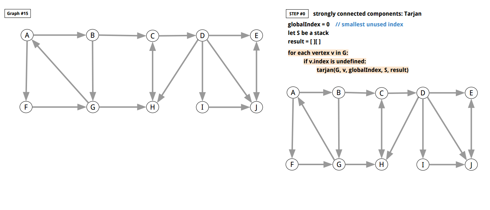
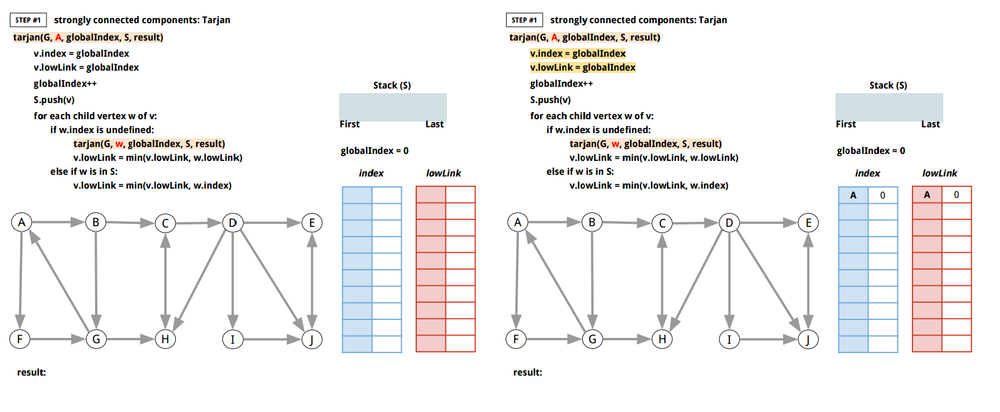
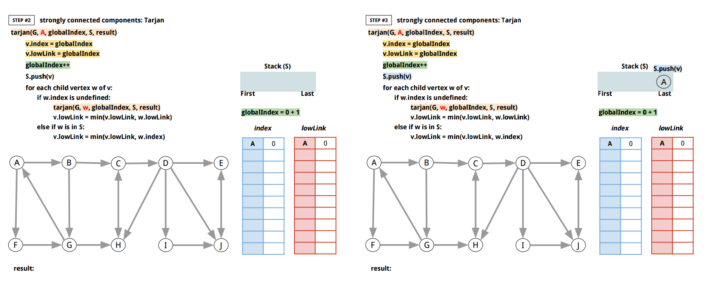
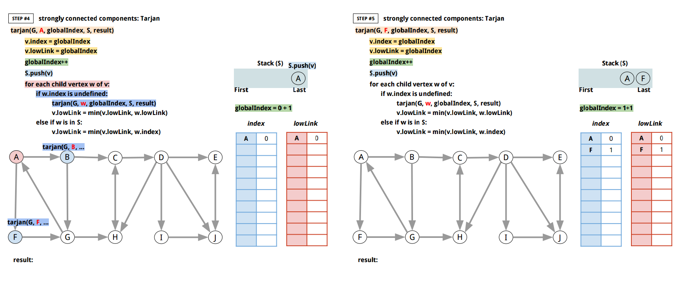
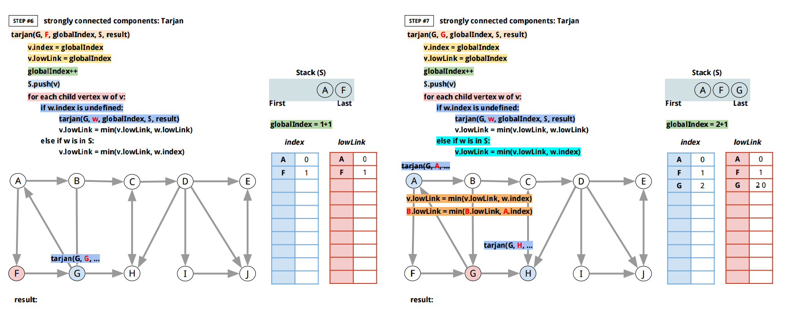
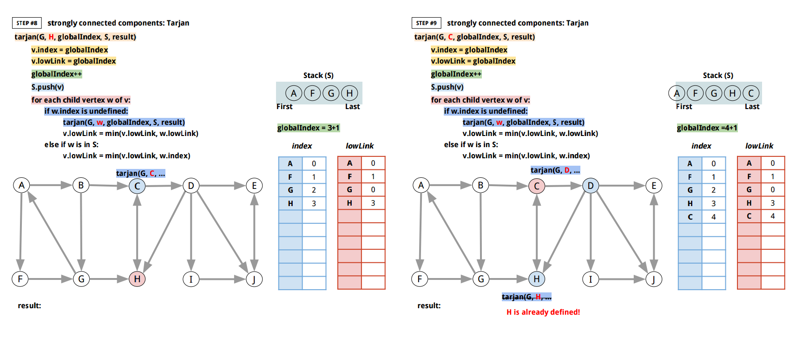
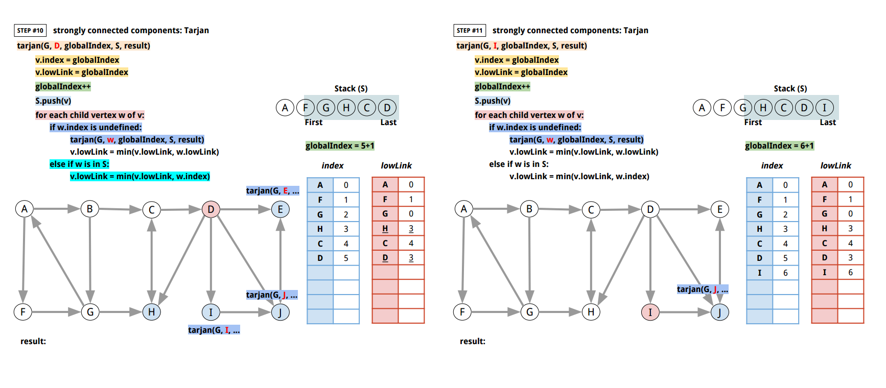
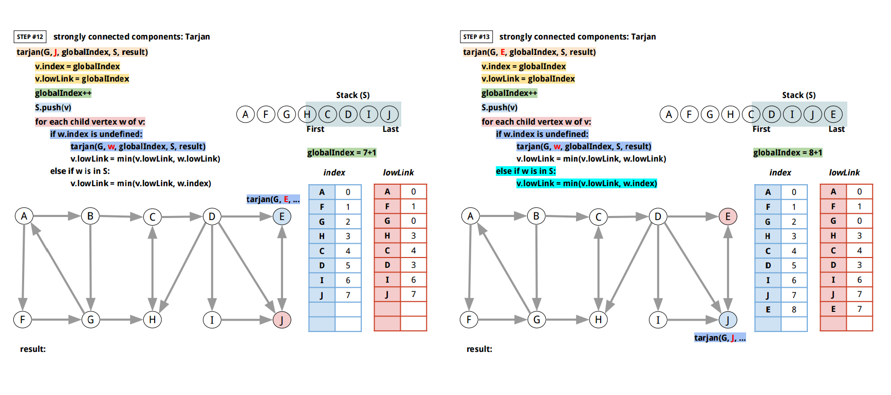
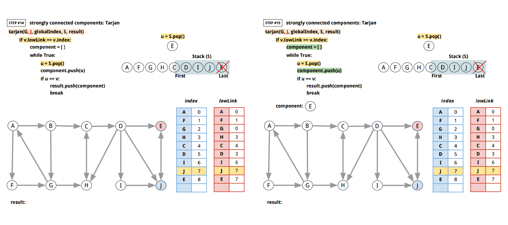
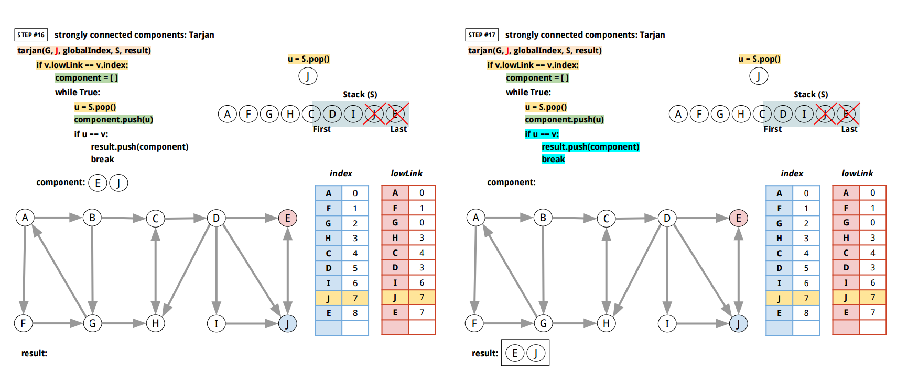
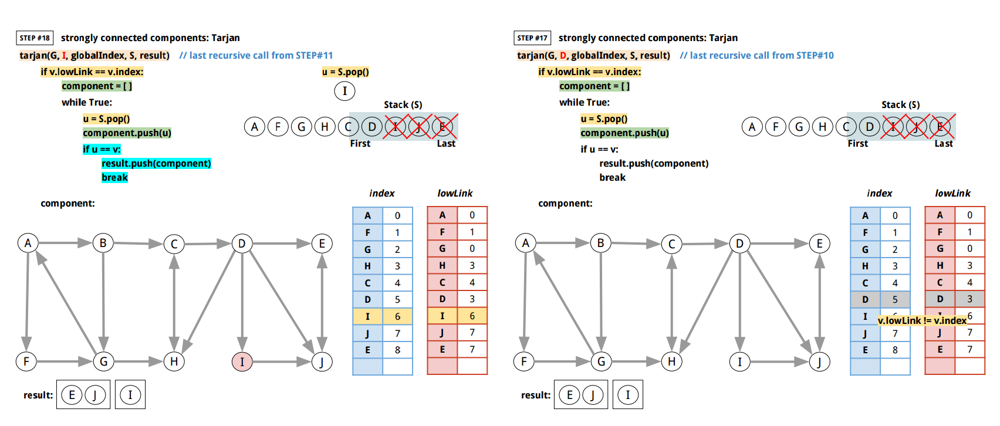
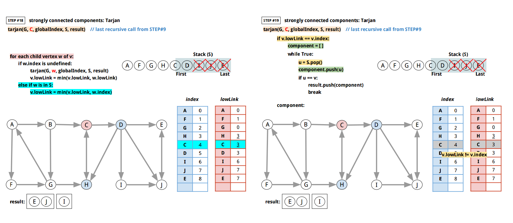
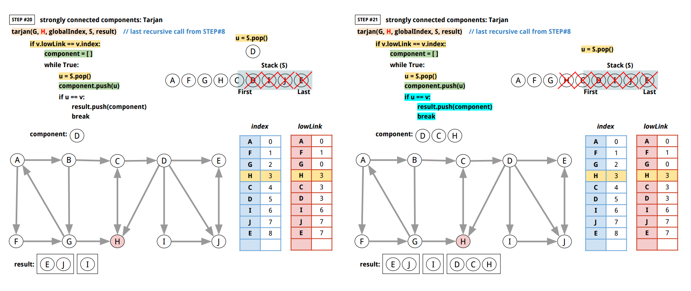
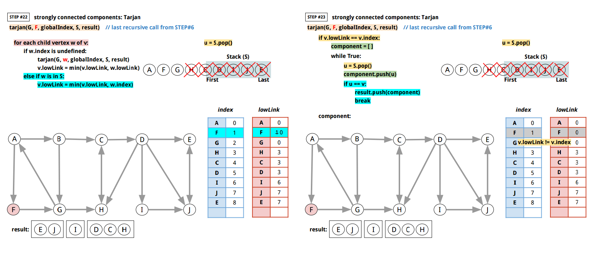
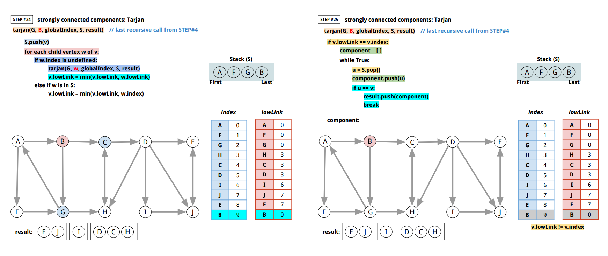
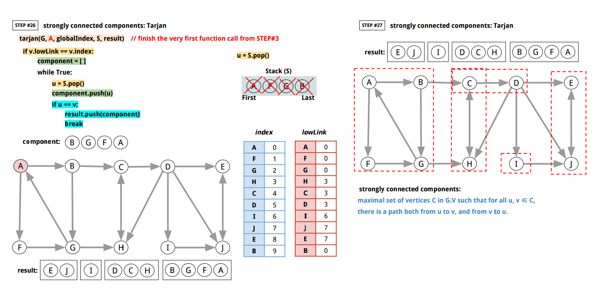

<br>
Here's Go implementation:

```go
package main

import (
	"bytes"
	"encoding/json"
	"fmt"
	"io"
	"log"
	"os"
	"sync"
)

// Tarjan finds the strongly connected components.
// In the mathematics, a directed graph is "strongly connected"
// if every vertex is reachable from every other node.
// Therefore, a graph is strongly connected if there is a path
// in each direction between each pair of node of a graph.
// Then a pair of vertices u and v is strongly connected to each other
// because there is a path in each direction.
// "Strongly connected components" of an arbitrary graph
// partition into sub-graphs that are themselves strongly connected.
// That is, "strongly connected component" of a directed graph
// is a sub-graph that is strongly connected.
// Formally, "Strongly connected components" of a graph is a maximal
// set of vertices C in G.V such that for all u, v ∈ C, there is a path
// both from u to v, and from v to u.
// (https://en.wikipedia.org/wiki/Tarjan%27s_strongly_connected_components_algorithm)
//
//	 0. Tarjan(G):
//	 1.
//	 2. 	globalIndex = 0 // smallest unused index
//	 3. 	let S be a stack
//	 4. 	result = [][]
//	 5.
//	 6. 	for each vertex v in G:
//	 7. 		if v.index is undefined:
//	 8. 			tarjan(G, v, globalIndex, S, result)
//	 9.
//	10. 	return result
//	11.
//	12.
//	13. tarjan(G, v, globalIndex, S, result):
//	14.
//	15. 	v.index = globalIndex
//	16. 	v.lowLink = globalIndex
//	17. 	globalIndex++
//	18. 	S.push(v)
//	19.
//	20. 	for each child vertex w of v:
//	21.
//	22. 		if w.index is undefined:
//	23. 			recursively tarjan(G, w, globalIndex, S, result)
//	24. 			v.lowLink = min(v.lowLink, w.lowLink)
//	25.
//	26. 		else if w is in S:
//	27. 			v.lowLink = min(v.lowLink, w.index)
//	28.
//	29. 	// if v is the root
//	30. 	if v.lowLink == v.index:
//	31.
//	32. 		// start a new strongly connected component
//	33. 		component = []
//	34.
//	35. 		while True:
//	36.
//	37. 			u = S.pop()
//	38. 			component.push(u)
//	39.
//	40. 			if u == v:
//	41. 				result.push(component)
//	42. 				break
//
func Tarjan(g Graph) [][]string {

	data := newTarjanData()

	// for each vertex v in G:
	for v := range g.GetVertices() {
		// if v.index is undefined:
		if _, ok := data.index[v]; !ok {
			// tarjan(G, v, globalIndex, S, result)
			tarjan(g, v, data)
		}
	}

	return data.result
}

type tarjanData struct {
	sync.Mutex

	// globalIndex is the smallest unused index
	globalIndex int

	// index is an index of a node to record
	// the order of being discovered.
	index map[string]int

	// lowLink is the smallest index of any index
	// reachable from v, including v itself.
	lowLink map[string]int

	// S is the stack.
	S []string

	// extra map to check if a vertex is in S.
	smap map[string]bool

	result [][]string
}

func newTarjanData() *tarjanData {
	d := tarjanData{}
	d.globalIndex = 0
	d.index = make(map[string]int)
	d.lowLink = make(map[string]int)
	d.S = []string{}
	d.smap = make(map[string]bool)
	d.result = [][]string{}
	return &d
}

func tarjan(
	g Graph,
	vtx string,
	data *tarjanData,
) {

	// TODO: be more completely thread-safe.
	// This is not inherently parallelizable problem,
	// but just to make sure.
	data.Lock()

	// v.index = globalIndex
	data.index[vtx] = data.globalIndex

	// v.lowLink = globalIndex
	data.lowLink[vtx] = data.globalIndex

	// globalIndex++
	data.globalIndex++

	// S.push(v)
	data.S = append(data.S, vtx)
	data.smap[vtx] = true

	data.Unlock()

	// for each child vertex w of v:
	cmap, err := g.GetChildren(vtx)
	if err != nil {
		panic(err)
	}
	for w := range cmap {

		// if w.index is undefined:
		if _, ok := data.index[w]; !ok {

			// recursively tarjan(G, w, globalIndex, S, result)
			tarjan(g, w, data)

			// v.lowLink = min(v.lowLink, w.lowLink)
			data.lowLink[vtx] = min(data.lowLink[vtx], data.lowLink[w])

		} else if _, ok := data.smap[w]; ok {
			// else if w is in S:

			// v.lowLink = min(v.lowLink, w.index)
			data.lowLink[vtx] = min(data.lowLink[vtx], data.index[w])
		}

	}

	data.Lock()

	// if v is the root
	// if v.lowLink == v.index:
	if data.lowLink[vtx] == data.index[vtx] {
		// start a new strongly connected component
		component := []string{}

		// while True:
		for {

			// u = S.pop()
			u := data.S[len(data.S)-1]
			data.S = data.S[:len(data.S)-1 : len(data.S)-1]
			delete(data.smap, u)

			// component.push(u)
			component = append(component, u)

			// if u == v:
			if u == vtx {
				data.result = append(data.result, component)
				break
			}
		}
	}

	data.Unlock()
}

func min(a, b int) int {
	if a < b {
		return a
	}
	return b
}

func main() {
	f, err := os.Open("graph.json")
	if err != nil {
		panic(err)
	}
	defer f.Close()
	g, err := NewDefaultGraphFromJSON(f, "graph_15")
	if err != nil {
		panic(err)
	}
	scc := Tarjan(g)
	if len(scc) != 4 {
		log.Fatalf("Expected 4 but %v", scc)
	}
	fmt.Println("Tarjan graph_15:", scc)
	// Tarjan graph_15: [[E J] [I] [H D C] [F A G B]]
}

// Graph describes the methods of graph operations.
// It assumes that the identifier of a Vertex is string and unique.
// And weight values is float64.
type Graph interface {
	// GetVertices returns a map of all vertices.
	GetVertices() map[string]bool

	// FindVertex returns true if the vertex already
	// exists in the graph.
	FindVertex(vtx string) bool

	// AddVertex adds a vertex to a graph, and returns false
	// if the vertex already existed in the graph.
	AddVertex(vtx string) bool

	// DeleteVertex deletes a vertex from a graph.
	// It returns true if it got deleted.
	// And false if it didn't get deleted.
	DeleteVertex(vtx string) bool

	// AddEdge adds an edge from vtx1 to vtx2 with the weight.
	AddEdge(vtx1, vtx2 string, weight float64) error

	// ReplaceEdge replaces an edge from vtx1 to vtx2 with the weight.
	ReplaceEdge(vtx1, vtx2 string, weight float64) error

	// DeleteEdge deletes an edge from vtx1 to vtx2.
	DeleteEdge(vtx1, vtx2 string) error

	// GetWeight returns the weight from vtx1 to vtx2.
	GetWeight(vtx1, vtx2 string) (float64, error)

	// GetParents returns the map of parent vertices.
	// (Vertices that comes to the argument vertex.)
	GetParents(vtx string) (map[string]bool, error)

	// GetChildren returns the map of child vertices.
	// (Vertices that goes out of the argument vertex.)
	GetChildren(vtx string) (map[string]bool, error)
}

// DefaultGraph type implements all methods in Graph interface.
type DefaultGraph struct {
	sync.Mutex

	// Vertices stores all vertices.
	Vertices map[string]bool

	// VertexToChildren maps a Vertex identifer to children with edge weights.
	VertexToChildren map[string]map[string]float64

	// VertexToParents maps a Vertex identifer to parents with edge weights.
	VertexToParents map[string]map[string]float64
}

// NewDefaultGraph returns a new DefaultGraph.
func NewDefaultGraph() *DefaultGraph {
	return &DefaultGraph{
		Vertices:         make(map[string]bool),
		VertexToChildren: make(map[string]map[string]float64),
		VertexToParents:  make(map[string]map[string]float64),
		//
		// without this
		// panic: assignment to entry in nil map
	}
}

func (g *DefaultGraph) Init() {
	// (X) g = NewDefaultGraph()
	// this only updates the pointer
	//
	*g = *NewDefaultGraph()
}

func (g DefaultGraph) GetVertices() map[string]bool {
	g.Lock()
	defer g.Unlock()
	return g.Vertices
}

func (g DefaultGraph) FindVertex(vtx string) bool {
	g.Lock()
	defer g.Unlock()
	if _, ok := g.Vertices[vtx]; !ok {
		return false
	}
	return true
}

func (g *DefaultGraph) AddVertex(vtx string) bool {
	g.Lock()
	defer g.Unlock()
	if _, ok := g.Vertices[vtx]; !ok {
		g.Vertices[vtx] = true
		return true
	}
	return false
}

func (g *DefaultGraph) DeleteVertex(vtx string) bool {
	g.Lock()
	defer g.Unlock()
	if _, ok := g.Vertices[vtx]; !ok {
		return false
	} else {
		delete(g.Vertices, vtx)
	}
	if _, ok := g.VertexToChildren[vtx]; ok {
		delete(g.VertexToChildren, vtx)
	}
	for _, smap := range g.VertexToChildren {
		if _, ok := smap[vtx]; ok {
			delete(smap, vtx)
		}
	}
	if _, ok := g.VertexToParents[vtx]; ok {
		delete(g.VertexToParents, vtx)
	}
	for _, smap := range g.VertexToParents {
		if _, ok := smap[vtx]; ok {
			delete(smap, vtx)
		}
	}
	return true
}

func (g *DefaultGraph) AddEdge(vtx1, vtx2 string, weight float64) error {
	g.Lock()
	defer g.Unlock()
	if _, ok := g.Vertices[vtx1]; !ok {
		return fmt.Errorf("%s does not exist in the graph.", vtx1)
	}
	if _, ok := g.Vertices[vtx2]; !ok {
		return fmt.Errorf("%s does not exist in the graph.", vtx2)
	}
	if _, ok := g.VertexToChildren[vtx1]; ok {
		if v, ok2 := g.VertexToChildren[vtx1][vtx2]; ok2 {
			g.VertexToChildren[vtx1][vtx2] = v + weight
		} else {
			g.VertexToChildren[vtx1][vtx2] = weight
		}
	} else {
		tmap := make(map[string]float64)
		tmap[vtx2] = weight
		g.VertexToChildren[vtx1] = tmap
	}
	if _, ok := g.VertexToParents[vtx2]; ok {
		if v, ok2 := g.VertexToParents[vtx2][vtx1]; ok2 {
			g.VertexToParents[vtx2][vtx1] = v + weight
		} else {
			g.VertexToParents[vtx2][vtx1] = weight
		}
	} else {
		tmap := make(map[string]float64)
		tmap[vtx1] = weight
		g.VertexToParents[vtx2] = tmap
	}
	return nil
}

func (g *DefaultGraph) ReplaceEdge(vtx1, vtx2 string, weight float64) error {
	g.Lock()
	defer g.Unlock()
	if _, ok := g.Vertices[vtx1]; !ok {
		return fmt.Errorf("%s does not exist in the graph.", vtx1)
	}
	if _, ok := g.Vertices[vtx2]; !ok {
		return fmt.Errorf("%s does not exist in the graph.", vtx2)
	}
	if _, ok := g.VertexToChildren[vtx1]; ok {
		g.VertexToChildren[vtx1][vtx2] = weight
	} else {
		tmap := make(map[string]float64)
		tmap[vtx2] = weight
		g.VertexToChildren[vtx1] = tmap
	}
	if _, ok := g.VertexToParents[vtx2]; ok {
		g.VertexToParents[vtx2][vtx1] = weight
	} else {
		tmap := make(map[string]float64)
		tmap[vtx1] = weight
		g.VertexToParents[vtx2] = tmap
	}
	return nil
}

func (g *DefaultGraph) DeleteEdge(vtx1, vtx2 string) error {
	g.Lock()
	defer g.Unlock()
	if _, ok := g.Vertices[vtx1]; !ok {
		return fmt.Errorf("%s does not exist in the graph.", vtx1)
	}
	if _, ok := g.Vertices[vtx2]; !ok {
		return fmt.Errorf("%s does not exist in the graph.", vtx2)
	}
	if _, ok := g.VertexToChildren[vtx1]; ok {
		if _, ok := g.VertexToChildren[vtx1][vtx2]; ok {
			delete(g.VertexToChildren[vtx1], vtx2)
		}
	}
	if _, ok := g.VertexToParents[vtx2]; ok {
		if _, ok := g.VertexToParents[vtx2][vtx1]; ok {
			delete(g.VertexToParents[vtx2], vtx1)
		}
	}
	return nil
}

func (g *DefaultGraph) GetWeight(vtx1, vtx2 string) (float64, error) {
	g.Lock()
	defer g.Unlock()
	if _, ok := g.Vertices[vtx1]; !ok {
		return 0.0, fmt.Errorf("%s does not exist in the graph.", vtx1)
	}
	if _, ok := g.Vertices[vtx2]; !ok {
		return 0.0, fmt.Errorf("%s does not exist in the graph.", vtx2)
	}
	if _, ok := g.VertexToChildren[vtx1]; ok {
		if v, ok := g.VertexToChildren[vtx1][vtx2]; ok {
			return v, nil
		}
	}
	return 0.0, fmt.Errorf("there is not edge from %s to %s", vtx1, vtx2)
}

func (g *DefaultGraph) GetParents(vtx string) (map[string]bool, error) {
	g.Lock()
	defer g.Unlock()
	if _, ok := g.Vertices[vtx]; !ok {
		return nil, fmt.Errorf("%s does not exist in the graph.", vtx)
	}
	rs := make(map[string]bool)
	if _, ok := g.VertexToParents[vtx]; ok {
		for k := range g.VertexToParents[vtx] {
			rs[k] = true
		}
	}
	return rs, nil
}

func (g *DefaultGraph) GetChildren(vtx string) (map[string]bool, error) {
	g.Lock()
	defer g.Unlock()
	if _, ok := g.Vertices[vtx]; !ok {
		return nil, fmt.Errorf("%s does not exist in the graph.", vtx)
	}
	rs := make(map[string]bool)
	if _, ok := g.VertexToChildren[vtx]; ok {
		for k := range g.VertexToChildren[vtx] {
			rs[k] = true
		}
	}
	return rs, nil
}

// FromJSON creates a graph Data from JSON. Here's the sample JSON data:
//
//	{
//	    "graph_00": {
//	        "S": {
//	            "A": 100,
//	            "B": 14,
//	            "C": 200
//	        },
//	        "A": {
//	            "S": 15,
//	            "B": 5,
//	            "D": 20,
//	            "T": 44
//	        },
//	        "B": {
//	            "S": 14,
//	            "A": 5,
//	            "D": 30,
//	            "E": 18
//	        },
//	        "C": {
//	            "S": 9,
//	            "E": 24
//	        },
//	        "D": {
//	            "A": 20,
//	            "B": 30,
//	            "E": 2,
//	            "F": 11,
//	            "T": 16
//	        },
//	        "E": {
//	            "B": 18,
//	            "C": 24,
//	            "D": 2,
//	            "F": 6,
//	            "T": 19
//	        },
//	        "F": {
//	            "D": 11,
//	            "E": 6,
//	            "T": 6
//	        },
//	        "T": {
//	            "A": 44,
//	            "D": 16,
//	            "F": 6,
//	            "E": 19
//	        }
//	    },
//	}
//
func NewDefaultGraphFromJSON(rd io.Reader, graphID string) (*DefaultGraph, error) {
	js := make(map[string]map[string]map[string]float64)
	dec := json.NewDecoder(rd)
	for {
		if err := dec.Decode(&js); err == io.EOF {
			break
		} else if err != nil {
			return nil, err
		}
	}
	if _, ok := js[graphID]; !ok {
		return nil, fmt.Errorf("%s does not exist", graphID)
	}
	gmap := js[graphID]
	g := NewDefaultGraph()
	for vtx1, mm := range gmap {
		if !g.FindVertex(vtx1) {
			g.AddVertex(vtx1)
		}
		for vtx2, weight := range mm {
			if !g.FindVertex(vtx2) {
				g.AddVertex(vtx2)
			}
			g.ReplaceEdge(vtx1, vtx2, weight)
		}
	}
	return g, nil
}

func (g DefaultGraph) String() string {
	buf := new(bytes.Buffer)
	for vtx1 := range g.Vertices {
		cmap, _ := g.GetChildren(vtx1)
		for vtx2 := range cmap {
			weight, _ := g.GetWeight(vtx1, vtx2)
			fmt.Fprintf(buf, "%s -- %.3f --> %s\n", vtx1, weight, vtx2)
		}
	}
	return buf.String()
}

```

[↑ top](#go-graph-strongly-connected-components)
<br><br><br><br>
<hr>
