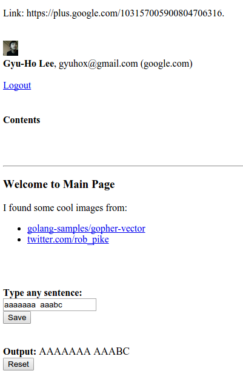
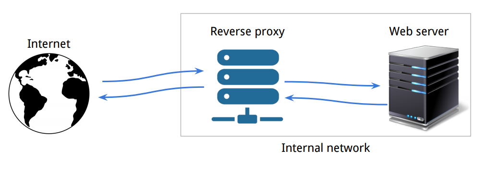

[*back to contents*](https://github.com/gyuho/learn#contents)
<br>

# Go: web application, deploy, container

- [Reference](#reference)
- [`text/template`](#texttemplate)
- [serve image](#serve-image)
- [concurrent web requests](#concurrent-web-requests)
- [**Web application with Javascript frontend**](#web-application-with-javascript-frontend)
- [proxy](#proxy)
- [docker, rkt](#docker-rkt)

[↑ top](#go-web-application-deploy-container)
<br><br><br><br>
<hr>


#### Reference

- [**Sample web application source code by gyuho**](./app)
- [Javascript](https://developer.mozilla.org/en-US/docs/Web/JavaScript)
- [Javascript Wikipedia](https://en.wikipedia.org/wiki/JavaScript)
- [jQuery Wikipedia](https://en.wikipedia.org/wiki/JQuery)
- [Proxy server](https://en.wikipedia.org/wiki/Proxy_server)
- [Reverse proxy](https://en.wikipedia.org/wiki/Reverse_proxy)
- [Nginx](https://en.wikipedia.org/wiki/Nginx)
- [Docker](https://www.docker.com/)
- [Docker Jumpstart, by Andrew Odewahn](https://github.com/odewahn/docker-jumpstart/)
- [Best practices for writing Dockerfiles](https://docs.docker.com/articles/dockerfile_best-practices/)
- [CoreOS](https://coreos.com/)
- [App Container Specification](https://github.com/appc/spec)
- [Amazon Web Service (AWS)](https://aws.amazon.com/)
- [Google Cloud Platform (GCP)](https://cloud.google.com/)
- [**How DNS works**](https://howdns.works/)
- [How the Domain Name System (DNS) Works](http://www.verisign.com/en_US/domain-names/online/how-dns-works/index.xhtml?inc=www.verisigninc.com)

[↑ top](#go-web-application-deploy-container)
<br><br><br><br>
<hr>


#### `text/template`

[Here](http://play.golang.org/p/V5fh24NbSf)'s an example of
[text/template](http://golang.org/pkg/text/template/) package:

```go
package main
 
import (
	"bytes"
	"fmt"
	"log"
	"text/template"
)
 
func main() {
	tagName := "{{.BranchName}}_{{.Type}}"
	tagStruct := struct {
		BranchName string
		Type       string
	}{
		"gyuho",
		"prod",
	}
	buf := new(bytes.Buffer)
	if err := template.Must(template.New("tmpl").Parse(tagName)).Execute(buf, tagStruct); err != nil {
		log.Fatal(err)
	}
	fmt.Println(buf.String())
	// gyuho_prod
 
	queryStruct := struct {
		SchemaName string
		TableName  string
		Slice      []map[string]string
		LastIndex  int
	}{
		"my",
		"table",
		[]map[string]string{
			map[string]string{"key": "VARCHAR(100) PRIMARY KEY NOT NULL"},
			map[string]string{"value1": "INTEGER"},
			map[string]string{"value2": "INTEGER"},
		},
		2,
	}
	var queryTmpl = `CREATE TABLE IF NOT EXISTS {{.SchemaName}}.{{.TableName}}  ({{$lastIndex := .LastIndex}}
{{range $index, $valueMap := .Slice}}{{if ne $lastIndex $index}}{{range $key, $value := $valueMap}}	{{$key}} {{$value}},{{end}}
{{else}}{{range $key, $value := $valueMap}}	{{$key}} {{$value}}{{end}}
{{end}}{{end}});`
	tb := new(bytes.Buffer)
	if err := template.Must(template.New("tmpl").Parse(queryTmpl)).Execute(tb, queryStruct); err != nil {
		log.Fatal(err)
	}
	fmt.Println(tb.String())
	/*
	   CREATE TABLE IF NOT EXISTS my.table  (
	   	key VARCHAR(100) PRIMARY KEY NOT NULL,
	   	value1 INTEGER,
	   	value2 INTEGER
	   );
	*/
}
```

[↑ top](#go-web-application-deploy-container)
<br><br><br><br>
<hr>


#### serve image

```go
package main

import (
	"net/http"
	"path"
)

func main() {
	http.HandleFunc("/", foo)
	http.ListenAndServe(":3000", nil)
}

func foo(w http.ResponseWriter, r *http.Request) {
	fp := path.Join(".", "gopherbw.png")
	http.ServeFile(w, r, fp)
}

```

[↑ top](#go-web-application-deploy-container)
<br><br><br><br>
<hr>


#### concurrent web requests

<br>
> In Go servers, **each incoming request** is handled in its **own goroutine**.
> Request handlers often start additional goroutines to access backends such
> as databases and RPC services. The set of goroutines working on a request
> typically needs access to request-specific values such as the identity of the
> end user, authorization tokens, and the request's deadline. When a request is
> canceled or times out, all the goroutines working on that request should exit
> quickly so the system can reclaim any resources they are using.
>
> At Google, we developed a `context` package that makes it easy to pass
> **request-scoped values**, cancelation signals, and deadlines across API
> boundaries to all the goroutines involved in handling a request.
>
> [Go Concurrency Patterns: Context](https://blog.golang.org/context) *by
> Sameer Ajmani*
<br>


```go
package main

import (
	"fmt"
	"io/ioutil"
	"log"
	"net/http"
	"time"
)

/*
sudo kill $(sudo netstat -tlpn | perl -ne 'my @a = split /[ \/]+/; print "$a[6]\n" if m/:3000/gio');
*/

// global variable shared by all concurrent requests
var color string

// This is not a good practice because the global variable
// is being affected by race conditions with concurrent web requests.

func main() {
	for i := 0; i < 100; i++ {
		go sendRequestRed()
		go sendRequestBlue()
	}
	http.HandleFunc("/", handler)
	http.HandleFunc("/red", red)
	http.HandleFunc("/blue", blue)
	fmt.Println("Listening to http://localhost:3000")
	http.ListenAndServe(":3000", nil)
}

func handler(w http.ResponseWriter, req *http.Request) {
	switch req.Method {
	case "GET":
		fmt.Fprintf(w, "Hello World! Global color is now %s", color)
	default:
		http.Error(w, "Method Not Allowed", 405)
	}
}

func red(w http.ResponseWriter, req *http.Request) {
	switch req.Method {
	case "GET":
		color = "red"
		fmt.Fprintf(w, "set red")
	default:
		http.Error(w, "Method Not Allowed", 405)
	}
}

func blue(w http.ResponseWriter, req *http.Request) {
	switch req.Method {
	case "GET":
		color = "blue"
		fmt.Fprintf(w, "set blue")
	default:
		http.Error(w, "Method Not Allowed", 405)
	}
}

func sendRequestRed() {
	time.Sleep(3 * time.Second)
	client := http.DefaultClient
	req, err := http.NewRequest("GET", "http://localhost:3000/red", nil)
	if err != nil {
		log.Panic(err)
	}
	resp, err := client.Do(req)
	if err != nil {
		log.Panic(err)
	}
	defer resp.Body.Close()
	b, err := ioutil.ReadAll(resp.Body)
	if err != nil {
		log.Panic(err)
	}
	fmt.Println("response is", string(b))
}

func sendRequestBlue() {
	time.Sleep(3 * time.Second)
	client := http.DefaultClient
	req, err := http.NewRequest("GET", "http://localhost:3000/blue", nil)
	if err != nil {
		log.Panic(err)
	}
	resp, err := client.Do(req)
	if err != nil {
		log.Panic(err)
	}
	defer resp.Body.Close()
	b, err := ioutil.ReadAll(resp.Body)
	if err != nil {
		log.Panic(err)
	}
	fmt.Println("response is", string(b))
}

```


[↑ top](#go-web-application-deploy-container)
<br><br><br><br>
<hr>


#### **Web application with Javascript frontend**

Output of [**sample web application source code by gyuho**](./app):

<br>



<br>

[↑ top](#go-web-application-deploy-container)
<br><br><br><br>
<hr>


#### proxy

> In computer networks, a **proxy server** is a server (a computer system or an
> application) that acts as an intermediary for requests from clients seeking
> resources from other servers. A client connects to the proxy server,
> requesting some service, such as a file, connection, web page, or other
> resource available from a different server and the proxy server evaluates the
> request as a way to simplify and control its complexity.
>
> A reverse proxy is usually an Internet-facing proxy used as a front-end to
> control and protect access to a server on a private network. A reverse proxy
> commonly also performs tasks such as load-balancing, authentication,
> decryption or caching.
>
> A **reverse proxy** (or surrogate) is a proxy server that *appears to clients* to
> be an *ordinary server*. **Requests are forwarded to** one or more **proxy servers**
> which handle the request. The **response from the proxy server** is returned *as
> if* it came directly from the **original server**, leaving the client no knowledge
> of the origin servers.
>
> [*Proxy server*](https://en.wikipedia.org/wiki/Proxy_server) *by Wikipedia*

<br>
> A reverse proxy taking requests from the Internet and forwarding them to
> servers in an internal network. Those making requests to the proxy may not be
> aware of the internal network.
> 
> Reverse proxies can hide the existence and characteristics of an origin
> server or servers.
>
> [*Reverse proxy*](https://en.wikipedia.org/wiki/Reverse_proxy) *by Wikipedia*

<br>
We can use [Nginx](http://wiki.nginx.org/Main) as an HTTP server, reverse proxy
along with Go web servers:



<br>
Then why do we bother to run another web server, or reverse proxy while we can
do pretty much everything in Go?

```go
package main

import (
    "fmt"
    "net/http"
)

func handler(w http.ResponseWriter, r *http.Request) {
    fmt.Fprintf(w, "Hi there, I love %s!", r.URL.Path[1:])
}

func main() {
    http.HandleFunc("/", handler)
    http.ListenAndServe(":8080", nil)
}

```

<br>
It's because popular web proxies like `Nginx` provides useful features
out-of-the box. So it's not to reinvent the wheels while we can just add
another module to `Nginx` configuration. `Nginx` provides:

- Rate limiting.
- Access, error logs.
- Serve static files with `try_files`.
- Auth, compression support.
- Serve cached contents while the application is down.

<br>
For more, please visit [Nginx wiki](http://wiki.nginx.org/Main).

[↑ top](#go-web-application-deploy-container)
<br><br><br><br>
<hr>


#### docker, rkt

These are great introductory articles about Docker, rkt, containers:

- https://www.docker.com/whatisdocker
- https://coreos.com/using-coreos/containers/
- https://coreos.com/rkt/docs/latest/

And this is just how I understand them.

<br>
**Docker** is like a big binary file for an application.
Just like Unix, you can compile an application into one file, and run it as a
process. **Docker** is an application container, not a system container.
Then what is *container*? Containers *contain* the *application* and all its
*dependencies*, but they share the kernel with other containers. And containers
are running as a separate process under its host operating system. (It's
recommended that you [run only one process per
container](https://docs.docker.com/articles/dockerfile_best-practices/).)
It's usually faster, lighter than VMs. Pre-existing techonologies include:

- [*`cgroups`*](https://en.wikipedia.org/wiki/Cgroups)
- [*`LXC`*](https://en.wikipedia.org/wiki/LXC)
- [*`namespace`*](http://man7.org/linux/man-pages/man7/namespaces.7.html)
- [*`AUFS`*](https://en.wikipedia.org/wiki/Aufs)

<br>
> The most powerful feature of containers is the ability to run any Linux
> userland that's compatible with the latest kernel.
>
> [*Container Overview*](https://coreos.com/using-coreos/containers/) *by
> CoreOS*

<br>
Software engineering becomes frustrating when you have to deal with
inconsistent development, production environments. This is the core problem
that containerization solves, in that developers can now **document** those
processes in `Dockerfile` or `App Container Specification`.
It helps define and maintain homogeneous dev/test/prod environments
in a reproduceable way.

<br>
Then let's write actual `Dockerfile` and `App Container Specification`
to deploy my
[web application](./code):

<br>
**`Docker`**:

```
FROM ubuntu:14.04
RUN apt-get update
RUN apt-get install -y nginx
ADD ./nginx.conf /etc/nginx/sites-available/default
RUN service nginx restart

# automatically copies the package source,
# fetches the application dependencies
# builds the program, and configures it to run on startup.
FROM golang:onbuild
EXPOSE 8080

```

```sh
#!/bin/bash
sudo docker build -t code .;
sudo docker run --publish 8080:8080 --name test --rm code;

```


<br>
<br>
**`App Container Specification`**:

**TODO: THIS IS NOT WORKING... (https://github.com/appc/spec/issues/480)**


```json
{
	"acKind": "ImageManifest",
	"acVersion": "0.6.1",
	"name": "gyuho/code",
	"labels": [
		{
			"name": "version",
			"value": "0.0.1"
		},
		{
			"name": "arch",
			"value": "amd64"
		},
		{
			"name": "os",
			"value": "linux"
		}
	],
	"app": {
		"user": "root",
		"group": "root",
		"exec": [
			"/usr/bin/code"
		],
		"mountPoints": [
			{
				"name": "static",
				"path": "/usr/bin/static"
			},
			{
				"name": "templates",
				"path": "/usr/bin/templates"
			}
		],
		"ports": [
			{
				"name": "web-server",
				"protocol": "tcp",
				"port": 8080
			}
		]
	},
	"annotations": [
		{
			"name": "authors",
			"value": "Gyu-Ho Lee <gyuhox@gmail.com>"
		}
	]
}

```

```sh
#!/bin/bash
# https://github.com/coreos/rkt/blob/master/Documentation/getting-started-guide.md

CGO_ENABLED=0 GOOS=linux go build -o code -a -installsuffix cgo .;
file code;
ldd code;
sudo ./actool --debug validate manifest.json;

mkdir -p image/rootfs/usr/bin;

sudo cp manifest.json image/manifest;

sudo cp code image/rootfs/usr/bin;
sudo cp -rf static/ image/rootfs/usr/bin;
sudo cp -rf templates/ image/rootfs/usr/bin;

sudo ./actool build --overwrite image/ code-0.0.1-linux-amd64.aci;
sudo ./actool --debug validate code-0.0.1-linux-amd64.aci;

sudo ./rkt metadata-service >/dev/null 2>&1 & # run in background

sudo ./rkt --insecure-skip-verify run \
code-0.0.1-linux-amd64.aci \
--volume static,kind=host,source=/usr/bin/static \
--volume templates,kind=host,source=/usr/bin/templates \
-- \
;

```

[↑ top](#go-web-application-deploy-container)
<br><br><br><br>
<hr>
