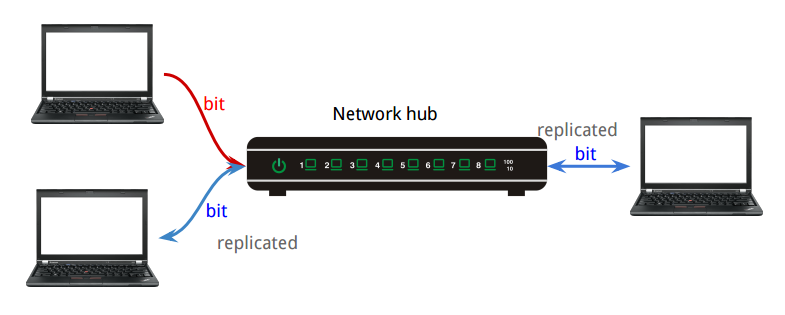
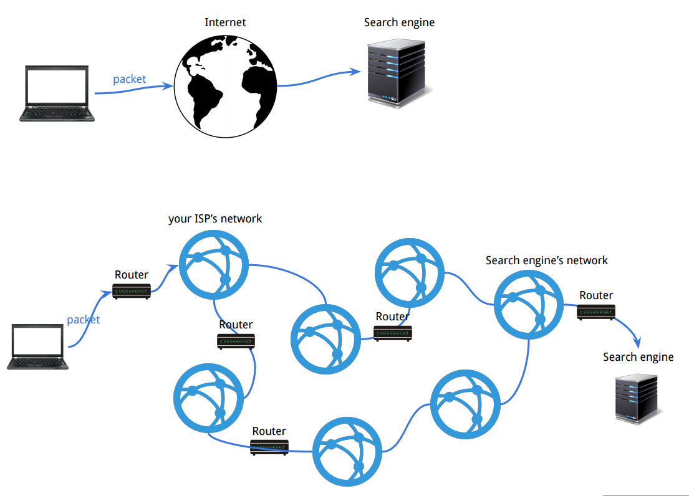
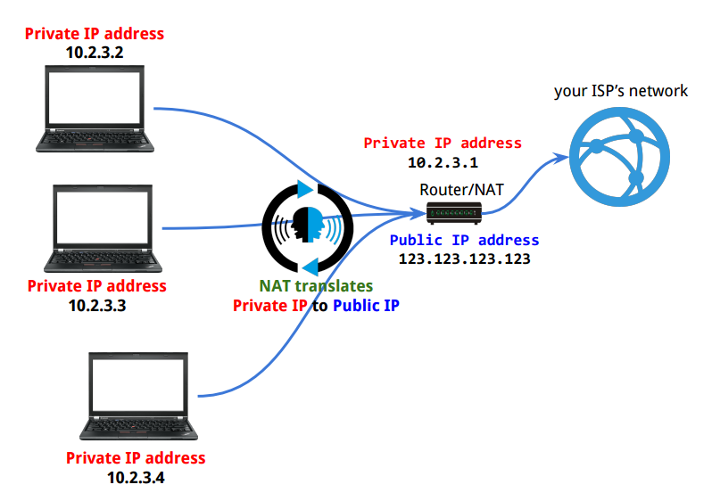
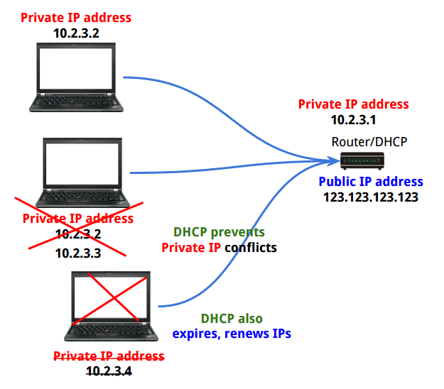

[*back to contents*](https://github.com/gyuho/learn#contents)
<br>

# network, net, http

- [Reference](#reference)
- [Overview of network layers](#overview-of-network-layers)
	- [physical layer](#physical-layer)
	- [data link layer](#data-link-layer)
	- [network layer](#network-layer)
	- [transport layer](#transport-layer)
	- [session layer](#session-layer)
	- [presentation layer](#presentation-layer)
	- [application layer](#application-layer)
- [communicate between networks](#communicate-between-networks)
	- [simple echo server](#simple-echo-server)
	- [simple rpc server](#simple-rpc-server)
	- [simple web server](#simple-web-server)
- [http request, roundtrip](#http-request-roundtrip)
- [error: too many open files](#error-too-many-open-files)

[↑ top](#network-net-http)
<br><br><br><br>
<hr>


#### Reference

- [OSI model](https://en.wikipedia.org/wiki/OSI_model)
- [Network hardware](https://en.wikipedia.org/wiki/Networking_hardware)
- [package `net`](http://golang.org/pkg/net/)

[↑ top](#network-net-http)
<br><br><br><br>
<hr>


#### Overview of network layers

<br>

<br>

[↑ top](#network-net-http)
<br><br><br>

##### physical layer

[Physical layer](https://en.wikipedia.org/wiki/Physical_layer)
refers to basic networking hardware transmissions. It defines how
to transfer raw bits over a physical link connecting network nodes.
For example, a [ethernet hub](https://en.wikipedia.org/wiki/Ethernet_hub)
works on a physical layer. It coordinates multiple network objects
and makes them act as a single network segment and share the
bandwidth of a network.

<br>


Ethernet hub works by repeating bits received from one of its ports to
all other ports, which means each incoming bit gets replicated to all
other interfaces. But this can generate unnecessary traffic and
waste bandwidth. This is where [network switch](https://en.wikipedia.org/wiki/Network_switch)
comes in.

[↑ top](#network-net-http)
<br><br><br>

##### data link layer

[Data link layer](https://en.wikipedia.org/wiki/Data_link_layer) transfers
data between adjacent network nodes. [Ethernet](https://en.wikipedia.org/wiki/Ethernet)
is an example of data link layer. It is a networking technology for
[LAN](https://en.wikipedia.org/wiki/Local_area_network). Ethernet is used to
communicate between this *local area networks (LAN)*.
Data link layer uses [MAC addresss](https://en.wikipedia.org/wiki/MAC_address)
to transfer data between two nodes in a network,
using [ARP](https://en.wikipedia.org/wiki/Address_Resolution_Protocol).
[Switch](https://en.wikipedia.org/wiki/Network_switch) and
[bridge](https://en.wikipedia.org/wiki/Network_bridge)
work on data link layer. Unlike less advanced [network hubs](https://en.wikipedia.org/wiki/Ethernet_hub),
a [**network switch**](https://en.wikipedia.org/wiki/Network_switch)
forwards data only to one or multiple devices that need to receive it,
rather than replicating data to every single port.

<br>


But what if we want to send packets across different networks?
This is where [router](https://en.wikipedia.org/wiki/Router_(computing))
comes in.

[↑ top](#network-net-http)
<br><br><br>

##### network layer

[Network layer](https://en.wikipedia.org/wiki/Network_layer) defines
[routing](https://en.wikipedia.org/wiki/Routing)
and [packet forwarding](https://en.wikipedia.org/wiki/Packet_forwarding),
to transfer data between hosts.
[Router](https://en.wikipedia.org/wiki/Router_(computing)) on network layer
fowards data packets between computer networks.
A [network switch](https://en.wikipedia.org/wiki/Network_switch)
in data link layer connects data lines from one single network,
while a [**router**](https://en.wikipedia.org/wiki/Router_(computing))
connects data lines from **different networks**.
[**Router**](https://en.wikipedia.org/wiki/Router_(computing)) is a networking
device that transfer *data packets* **between computer networks**.
In most cases, you have your own router at home to connect to Internet
through your own [ISP](https://en.wikipedia.org/wiki/Internet_service_provider).


<br>
**Router** also does:

- [Network Address Translation (NAT)](https://en.wikipedia.org/wiki/Network_address_translation)
- [Dynamic Host Configuration Protocol (DHCP)](https://en.wikipedia.org/wiki/Dynamic_Host_Configuration_Protocol)

<br>
<br>
**NAT** remapps one IP address space into another by modifying
network address information. It helps conserve IPv4 addresses by abstracting
the entire IP address space with private network IP addresses.


<br>
<br>
**DHCP** dynamically distributes network configurations, such as IP addresses.
It usually reserves a range of IP addresses, and each DHCP client requests an
IP address from DHCP server during network initialization. It uses a lease
concept with limited time period, so that DHCP server can reclaim, reallocate,
and renew IP addresses.


[↑ top](#network-net-http)
<br><br><br>

##### transport layer

[Transport layer](https://en.wikipedia.org/wiki/Transport_layer) provides
end-to-end or host-to-host communication. Let's compare two most popular
transport protocols: [Transmission Control Protocol (TCP)](https://en.wikipedia.org/wiki/Transmission_Control_Protocol)
and [User Datagram Protocol (UDP)](https://en.wikipedia.org/wiki/User_Datagram_Protocol).

|        |  TCP 	|  UDP 	|
|:-:	 |:-:	|:-:	|
| header | 20 bytes | 8 bytes |
| connection | need connection(3 way) |  no need |
| data corruption | retry | no retry |
| in order | ordered | no order |
| congestion control | Yes | No |

<br>
> TCP provides reliable, ordered, and error-checked delivery of a stream of
> octets between applications running on hosts communicating over an IP
> network. TCP is the protocol that major Internet applications such as the
> World Wide Web, email, remote administration and file transfer rely on.
> Applications that do not require reliable data stream service may use the
> User Datagram Protocol (UDP), which provides a connectionless datagram
> service that emphasizes reduced latency over reliability.
>
> [*Transmission Control
> Protocol*](https://en.wikipedia.org/wiki/Transmission_Control_Protocol) *by Wikipedia*

[↑ top](#network-net-http)
<br><br><br>

##### session layer

[Session layer](https://en.wikipedia.org/wiki/Session_layer) stores
states between two connections.

[↑ top](#network-net-http)
<br><br><br>

##### presentation layer

[Presentation layer](https://en.wikipedia.org/wiki/Presentation_layer)
converts between different formats of data, such as encoding, encryption,
or decryption.

[↑ top](#network-net-http)
<br><br><br>

##### application layer

[Application layer](https://en.wikipedia.org/wiki/Application_layer) refers
to shared protocols and interface methods between hosts, such as HTTP, SSH,
SMTP (which will be covered separately).

[↑ top](#network-net-http)
<br><br><br><br>
<hr>


#### communicate between networks

<br><br>
##### simple echo server

```go
package main

import (
	"fmt"
	"net"
)

func startServer(port string) {
	// Listen function creates servers,
	// listening for incoming connections.
	ln, err := net.Listen("tcp", port)
	if err != nil {
		panic(err)
	}
	defer ln.Close()
	fmt.Println("Listening on", port)
	for {
		// Listen for an incoming connection.
		conn, err := ln.Accept()
		if err != nil {
			panic(err)
		}
		go handleRequests(conn)
	}
}

// Handles incoming requests.
func handleRequests(conn net.Conn) {
	fmt.Printf("Received from %s → %s\n", conn.RemoteAddr(), conn.LocalAddr())
	buf := make([]byte, 5) // read max 5 characters
	if _, err := conn.Read(buf); err != nil {
		panic(err)
	}
	conn.Write([]byte("received message: " + string(buf) + "\n"))
	conn.Close()
}

func main() {
	const port = ":5000"
	startServer(port)
}

/*
From client side:
echo "Hello server" | nc localhost 5000

Received from 127.0.0.1:58405 → 127.0.0.1:5000
Received from 127.0.0.1:58406 → 127.0.0.1:5000
Received from 127.0.0.1:58407 → 127.0.0.1:5000
Received from 127.0.0.1:58408 → 127.0.0.1:5000
Received from 127.0.0.1:58409 → 127.0.0.1:5000
...

sudo kill $(sudo netstat -tlpn | perl -ne 'my @a = split /[ \/]+/; print "$a[6]\n" if m/:5000/gio')
*/

```

[↑ top](#network-net-http)
<br><br>


##### simple rpc server

```go
package main

import (
	"fmt"
	"net"
	"net/rpc"
	"net/rpc/jsonrpc"
)

type Args struct {
	A, B int
}

type Arith int

func (t *Arith) Multiply(args *Args, reply *int) error {
	*reply = args.A * args.B
	return nil
}

func startServer(port string) {
	srv := rpc.NewServer()
	arith := new(Arith)
	srv.Register(arith)
	srv.HandleHTTP(rpc.DefaultRPCPath, rpc.DefaultDebugPath)
	// Listen function creates servers,
	// listening for incoming connections.
	ln, err := net.Listen("tcp", port)
	if err != nil {
		panic(err)
	}
	defer ln.Close()
	fmt.Println("Listening on", port)
	for {
		// Listen for an incoming connection.
		conn, err := ln.Accept()
		if err != nil {
			panic(err)
		}
		go srv.ServeCodec(jsonrpc.NewServerCodec(conn))
	}
}

func main() {
	const port = ":5000"
	go startServer(port)

	conn, err := net.Dial("tcp", "localhost"+port)
	if err != nil {
		panic(err)
	}
	defer conn.Close()

	args := &Args{5, 10}
	var reply int

	client := jsonrpc.NewClient(conn)
	if err := client.Call("Arith.Multiply", args, &reply); err != nil {
		panic(err)
	}
	fmt.Println("reply:", reply)
	// reply: 50
}

```

[↑ top](#network-net-http)
<br><br>


##### simple web server

```go
package main

import (
	"encoding/gob"
	"encoding/json"
	"fmt"
	"io"
	"io/ioutil"
	"net/http"
	"os"
	"time"

	stdlog "log"
)

/*
sudo kill $(sudo netstat -tlpn | perl -ne 'my @a = split /[ \/]+/; print "$a[6]\n" if m/:5000/gio')
*/

func main() {
	const port = ":5000"
	go sendRequest(port, "/")
	go sendRequest(port, "/json")
	go sendRequest(port, "/gob")
	mainRouter := http.NewServeMux()
	mainRouter.HandleFunc("/", wrapHandlerFunc0(handler))
	mainRouter.HandleFunc("/hello", wrapHandlerFunc0(helloHandler))
	mainRouter.HandleFunc("/json", wrapHandlerFunc1(handlerJSON))
	mainRouter.HandleFunc("/gob", wrapHandlerFunc1(handlerGOB))
	fmt.Println("Serving http://localhost" + port)
	if err := http.ListenAndServe(port, mainRouter); err != nil {
		panic(err)
	}
}

/*
Serving http://localhost:5000
[TEST] 2015/09/03 12:42:35 v0 GET /   |  Took 4.564µs
[TEST] 2015/09/03 12:42:35 v0 GET /favicon.ico   |  Took 4.115µs
[TEST] 2015/09/03 12:42:36 v0 GET /   |  Took 2.913µs
[TEST] 2015/09/03 12:42:36 v1 GET /json   |  Took 63.403µs
[TEST] 2015/09/03 12:42:36 v1 GET /gob   |  Took 145.274µs
response for /gob = {Go 1000 2015-09-03 12:42:36}
response for /json = {Go 1000 2015-09-03 12:42:36}
response for / = Hello World!
[TEST] 2015/09/03 12:42:45 v0 GET /hello   |  Took 6.74µs
[TEST] 2015/09/03 12:42:45 v0 GET /favicon.ico   |  Took 6.325µs
...
*/

var logger = stdlog.New(os.Stdout, "[TEST] ", stdlog.Ldate|stdlog.Ltime)

func wrapHandlerFunc0(fn func(w http.ResponseWriter, req *http.Request)) func(w http.ResponseWriter, req *http.Request) {
	return func(w http.ResponseWriter, req *http.Request) {
		start := time.Now()
		fn(w, req)
		logger.Printf("v0 %s %s   |  Took %s", req.Method, req.URL.Path, time.Since(start))
	}
}

func wrapHandlerFunc1(h http.HandlerFunc) http.HandlerFunc {
	return func(w http.ResponseWriter, req *http.Request) {
		start := time.Now()
		h.ServeHTTP(w, req)
		logger.Printf("v1 %s %s   |  Took %s", req.Method, req.URL.Path, time.Since(start))
	}
}

type Data struct {
	Name  string
	Value float64
	TS    string
}

func handler(w http.ResponseWriter, req *http.Request) {
	switch req.Method {
	case "GET":
		fmt.Fprintf(w, "Hello World!")
	default:
		http.Error(w, "Method Not Allowed", 405)
	}
}

func helloHandler(w http.ResponseWriter, req *http.Request) {
	switch req.Method {
	case "GET":
		fmt.Fprintf(w, "Hello!")
	default:
		http.Error(w, "Method Not Allowed", 405)
	}
}

func handlerJSON(w http.ResponseWriter, req *http.Request) {
	switch req.Method {
	case "GET":
		data := Data{}
		data.Name = "Go"
		data.Value = 1000
		data.TS = time.Now().String()[:19]
		if err := json.NewEncoder(w).Encode(data); err != nil {
			panic(err)
		}

	default:
		http.Error(w, "Method Not Allowed", 405)
	}
}

func handlerGOB(w http.ResponseWriter, req *http.Request) {
	switch req.Method {
	case "GET":
		data := Data{}
		data.Name = "Go"
		data.Value = 1000
		data.TS = time.Now().String()[:19]
		if err := gob.NewEncoder(w).Encode(data); err != nil {
			panic(err)
		}

	default:
		http.Error(w, "Method Not Allowed", 405)
	}
}

func sendRequest(port, endPoint string) {
	time.Sleep(3 * time.Second)

	client := http.DefaultClient
	req, err := http.NewRequest("GET", "http://localhost"+port+endPoint, nil)
	if err != nil {
		panic(err)
	}
	resp, err := client.Do(req)
	if err != nil {
		panic(err)
	}
	defer resp.Body.Close()

	switch endPoint {
	case "/":
		b, err := ioutil.ReadAll(resp.Body)
		if err != nil {
			panic(err)
		}
		fmt.Println("response for", endPoint, "=", string(b))

	case "/json":
		data := Data{}
		for {
			if err := json.NewDecoder(resp.Body).Decode(&data); err == io.EOF {
				break
			} else if err != nil {
				panic(err)
			}
		}
		fmt.Println("response for", endPoint, "=", data)

	case "/gob":
		data := Data{}
		for {
			if err := gob.NewDecoder(resp.Body).Decode(&data); err == io.EOF {
				break
			} else if err != nil {
				panic(err)
			}
		}
		fmt.Println("response for", endPoint, "=", data)
	}
}

```

[↑ top](#network-net-http)
<br><br><br><br>
<hr>


#### http request, roundtrip

[`RoundTripper`](http://golang.org/pkg/net/http/#RoundTripper)
is an interface for a single HTTP transaction.

```
type RoundTripper interface {
        // RoundTrip executes a single HTTP transaction, returning
        // the Response for the request req.  RoundTrip should not
        // attempt to interpret the response.  In particular,
        // RoundTrip must return err == nil if it obtained a response,
        // regardless of the response's HTTP status code.  A non-nil
        // err should be reserved for failure to obtain a response.
        // Similarly, RoundTrip should not attempt to handle
        // higher-level protocol details such as redirects,
        // authentication, or cookies.
        //
        // RoundTrip should not modify the request, except for
        // consuming and closing the Body, including on errors. The
        // request's URL and Header fields are guaranteed to be
        // initialized.
        RoundTrip(*Request) (*Response, error)
}
```

A `RoundTripper` is safe for concurrent use by multiple goroutines.

```
var DefaultTransport RoundTripper = &Transport{
        Proxy: ProxyFromEnvironment,
        Dial: (&net.Dialer{
                Timeout:   30 * time.Second,
                KeepAlive: 30 * time.Second,
        }).Dial,
        TLSHandshakeTimeout: 10 * time.Second,
}
```

And [`http.Transport`](http://golang.org/pkg/net/http/#Transport.RoundTrip)
implements `RoundTrip` therefore satisfying the `RoundTripper` interface.

<br>
```go
package main

import (
	"fmt"
	"net"
	"net/http"
	"time"
)

func main() {
	st1, err := head("http://google.com")
	if err != nil {
		panic(err)
	}
	fmt.Println(st1)

	st2, err := headRoundTrip("http://google.com")
	if err != nil {
		panic(err)
	}
	fmt.Println(st2)

	st3, err := get("http://httpbin.org/redirect/3")
	if err != nil {
		panic(err)
	}
	fmt.Println(st3)
}

/*
`head` Took: 210.14204ms [ 200 | OK | http://google.com ]
200
`headRoundTrip` Took: 83.776081ms [ 301 | Moved Permanently | http://google.com ]
301
Found 1 redirects.
Found 2 redirects.
Found 3 redirects.
`get` Took: 1.056694074s [ 200 | OK | http://httpbin.org/redirect/3 ]
200
*/

func head(target string) (int, error) {
	now := time.Now()
	req, err := http.NewRequest("HEAD", target, nil)
	if err != nil {
		return -1, err
	}
	resp, err := http.DefaultClient.Do(req)
	if err != nil {
		resp.Body.Close()
		return 0, err
	}
	resp.Body.Close()
	stCode := resp.StatusCode
	stText := http.StatusText(resp.StatusCode)
	fmt.Printf("`head` Took: %v [ %d | %s | %s ]\n", time.Since(now), stCode, stText, target)
	return stCode, nil
}

func headRoundTrip(target string) (int, error) {
	now := time.Now()
	req, err := http.NewRequest("HEAD", target, nil)
	if err != nil {
		return -1, err
	}
	client := newClient(30*time.Second, 30*time.Second, 30*time.Second, 5, true)
	resp, err := client.Transport.RoundTrip(req)
	if err != nil {
		resp.Body.Close()
		return 0, err
	}
	resp.Body.Close()
	stCode := resp.StatusCode
	stText := http.StatusText(resp.StatusCode)
	fmt.Printf("`headRoundTrip` Took: %v [ %d | %s | %s ]\n", time.Since(now), stCode, stText, target)
	return stCode, nil
}

func newClient(
	dialTimeout time.Duration,
	responseHeaderTimeout time.Duration,
	responseTimeout time.Duration,
	redirectLimit int,
	disableAlive bool,
) *http.Client {

	// http://golang.org/src/pkg/net/http/transport.go
	dialfunc := func(network, addr string) (net.Conn, error) {
		cn, err := net.DialTimeout(network, addr, dialTimeout)
		if err != nil {
			return nil, err
		}
		return cn, err
	}

	// This will still be type http.RoundTripper
	// If we want to update Transport, we need to type-assert like:
	// client.Transport.(*http.Transport)
	transport := &http.Transport{
		ResponseHeaderTimeout: responseHeaderTimeout,
		Dial:              dialfunc,
		DisableKeepAlives: disableAlive,
	}

	// http://golang.org/src/pkg/net/http/client.go
	client := &http.Client{
		Transport: transport,
		Timeout:   responseTimeout,
		Jar:       nil, // TODO(gyuho): Add Cookie
	}

	// Without this, for redirects, all HTTP headers get reset by default
	// https://code.google.com/p/go/issues/detail?id=4800&q=request%20header
	client.CheckRedirect = func(req *http.Request, via []*http.Request) error {
		if len(via) > redirectLimit {
			return fmt.Errorf("%d consecutive requests(redirects)", len(via))
		}
		if len(via) == 0 {
			fmt.Println("No redirect")
			return nil
		}
		fmt.Printf("Found %d redirects.\n", len(via))
		// mutate the subsequent redirect requests with the first Header
		for key, val := range via[0].Header {
			req.Header[key] = val
		}
		return nil
	}
	return client
}

func get(target string) (int, error) {
	now := time.Now()
	req, err := http.NewRequest("GET", target, nil)
	if err != nil {
		return -1, err
	}
	client := newClient(30*time.Second, 30*time.Second, 30*time.Second, 5, true)
	resp, err := client.Do(req)
	if err != nil {
		resp.Body.Close()
		return 0, err
	}
	resp.Body.Close()
	stCode := resp.StatusCode
	stText := http.StatusText(resp.StatusCode)
	fmt.Printf("`get` Took: %v [ %d | %s | %s ]\n", time.Since(now), stCode, stText, target)
	return stCode, nil
}

```

[↑ top](#network-net-http)
<br><br><br><br>
<hr>


#### error: too many open files

> Everything is a file.
>
> *Unix*

When a file is opened, a [*file descriptor*] gets created.
And *file descriptor* is an interface for byte stream I/O.
So *file descriptor* refers to the streams of data in Unix.

<br>
*Unix* also creates *file descriptors* for
[anonymous pipes](https://en.wikipedia.org/wiki/Anonymous_pipe)
and [network sockets](https://en.wikipedia.org/wiki/Network_socket).
So it is more accurate to say:

> Everything is a file descriptor or a process
>
> [*Linus Torvalds*](http://yarchive.net/comp/linux/everything_is_file.html)

Therefore, open `TCP/IP` sockets (socket address is the combination of an IP
address and a port number) are also considered **open files**. And most Linux
has a limit on the number of maximum open files to prevent forgetting to
close a lot of files because it will cause system-wide problems. 

<br>
[*Dave Cheney*](http://dave.cheney.net/) explains in this article
[Why is a Goroutine’s stack infinite?](http://dave.cheney.net/2013/06/02/why-is-a-goroutines-stack-infinite):

> One of the key features of Goroutines is their cost; they are cheap to create
> in terms of initial memory footprint (as opposed to the 1 to 8 megabytes with
> a traditional POSIX thread) and their stack grows and shrinks as necessary.
> This allows a Goroutine to start with a single 4096 byte stack which grows
> and shrinks as needed without the risk of ever running out.
> (**goroutine is 2048 bytes as of Go1.4**)

goroutine's stack grows and shrinks as needed.
Launching millions of goroutines shouldn't cause any problem.
But the following program crashes with:

```
dial tcp 127.0.0.1:42940: too many open files
exit status 1
```

```go
package main

import (
	"fmt"
	"io/ioutil"
	"net/http"
	"net/http/httptest"
	"sync"
)

func main() {
	ts := httptest.NewServer(http.HandlerFunc(func(w http.ResponseWriter, r *http.Request) {
		fmt.Fprintln(w, "Hello, client")
	}))
	defer ts.Close()

	var wg sync.WaitGroup

	for i := 0; i < 10; i++ {
		wg.Add(1)
		go func(i int) {
			defer wg.Done()
			resp, err := http.Get(ts.URL)
			if err != nil {
				panic(err)
			}
			defer resp.Body.Close()
			greeting, err := ioutil.ReadAll(resp.Body)
			if err != nil {
				panic(err)
			}
			fmt.Printf("Get [%5d] : %s", i, greeting)
		}(i)
	}
	wg.Wait()

	for i := 0; i < 10; i++ {
		wg.Add(1)
		go func(i int) {
			defer wg.Done()
			client := http.DefaultClient
			req, err := http.NewRequest("GET", ts.URL, nil)
			if err != nil {
				panic(err)
			}
			resp, err := client.Do(req)
			if err != nil {
				panic(err)
			}
			defer resp.Body.Close()
			greeting, err := ioutil.ReadAll(resp.Body)
			if err != nil {
				panic(err)
			}
			fmt.Printf("Get [%5d] : %s", i, greeting)
		}(i)
	}
	wg.Wait()

	for i := 0; i < 10000; i++ {
		wg.Add(1)
		go func(i int) {
			defer wg.Done()

			// client := http.DefaultClient
			// req, err := http.NewRequest("GET", ts.URL, nil)
			// if err != nil {
			// 	panic(err)
			// }
			// resp, err := client.Do(req)
			// if err != nil {
			// 	panic(err)
			// }
			// defer resp.Body.Close()
			// greeting, err := ioutil.ReadAll(resp.Body)
			// if err != nil {
			// 	panic(err)
			// }

			resp, err := http.Get(ts.URL)
			if err != nil {
				panic(err)
			}
			greeting, err := ioutil.ReadAll(resp.Body)
			resp.Body.Close()
			if err != nil {
				panic(err)
			}

			fmt.Printf("Get [%5d] : %s", i, greeting)
		}(i)
	}
	wg.Wait()
}

/*
Get [    9] : Hello, client
Get [    0] : Hello, client
Get [    1] : Hello, client
Get [    2] : Hello, client
Get [    3] : Hello, client
Get [    4] : Hello, client
Get [    5] : Hello, client
Get [    6] : Hello, client
Get [    7] : Hello, client
Get [    8] : Hello, client
2015/09/01 05:06:07 Get http://127.0.0.1:42940: dial tcp 127.0.0.1:42940: too many open files
exit status 1
*/

```

<br>
To investigate more:

```
$ ps ax | grep "go run"

$ lsof -p

COMMAND   PID   USER   FD   TYPE DEVICE SIZE/OFF    NODE NAME
go      14752 ubuntu  cwd    DIR    8,1     4096 1836373 /home/ubuntu/go/src/github.com/gyuho/learn/doc/network_net_http/code
go      14752 ubuntu  rtd    DIR    8,1     4096       2 /
go      14752 ubuntu  txt    REG    8,1  9571864 5642709 /usr/local/go/bin/go
go      14752 ubuntu  mem    REG    8,1  1840928 1572965 /lib/x86_64-linux-gnu/libc-2.19.so
go      14752 ubuntu  mem    REG    8,1   141574 1572966 /lib/x86_64-linux-gnu/libpthread-2.19.so
go      14752 ubuntu  mem    REG    8,1   149120 1572962 /lib/x86_64-linux-gnu/ld-2.19.so
go      14752 ubuntu    0u   CHR 136,24      0t0      27 /dev/pts/24
go      14752 ubuntu    1u   CHR 136,24      0t0      27 /dev/pts/24
go      14752 ubuntu    2u   CHR 136,24      0t0      27 /dev/pts/24
```

<br>
Nothing much. So I looked into the maximum number of file descriptors:

```
$ ulimit -Hn
4096

$ ulimit -Sn
1024

$ ulimit -n
1024
```

<br>
It was **exceeding the maximum number of possible open files** in the OS(*Ubuntu*).
To increase the limit, we can do:

```
$ sudo vi /etc/security/limits.conf;

# add the following lines
* soft nofile 120000
* hard nofile 120000

# and reboot the machine
# or log out/in
```

<br>
Once the limit is increased, the same code works with no crash:

```
...
Get [ 5390] : Hello, client
Get [ 5525] : Hello, client
...
```

[↑ top](#network-net-http)
<br><br><br><br>
<hr>
