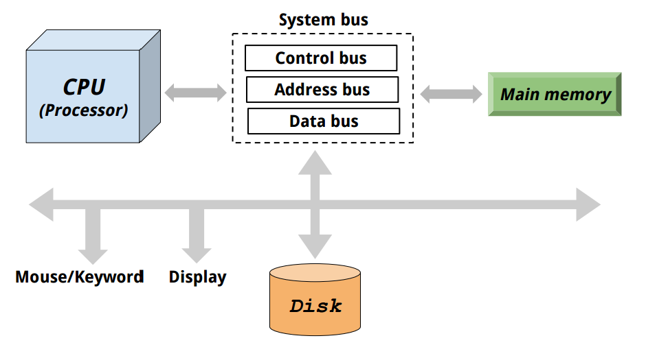
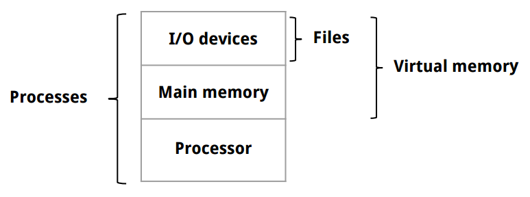
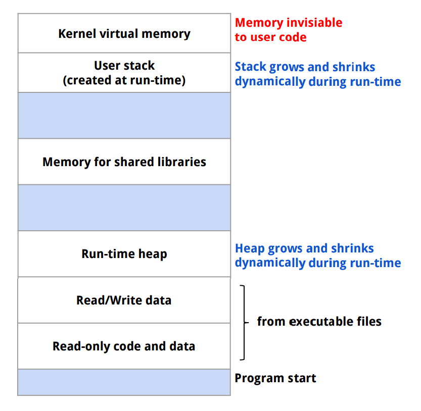
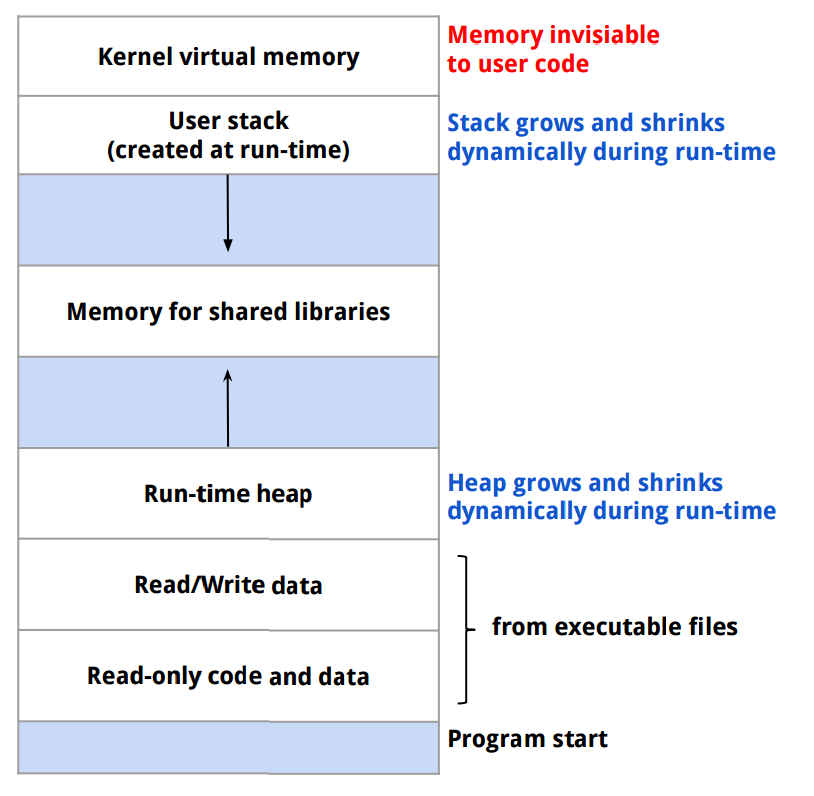

[*back to contents*](https://github.com/gyuho/learn#contents)
<br>

# Overview of computer architecture

- [Reference](#reference)
- [Computer system](#computer-system)
- [Memory hierarchy](#memory-hierarchy)
- [`register`](#register)
- [`word`](#word)
- [process, thread](#process-thread)
- [virtual memory](#virtual-memory)
- [stack, heap](#stack-heap)

[↑ top](#overview-of-computer-architecture)
<br><br><br><br>
<hr>


#### Reference

- [Computer systems: a programmer's perspective](http://csapp.cs.cmu.edu/)
- [MIT lecture: Computer System Architecture](http://ocw.mit.edu/courses/electrical-engineering-and-computer-science/6-823-computer-system-architecture-fall-2005/)
- [**Memory : Stack vs Heap**](http://gribblelab.org/CBootcamp/7_Memory_Stack_vs_Heap.html)

[↑ top](#overview-of-computer-architecture)
<br><br><br><br>
<hr>


#### Computer system

Here's an example computer architecture in very high level:




- `CPU` is a central processing unit, *or processor*, that interprets and 
	executes the machine instructions stored in `main memory`. Processor has a small storage called `register` to provide the fastest way to access data.
- `Main memory` is a temporary storage both for executing programs and 
	data during execution.
- `Disk` stores data. It can contain more data than memory, but is much
	slower to read from disks.

[↑ top](#overview-of-computer-architecture)
<br><br><br><br>
<hr>


#### Memory hierarchy


- Computer's total system memory is from `RAM` (physical memory)
	and `virtual memory`.
- `Main memory` or **Random-access memory** (`RAM`) is a form of computer
	data storage that can be accessed randomly when you know the
	intersecting row and column at cell. It consists of collection of `DRAM`.
- [`DRAM` (Dynamic Random Access Memory)](https://en.wikipedia.org/wiki/Dynamic_random-access_memory) is used for `main memory`. Data get lost when the power is off.
- [`SRAM` (Static Random Access Memory)](https://en.wikipedia.org/wiki/Static_random-access_memory) is faster and less volatile than `DRAM`
	but more expensive. It's typically used for **`CPU` cache**.

[↑ top](#overview-of-computer-architecture)
<br><br><br><br>
<hr>


#### `register`

Processor `register` is a small amount of storage available as part of a CPU.
Computers load data from a large memory into registers
and do the arithmetic, manipulating computation
and store the data back to main memory.
`Register` is normally at the top of the memory hierarchy
, and provides the fastest way to access data.

[↑ top](#overview-of-computer-architecture)
<br><br><br><br>
<hr>


#### `word`

`Word`, in computing, is the natural unit of data.
A `word` is a fixed-sized group of digits that are handled
as a unit by the processor.
Modern processors usually have a word size of `32` or `64` bits.

- Word size 32-bit: need 4 bytes (32-bit) to store a single word in 
	consecutive memory address.
- Word size 64-bit: need 8 bytes (64-bit) to store a single word in 
	**consecutive memory address**.

[↑ top](#overview-of-computer-architecture)
<br><br><br><br>
<hr>


#### process, thread

Here's the abstraction provided by an operating system:



<br>
A `process` is an abstraction of a running program in an operating system.
Traditional program use processor, main memory, I/O devices exclusively.
But with modern CPUs, a single processor can run multiple processes
concurrently having the processor switch among multiple processes.

<br>
A single `process` can consist of multiple execution units, *`threads`*.
Each `thread` runs in the context of the process.

<br>

**_Thread_** is a lightweight process since it executes within the context of one
process. Both threads and processes are independent units of execution.
**Threads** under the **same process** **_run in one shared memory_** space,
while **process** **_run in separate memory_** spaces.

> Each *process* provides the resources needed to execute a program. A process
> has a virtual address space, executable code, open handles to system objects,
> a security context, a unique process identifier, environment variables, a
> priority class, minimum and maximum working set sizes, and at least one
> thread of execution. Each process is started with a single thread, often
> called the primary thread, but can create additional threads from any of its
> threads.
>
> A *thread* is the entity within a process that can be scheduled for
> execution. All threads of a process share its virtual address space and
> system resources. In addition, each thread maintains exception handlers, a
> scheduling priority, thread local storage, a unique thread identifier, and a
> set of structures the system will use to save the thread context until it is
> scheduled. The thread context includes the thread’s set of machine registers,
> the kernel stack, a thread environment block, and a user stack in the address
> space of the thread’s process. Threads can also have their own security
> context, which can be used for impersonating clients.
>
> [**_About Processes and Threads by
> Microsoft_**](https://msdn.microsoft.com/en-us/library/windows/desktop/ms681917%28v=vs.85%29.aspx)

<br>
When you say *8-core machine*, the `core` represents the actual physical
processors. *8-core machine* has 8 independent processing units (*cores* or
*CPU*s). Not to be confused with processor, a `process` is a computer program
instance that is being executed. A `process` can be made up of multiple
`threads` executing instructions concurrently. Again, `core` is an actual
physical `processor`, and `process` and `thread` are independent units of
program execution: `threads` under the same `process` run in a shared memory
space, whereas `processes` run in separate memory spaces. `threads` are more
dependent on an operating system, than a hardware or CPU. Normally one CPU can
handle one `thread` at a time, but one CPU with
[hyper threading](https://en.wikipedia.org/wiki/Hyper-threading)
can handle two `threads` simultaneously.
<br>

> [Threads] are conceptually the same as processes, but share the same memory space.
>
> As threads share address space, they are lighter than processes so are faster
> to create and faster to switch between.
>
> Threads still have an expensive context switch cost, a lot of state must be
> retained.
>
> Goroutines take the idea of threads a step further.
>
> Many goroutines are multiplexed onto a single operating system thread.
>	- Super cheap to create.
>	- Super cheap to switch between as it all happens in user space.
>	- Tens of thousands of goroutines in a single process are the norm,
>	    hundreds of thousands not unexpected.
>
> This results in relatively few operating system threads per Go process, with
> the Go runtime taking care of assigning a runnable Goroutine to a free
> operating system thread.
>
> [**High performance servers without the event
>  loop**](http://go-talks.appspot.com/github.com/davecheney/presentations/performance-without-the-event-loop.slide#1)
> *by Dave Cheney*

[↑ top](#overview-of-computer-architecture)
<br><br><br><br>
<hr>


#### virtual memory

For a program to run, code and its data must be accessible in main memory, but
it might not be large enough to handle the entire process. We could have a very
large memory to fit it in, but memory is very costly. This is where `virtual
memory` comes in. It separates *logical memory required by process* from
*physical memory of processor*. And it provides each program with its own
complete and independent memory.


> Virtual memory is a component of most operating systems, such as MAC OS,
> Windows and Linux. Virtual memory has a very important role in the operating
> system. It allows us to run more applications on the system than we have
> enough physical memory to support. Virtual memory is simulated memory that is
> written to a file on the hard drive. That file is often called page file or
> swap file. It's used by operating systems to simulate physical RAM by using
> hard disk space. To understand how virtual memory works we have to go back in
> time, before virtual memory even exited. In the days of Windows version 1 or
> 2, we actually couldn't run many applications if we didn't have enough
> physical RAM installed. As we know, the system itself is using a portion of
> RAM. If we run more applications, each application will also get its own
> portion of RAM. If we run too many applications, at one point we will run out
> of RAM. At that point we won't be able to open any additional application.
> Back in those days we had to live with that. If we don't have enough memory,
> we can't run applications.
>
> Everything changed with the release of Windows 3.0 and the 8386 processor.
> With these two together we could use virtual memory. With virtual memory we
> still use our physically installed RAM, but we can also map RAM addresses to
> the hard drive. To do that, a portion of the hard drive is reserved by the
> system. That portion can be either a file or a separate partition. In the
> case of Windows it is a file called pagefile.sys. Under Linux a separate
> partition is used for memory. When the system needs more memory it maps some
> of it's memory addresses out to the hard disk drive. That means that we can
> run more applications than we have RAM installed. As far as the CPU is
> concerned there is enough memory to accommodate all applications. That extra
> memory doesn't actually exist in RAM. It's the storage space on the hard
> drive. 
>
> [*What is Virtual
> Memory*](http://www.utilizewindows.com/pc-fundamentals/optimization/345-what-is-virtual-memory-and-why-do-we-need-it)

`Virtual memory` is an abstraction layer of `main memory` for a `process`.
Each process has an uniform way of looking at the memory, which is known
as `virtual address space`. In other words, each process has its own 
`virtual address space` for memory management, and its memory addresses.
`Virtual memory` with `virtual address space` is useful for multiple programs
running at the same time with shared resources, because each data object can
get multiple **independent** addresses. `Virtual memory` keeps memory isolated
from other processes and prevents data corruption. And size of `virtual memory`
is limited by the size of pointers on a given operating system.



[↑ top](#overview-of-computer-architecture)
<br><br><br><br>
<hr>


#### stack, heap

[Call stack](https://en.wikipedia.org/wiki/Call_stack) is a
**stack or LIFO (last in, first out)** data structure to keep track of
active [subroutines](https://en.wikipedia.org/wiki/Subroutine) of a
computer program. And a **call stack** is composed of **stack frames**.
A **stack frame** is literally a frame of data that gets pushed onto
the call stack. And a stack frame usually represent function calls and
its arguments.

- `stack` stores temporary variables. When a function exits, all 
	variables from the function get freed from the stack. So `stack`
	grows and shrinks as the function pushes and pops local variables.
	- Memory is automatically managed by CPU.
	- No need to allocate or deallocate memory by hand.
	- Reading/writing to stack variables is fast.
	- Limited by the stack size of OS.
- `heap` is also memory but not managed automatically by CPU.
	- Need to allocate and deallocate memory manually (in C).
	- Need **pointer** to access memory on the heap.
	- Reading/writing to heap is slower.
	- Heap variables are global in scope, accessed anywhere in your program.

<br>
My machine setting as of today is `Linux 64-bit`:

```bash
$ cat /proc/cpuinfo | grep "model name" | head -1;
model name	: Intel(R) Core(TM) i7-4750HQ CPU @ 2.00GHz

$ lsb_release -a
Distributor ID:	Ubuntu
Description:	Ubuntu 14.04.3 LTS
Release:	14.04
Codename:	trusty

$ uname -sm
Linux x86_64
```

<br>
> x86-64 (also known as x64, x86_64 and **_`AMD64`_**) is the 64-bit
> version of the x86 instruction set.
>
> [x86-64](https://en.wikipedia.org/wiki/X86-64) *by Wikipedia*

<br>
<br>
Then which way does the stack grow on `x86`?
<br>



It grows downwards. A simple code to verify this:

```cpp
#include <iostream>
using namespace std;

int find_stack_direction (int *num1)
{
	int num2 = 1;
	if (*num1 == 0)
	{
		num1 = &num2;
		return find_stack_direction (num1);
	}
	else
	{
		return ((&num2 > num1) ? 1 : -1);
	}
}

int main() {
	int num1 = 0;
	cout << find_stack_direction(&num1) << endl;
	// -1
	// (downwards)
}

```

[↑ top](#overview-of-computer-architecture)
<br><br><br><br>
<hr>
